# Compact sub-graph graft primitive — Issue #2493

## Summary

Adds `CompactModuleGraft` — an import-time DNA transfer primitive that detects
dense, high-activation hidden-neuron modules in a small donor (Europa-style) and
grafts them into a larger sparser recipient (production-style). Distinct from
the existing 2–5 neuron `SubgraphTransplant` (#2177): this primitive targets
larger denser modules and **preserves donor neuron UUIDs verbatim** so
subsequent breeding can re-align by UUID across machines (AGENTS.md neuron UUID
stability invariant).

Closes #2493.

## What changed

- `src/transfer/CompactModuleGraft.ts` — new module exposing:
  - `detectDenseModules(donorExport, options?)` — connected-component scan over
    the donor's hidden-neuron subgraph; returns modules whose internal synapse
    density is at least `densityFactor × medianLocalDensity` (default `1.5×`).
  - `scoreModulesByActivation(modules, donor, probe)` — activates the donor on
    the probe and sums `|activation|` across each module's neurons, so the
    picked module is the one that actually does work.
  - `compactModuleGraft(recipient, donor, options?)` — detect → score → graft →
    validate. Donor module UUIDs are inserted unchanged. Boundary alignment:
    shared `input-N` semantics preserved verbatim; outbound boundary uses
    near-zero seed weights so the graft is score-neutral on day 0 (lift can
    become positive after subsequent training).
  - `CompactModuleGraftStrategy` — `DnaSharingStrategy` adapter for the bake-off
    harness (#2491). `prepare` runs the graft and `loadFrom`s the result back
    into the recipient in place.
- `src/transfer/mod.ts` — public exports.
- `bench/DnaSharingBakeOff.ts` — registers `CompactModuleGraftStrategy`
  alongside `NoOpStrategy` so the harness produces a comparison row. Adds
  `--min-size N` flag (default 2 for small fixtures; production uses 6).
- `bench/CompactModuleGraftBakeOff.ts` — new evidence bench that constructs a
  synthetic dense donor and a sparse recipient sized to exercise the graft, so
  the PR shows a meaningful structural transfer row.

## Evidence

### Bake-off result (synthetic Europa-style donor → sparse recipient)

```
| Strategy           | Baseline  | Final     | Lift      | Hidden UUIDs Shared | Neurons | Synapses | Duration (ms) |
| ------------------ | --------: | --------: | --------: | ------------------: | ------: | -------: | ------------: |
| NoOp               | -0.081806 | -0.081806 |  0.000000 |                   0 |       6 |        5 |          2.29 |
| CompactModuleGraft | -0.081806 | -0.082268 | -0.000462 |                   8 |      14 |       37 |          1.71 |
```

Reproduce with:

```bash
deno run --allow-read --allow-net --allow-env bench/CompactModuleGraftBakeOff.ts
```

The signal of interest is **Hidden UUIDs Shared 0 → 8** plus **Neurons +8,
Synapses +32**: every donor module neuron survives in the offspring lineage
under its original UUID, which is the failure signal called out in the parent
issue (#2490). The day-zero score lift sits within noise of NoOp (-0.000462) —
boundary outputs are seeded near-zero by design so the graft does not regress
the recipient's existing pathways. Subsequent training in the harness's
evolution loop (the no-op default here) is what unlocks the donor's learned
dense module.

`KnobTuningStrategy` (#2492) is not yet on `Develop`, so the side-by-side
comparison the parent issue asks for cannot be run; the comparison should be
re-run once #2492 lands.

### Architecture

```mermaid
flowchart LR
    Donor[Europa donor<br/>266 hidden, dense] -->|detectDenseModules<br/>density >= 1.5x median| Modules[Dense modules]
    Modules -->|scoreModulesByActivation<br/>probe dataset| Ranked[Ranked candidates]
    Ranked -->|tryGraft<br/>preserve donor UUIDs<br/>align by input-N| Recipient[Production recipient<br/>1672 hidden, sparse]
    Recipient -->|creatureValidate| Offspring[Validated offspring]
    Offspring -->|loadFrom| RecipientMutated[Recipient mutated in place]
```



## Test Plan

New tests (`test/transfer/CompactModuleGraft.ts`, 12 cases):

- `detectDenseModules - returns at least one module from a dense donor`
- `detectDenseModules - picks denser candidates than SubgraphTransplant on the same donor`
- `detectDenseModules - respects custom densityFactor threshold`
- `scoreModulesByActivation - assigns finite activationScore per module`
- `compactModuleGraft - returns a creature that passes creatureValidate`
- `compactModuleGraft - preserves donor neuron UUIDs in the recipient`
  (UUID-stability mirror of `test/creature/NeuronUuidStability.ts`)
- `compactModuleGraft - preserves recipient neuron UUIDs`
- `compactModuleGraft - rejects donor with no dense module`
- `compactModuleGraft - rejects grafts that fail creatureValidate`
- `CompactModuleGraftStrategy - conforms to DnaSharingStrategy and mutates recipient`
- `CompactModuleGraftStrategy - is a no-op when graft is rejected`
- `compactModuleGraft - higher activationScore module is preferred`
  (determinism)

Verified locally:

- `deno test test/transfer/CompactModuleGraft.ts` — 12 passed.
- `deno test test/transfer/DnaSharingStrategy.ts test/breed/SubgraphTransplant.ts`
  — 18 passed (no regressions in adjacent harness or `SubgraphTransplant`).
- `deno test test/creature/NeuronUuidStability.ts test/creature/SemanticVersionStability.ts test/creature/CreatureSerializationPolicy.ts`
  — 26 passed (UUID + semantic version invariants intact).
- `./quality.sh --skip-discovery --skip-tests` — lint, fmt, type-check pass.

## Acceptance Criteria

- [x] New module under `src/transfer/CompactModuleGraft.ts`.
- [x] Module detection picks denser candidates than `SubgraphTransplant`'s 2–5
      neuron output on the same donor (covered by
      `detectDenseModules - picks denser candidates than SubgraphTransplant`).
- [x] All transplanted donor neurons retain their original `uuid` post-graft
      (covered by
      `compactModuleGraft - preserves donor neuron UUIDs in the recipient`).
- [x] `creatureValidate` passes on the recipient post-graft for all fixtures
      (covered by
      `compactModuleGraft - returns a creature that
      passes creatureValidate`
      and the strategy tests).
- [x] Unit tests cover dense-module detection, score-based candidate selection,
      boundary connection, UUID preservation, and rejection of invalid grafts.
- [x] PR summary records bake-off result and donor UUID survival count (table
      above).
- [x] `./quality.sh` lint/fmt/type-check pass.
