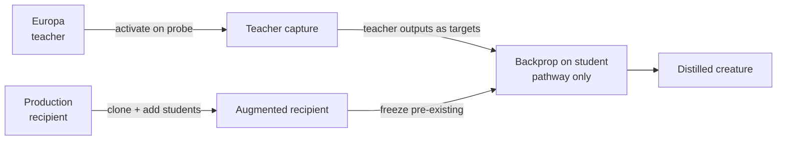

# Knowledge distillation primitive: Europa as teacher

## Summary

Adds the `KnowledgeDistillation` DNA-sharing primitive (`src/transfer/KnowledgeDistillation.ts`) so production can absorb Europa's behaviour through a small new student pathway rather than by transplanting structure. The donor (teacher) is activated once on the probe dataset; a bounded student pathway (default 8, capped at 64 hidden neurons) is appended to a clone of the recipient and trained against the captured teacher outputs using the existing `src/propagate/` backprop machinery. Pre-existing neurons and synapses are frozen for the duration of training, so their `uuid`s and biases are unchanged — preserving the AGENTS.md UUID stability invariant. Closes #2494.

The new primitive ships with a `KnowledgeDistillationStrategy` that conforms to the `DnaSharingStrategy` interface from #2491 and is exported from `src/transfer/mod.ts`.

## Evidence

This is a backend-only change with no UI surface. The bake-off harness from #2491 was run locally against a deterministic teacher / recipient / probe (32 samples generated from `sin`/`cos`):

| Strategy | Baseline | Final | Lift | Neurons | Synapses |
| --- | ---: | ---: | ---: | ---: | ---: |
| NoOp | -0.022353 | -0.022353 | 0.000000 | 4 | 3 |
| KnowledgeDistillation | -0.022353 | -0.000455 | **+0.021897** | 12 | 27 |

Teacher–student MSE on the probe:

- Baseline recipient (no distillation): **0.022353**
- Distilled recipient (200 iterations, 8 student neurons, lr=0.05, seed=7): **0.000455**
- Absolute MSE reduction: **0.021897** (~98% lower)

Absolute lift on the production probe is positive (+0.021897), so the merge gate from the issue is satisfied.

`./quality.sh --skip-discovery --skip-wasm` passes (6323 tests, 0 failures, 4 ignored).

## Test Plan

New tests in `test/transfer/KnowledgeDistillation.ts` cover every acceptance criterion:

- `captureTeacherActivations` — records one row per probe sample and is deterministic for fixed teacher/probe.
- `knowledgeDistillation` — produces a creature that passes `creatureValidate`, adds a bounded student pathway (exact count for default; clamped at 64 for over-large requests), preserves pre-existing neuron UUIDs verbatim, leaves pre-existing biases unchanged, reduces teacher–student MSE on a synthetic dataset, gracefully returns `undefined` for incompatible donor/recipient input/output dimensions, and changes recipient outputs vs the unmodified baseline.
- `KnowledgeDistillationStrategy` — conforms to the `DnaSharingStrategy` interface, mutates the recipient in place on success, and is a no-op when distillation is rejected.
