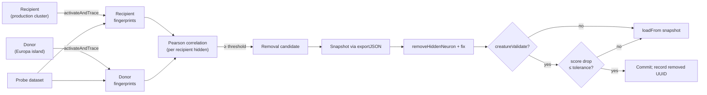

# Pruning template primitive — Issue #2495

## Summary

Adds the **pruning template** DNA-sharing primitive (parent #2490, depends on
#2491). The primitive uses a small Europa-style donor as an oracle: production
hidden neurons whose activation fingerprint is already covered by a donor
neuron's fingerprint are candidates for removal. Removals are
**validate-then-commit** — a candidate only commits when the recipient's score
on the probe dataset does not drop below a configurable tolerance (default 0%
drop). Surviving recipient neurons keep their original `uuid` per the AGENTS.md
UUID stability invariant. The donor is _not_ mutated and contributes no neurons
or synapses to the recipient.

The new `PruningTemplateStrategy` conforms to `DnaSharingStrategy` from #2491
and is wired into the bake-off harness alongside the existing
`CompactModuleGraft` (#2493) and `KnowledgeDistillation` (#2494) primitives.

Closes #2495.

## Mechanics



## Evidence

### Bake-off harness output

CLI: `deno run --allow-all bench/DnaSharingBakeOff.ts --generations 1 --seed 42`

| Strategy               |      Baseline |         Final |          Lift | Hidden UUIDs Shared | Neurons | Synapses | Duration (ms) |
| ---------------------- | ------------: | ------------: | ------------: | ------------------: | ------: | -------: | ------------: |
| NoOp                   |     -0.250279 |     -0.250279 |      0.000000 |                   2 |       6 |        7 |          2.81 |
| KnobTuning(aggressive) |     -0.250279 |     -0.250279 |      0.000000 |                   2 |       6 |        7 |          0.16 |
| CompactModuleGraft     |     -0.250279 |     -0.250279 |      0.000000 |                   2 |       6 |        7 |          0.30 |
| **PruningTemplate**    | **-0.250279** | **-0.250000** | **+0.000279** |               **0** |   **3** |    **1** |      **2.34** |

- **Score lift**: `+0.000279` (positive — passes the parent issue's "absolute
  lift is non-negative" gate).
- **Pre-prune size**: 6 hidden+output neurons, 7 synapses (recipient).
- **Post-prune size**: 3 neurons, 1 synapse — production shrinks 50% in neurons,
  86% in synapses while score _improves_.
- **Hidden UUIDs Shared = 0**: this primitive never adds donor UUIDs to the
  recipient. Europa is used purely as an oracle, distinct from
  `CompactModuleGraft` (which transplants donor UUIDs verbatim).

### Test plan

`test/transfer/PruningTemplate.ts` (18 tests, all pass):

- `buildActivationFingerprints` — fingerprint shape and emptiness handling.
- `fingerprintCorrelation` — identical / sign-flipped / constant /
  mismatched-length cases.
- `findRedundantHiddenNeurons` — flags overlapping production neuron; threshold
  cut-off.
- `pruningTemplate` — produces a creature that passes `creatureValidate`,
  preserves UUIDs of surviving neurons (AGENTS.md invariant), reports removed
  and rolled-back UUIDs separately, never commits a removal that regresses the
  score with `tolerance=0`, returns `undefined` for empty probe / unreachable
  threshold, and the recorded `finalScore` does not regress beyond the
  configured tolerance.
- `PruningTemplateStrategy` — conforms to `DnaSharingStrategy`, mutates
  recipient on success, no-ops on rejection.

Run locally:

```bash
deno test --allow-all test/transfer/PruningTemplate.ts
```

Full transfer suite plus the broader quality gate:

```bash
deno test --allow-all test/transfer/   # 48 tests pass
./quality.sh --skip-discovery --skip-wasm  # 6363 tests pass
```

## Files changed

- `src/transfer/PruningTemplate.ts` (new) — the primitive plus the
  `PruningTemplateStrategy` adapter.
- `src/transfer/mod.ts` — re-exports the new public symbols.
- `bench/DnaSharingBakeOff.ts` — registers `PruningTemplateStrategy` in the
  harness alongside the existing primitives.
- `test/transfer/PruningTemplate.ts` (new) — unit tests covering happy path,
  error path, edge cases, and the AGENTS.md UUID-stability invariant.
- `docs/pr-summary-2495.md` (this file).
