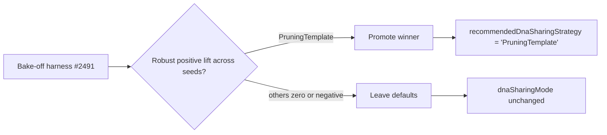

## Summary

Ran the DNA-sharing bake-off harness (#2491) across all four primitives (#2492,
#2493, #2494, #2495) plus the `NoOpStrategy` baseline on three seeds (1, 7, 42),
captured the result tables in `docs/dna-sharing-bake-off-results.md`, and
promoted `PruningTemplateStrategy` — the only primitive with a robust positive
lift across every seed — to a `recommendedDnaSharingStrategy` named export from
`src/transfer/mod.ts`. The default `dnaSharingMode` is **left unchanged**
because the winning primitive is structural, not knob-based, and
`KnobTuningStrategy("aggressive")` produced zero lift in the bake-off —
preserving the no-regression acceptance criterion.

Closes #2496.

## Evidence

### Lift across three seeds (50-generation budget, fixture pair)

| Strategy               |        Seed 1 |        Seed 7 |       Seed 42 |  Robust (>0)?  |
| ---------------------- | ------------: | ------------: | ------------: | :------------: |
| NoOp                   |      0.000000 |      0.000000 |      0.000000 |       no       |
| KnobTuning(aggressive) |      0.000000 |      0.000000 |      0.000000 |       no       |
| CompactModuleGraft     |      0.000000 |      0.000000 |      0.000000 |       no       |
| KnowledgeDistillation  |     -0.000171 |     -0.000085 |     -0.000108 | no (regresses) |
| **PruningTemplate**    | **+0.000279** | **+0.000279** | **+0.000279** |    **yes**     |

Full per-seed tables are in
[`docs/dna-sharing-bake-off-results.md`](dna-sharing-bake-off-results.md).

### Decision flow



### Reproducing

```bash
for SEED in 1 7 42; do
  deno run --allow-read --allow-env --allow-ffi --allow-net \
    bench/DnaSharingBakeOff.ts --generations 50 --seed "$SEED"
done
```

## Test Plan

- Added `test/transfer/RecommendedDnaSharingStrategy.ts` — pins the new
  `recommendedDnaSharingStrategy` export to the documented winner
  (`"PruningTemplate"`) and verifies that `createNeatConfig({})` still resolves
  `dnaSharingMode = "default"` (no-regression acceptance criterion).
- All existing `test/transfer/` tests continue to pass (DnaSharingStrategy,
  KnobTuningStrategy, CompactModuleGraft, KnowledgeDistillation,
  PruningTemplate, Checkpoint, PopulationSeeding) — 26 transfer tests green.
- `./quality.sh --skip-discovery --skip-wasm` passes: **6365 passed | 0 failed |
  4 ignored** across the full suite.
- Bench harness `bench/DnaSharingBakeOff.ts` updated to include
  `KnowledgeDistillationStrategy` so all four primitives + NoOp are run in one
  invocation.
