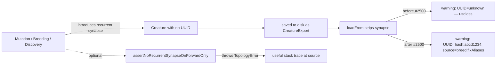

# Stamp creature UUID before loadFrom strips recurrent synapses (#2500)

## Summary

Production logs were repeatedly emitting `🚨 [loadFrom] Stripping
recurrent synapse … from forward-only creature (UUID: unknown). This
indicates upstream corruption.` 50 times in a single GRQ-3 run. The
`UUID: unknown` text made it impossible to correlate corrupt-creature
events or trace the upstream pipeline that produced them — a regression
of GRQ#1497 / GRQ#1906.

The root cause is that `CreatureExport` JSON deliberately omits the
creature `uuid` (it is wire-only), so `loadFrom` had no identifier to
report when the synapse-strip warning fired.

This change makes the warning genuinely diagnostic:

- **Stable identifier**: when `creature.uuid` is missing, `loadFrom`
  computes a deterministic `hash:<8hex>` from the JSON payload (input/
  output sizes, neuron uuids/types, sorted synapse `fromUUID->toUUID`
  pairs). The same poisoned creature now produces the same hash on
  every machine, so events can be correlated.
- **`source=...` tag**: every caller of `loadFrom` now passes a short
  string identifying the upstream pipeline (`breed:fixAliases`,
  `transfer:compactGraft`, `training:teardownRestore`,
  `compact:deadSubgraphPruning`, `predictiveCoding:restoreBest`, etc.).
  The tag is included in the strip warning so the offending pipeline
  is visible from a single log line.
- **Assertion helper**: a new
  `assertNoRecurrentSynapseOnForwardOnly(creature, source)` lets
  pipelines that produce structures fail fast at the corruption
  introduction point instead of leaving the silent-strip in `loadFrom`
  as the only signal.

Closes #2500.

## Evidence

This is a backend / CLI change with no UI to screenshot. Behaviour is
verified by three new test files (see Test Plan).



Sample warning before and after:

```
# before
🚨 [loadFrom] Stripping recurrent synapse 2738->2736 (fromUUID=output-0, toUUID=d276ed0d-…) from forward-only creature (UUID: unknown). This indicates upstream corruption.

# after
🚨 [loadFrom] Stripping recurrent synapse 2738->2736 (fromUUID=output-0, toUUID=d276ed0d-…) from forward-only creature (UUID: hash:1a2b3c4d, source=breed:fixAliases). This indicates upstream corruption.
```

## Test Plan

- `test/utils/CreatureStructuralHash.ts` — verifies the hash is stable,
  hex-only, insensitive to synapse order, and changes when topology /
  input / output changes.
- `test/creature/LoadFromObservability.ts` — verifies that
  `loadFrom` warnings (a) never contain `UUID: unknown`, (b) always
  contain a uuid or `hash:<8hex>` identifier, (c) reflect the caller's
  `source=…` tag, and (d) assign the same hash to identical JSON twice.
- `test/architecture/ForwardOnlyAssertion.ts` — verifies the new
  `assertNoRecurrentSynapseOnForwardOnly` helper is a no-op for valid
  forward-only creatures and throws a `TopologyError` (with `source`
  tag) for self-loops and backward edges.

All 6335 tests pass via `./quality.sh --skip-discovery --skip-wasm`.

## Files changed

- `src/utils/CreatureStructuralHash.ts` *(new)* — FNV-1a 32-bit hash
  helper.
- `src/architecture/ForwardOnlyAssertion.ts` *(new)* — corruption
  introduction-point assertion.
- `src/creature/CreatureSerialization.ts` — `loadFrom` and `fromJSON`
  accept an optional `source` parameter; strip and clamp warnings now
  include uuid-or-hash and `source=…`.
- `src/Creature.ts` — `Creature.loadFrom` and `Creature.fromJSON`
  forward the new `source` parameter.
- `src/architecture/Offspring.ts`, `src/transfer/CompactModuleGraft.ts`,
  `src/transfer/KnowledgeDistillation.ts`,
  `src/architecture/training/TrainingOutcome.ts`,
  `src/architecture/training/TrainingTeardown.ts`,
  `src/architecture/CrossValidationTrainer.ts`,
  `src/predictiveCoding/PredictiveCodingTrainer.ts`,
  `src/creature/CreatureTraining.ts`,
  `src/propagate/RemoveSyntheticSynapses.ts`,
  `src/compact/DeadSubgraphPruning.ts`,
  `src/compact/OrphanedNeuronCleanup.ts` — pass meaningful `source`
  tags.
- `test/utils/CreatureStructuralHash.ts` *(new)*,
  `test/creature/LoadFromObservability.ts` *(new)*,
  `test/architecture/ForwardOnlyAssertion.ts` *(new)* — coverage for
  the new behaviour.
