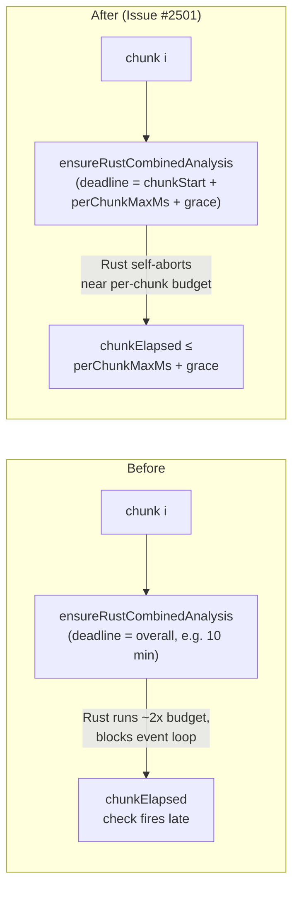

# Tighten Rust FFI per-chunk deadline so a single chunk cannot over-spend the budget

## Summary

The synchronous Rust combined-analysis FFI used to receive the full **overall**
discovery deadline (e.g. 10 minutes) and could happily run for nearly twice the
per-chunk budget before returning. Issue #2420's `Promise.race` only protected
the asynchronous `runParallelAnalysis` fallback path — it cannot interrupt a
blocking FFI call, because the JS event loop is suspended while Rust is running.
As a result, GRQ-3-sloth saw chunk 1/3 take **3m 49s** against a **2m**
per-chunk budget, then chunks 2 and 3 were skipped after the budget had already
been violated.

This change forwards a **per-chunk** `analysisDeadlineMs` to Rust. Rust already
self-aborts on this deadline; we now compute it as
`chunkStart + perChunkMaxMs + grace` so a single chunk cannot consume far more
than its allotted budget regardless of how much overall analysis window remains.
The Rust-side deadline is the only mechanism that can actually bound a
synchronous FFI call's wall-clock — the existing JS-side post-call check fires
too late by definition.

Closes #2501.

## Evidence

Backend / CLI change — no UI. Verified by:

- New regression test
  `runAnalysisLoop forwards a tight per-chunk deadline to Rust (Issue #2501)`
  asserts the spy on `analyzeParallel` receives
  `analysisDeadlineMs === chunkStart + perChunkMaxMs + grace`. Confirmed the
  test **fails** before the production change is applied (verified by stashing
  `DataRecorderAnalysis.ts`, `DiscoverStructureAnalysis.ts`, and
  `RustAnalysisCache.ts`, then running the suite — the new test then reports
  `Values are not equal: ... got 1777576109855, expected 5121000`). After
  restoring the change, all 9 tests in the suite pass.
- Companion test
  `runAnalysisLoop omits per-chunk deadline tightening when stall guard disabled (Issue #2501)`
  guards the negative case: when `perChunkMaxMs <= 0`, no chunk-level tightening
  is applied and the overall analysis deadline is forwarded unchanged.
- All 113 tests under `test/ErrorGuidedStructuralEvolution/` pass.
- `./quality.sh --skip-tests --skip-discovery --skip-wasm` (lint, fmt, bash
  check, type-check) is green.

## Test Plan

- Added:
  `runAnalysisLoop forwards a tight per-chunk deadline to Rust (Issue #2501)` in
  `test/ErrorGuidedStructuralEvolution/DiscoverAnalysisChunking.ts` — asserts
  the deadline forwarded to the `analyzeParallel` spy equals
  `chunkStart + perChunkMaxMs + perChunkGraceMs`.
- Added:
  `runAnalysisLoop omits per-chunk deadline tightening when stall guard disabled (Issue #2501)`
  — asserts that with `perChunkMaxMs = 0` the deadline is **not** tightened
  below the overall analysis deadline.
- Extended `runWithMockedAnalyzeParallel` to capture each call's
  `analysisDeadlineMs` and the time it was captured at, plus a new
  `perChunkGraceMs` knob plumbed through to the loop context.
- Existing chunking, stall-guard, and defence-in-depth iteration-cap tests
  continue to pass.
