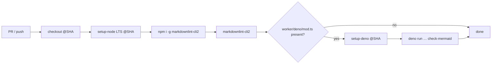

## Summary

Adds the missing **Markdown Lint** GitHub Actions workflow to the repository so
every pull request and push to the default branches gets `markdownlint-cli2`
applied to all Markdown files. The new workflow uses the existing
`.markdownlint-cli2.jsonc` glob config and `.markdownlint.yaml` rule overrides
that already drive the local quality gate, so the GitHub check stays in lock
step with what contributors run on their machines. Closes #2507.

The optional Mermaid block validator from the suggested template is preserved
behind a `detect-deno` guard — this repo has no `worker/deno/mod.ts` today, so
the step skips itself, but if that module is ever vendored in, the workflow
will automatically start running `deno run … check-mermaid` without further
edits.

## Evidence



Local `markdownlint-cli2` run against the repo's 560 Markdown files — `0
error(s)` — so the new workflow will pass the first time it runs on `Develop`.

Tests added in `test/scripts/MarkdownLintWorkflow.ts` parse the workflow YAML
and assert on its real shape (triggers, permissions, action SHAs, install +
run steps, Mermaid gating). All 8 pass:

```text
ok | 8 passed | 0 failed
```

`./quality.sh --lint-only` and `./quality.sh --check-only` both pass cleanly
after adding the new test file.

## Test Plan

- New: `test/scripts/MarkdownLintWorkflow.ts`
  - workflow file exists
  - triggers on pull_request and push
  - grants only `contents: read` (least privilege)
  - uses `actions/checkout` and `actions/setup-node`
  - all third-party actions pinned to 40-char commit SHAs (supply-chain gate)
  - installs and runs `markdownlint-cli2`
  - the optional `check-mermaid` step is gated on `detect-deno` output
  - `.markdownlint-cli2.jsonc` config is present

## Files Changed

- `.github/workflows/markdown-lint.yml` — new workflow
- `test/scripts/MarkdownLintWorkflow.ts` — new tests
- `deno.json` — adds `@std/yaml` import map entry used by the new test
