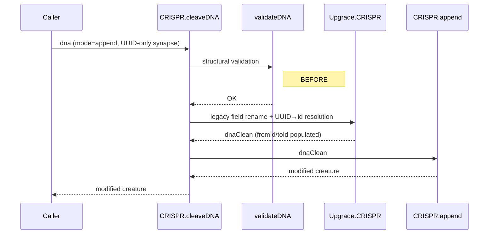

## Summary

Documents and supports the CRISPR `append + demote` pattern that GRQ relies
on, and removes one workaround that the gap forced GRQ to carry. Closes
#2509.

Three deliverables:

1. **`validateDNA` recognises UUID-only synapses.** Append-mode synapses
   may now reference endpoints with `fromUUID` / `toUUID` alone, without
   the `fromRelative: 0` / `toRelative: 0` placeholder workaround that
   GRQ's `prepareAppendCrisprDnaForValidate.ts` currently injects. Insert
   mode is unchanged (it already accepted UUID-only).
2. **Named constants for the convention.** New exports:
   `CRISPR_DEFAULT_FIRST_DNA_OUTPUT_INDEX` (`100_000`) and
   `FROM_RELATIVE_DEMOTED_OUTPUT` (`99_999`). These replace the magic
   numbers used throughout the GRQ DNA files and document the
   `firstDnaOutputIndex - 1 == 99999` relationship.
3. **`docs/CRISPR_GUIDE.md`** — new guide covering the append+demote
   pattern, the index arithmetic inside `CRISPR.append()`, the
   constants, the validation rules, and the caveats (shadowed
   `output-N` labels, multi-neuron anchor shifts, synapse dedup).
   Linked from `docs/API_REFERENCE.md` and `AGENTS.md`.

GRQ can now drop `prepareAppendCrisprDnaForValidate.ts` after upgrading
to a NEAT-AI release containing this change.

## Evidence

CLI/library change with no UI surface — verification is via tests.



All 93 CRISPR tests pass:

```
test/CRISPR/ValidateDNA.ts          29 tests, all passing
test/CRISPR/AppendDemoteOutput.ts    3 tests, all passing (new)
test/CRISPR/{others}                61 tests, all passing
```

Full quality suite: 6381 passed / 1 unrelated flaky failure
(`ThroughputMetrics - fastQueueMaxDepth`, passes on rerun and is
unrelated to CRISPR).

## Test Plan

- **Added** `test/CRISPR/AppendDemoteOutput.ts` (3 tests):
  - Constants relationship: `FROM_RELATIVE_DEMOTED_OUTPUT == CRISPR_DEFAULT_FIRST_DNA_OUTPUT_INDEX - 1`.
  - End-to-end `cleaveDNA` with `fromRelative: FROM_RELATIVE_DEMOTED_OUTPUT`
    wires the demoted previous output into the new TANH output.
  - `DNA-SANE.json` regression: 3 demoted outputs all wired to 3 new
    outputs via `fromRelative: 997/998/999` (smaller-anchor variant of
    the same arithmetic).
- **Added** to `test/CRISPR/ValidateDNA.ts` (4 tests):
  - Append-mode synapse with `fromUUID` + `toUUID` alone passes.
  - Append-mode synapse with only `fromUUID` still rejected (target
    missing).
  - Append-mode synapse with only `toUUID` still rejected (source
    missing).
  - Insert-mode regression: `fromUUID`/`toUUID` continues to pass.
- **Modified** files:
  - `src/reconstruct/validateDNA.ts` — UUID acceptance + updated error
    messages.
  - `src/reconstruct/CRISPR.ts` — constants with JSDoc.
  - `mod.ts` — re-export the constants.
  - `docs/API_REFERENCE.md` — link to new guide + constants table.
  - `docs/CRISPR_GUIDE.md` — new (full guide).
  - `AGENTS.md` — added the guide to the docs layout list.
