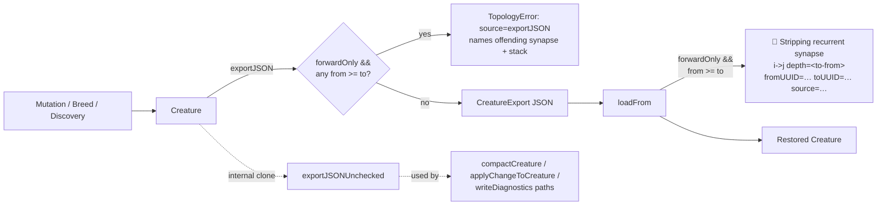

# Issue #2511 — Forward-only save-side assertion + tighter loadFrom log

## Summary

Forward-only creatures were round-tripping through `Creature.fromJSON` with
recurrent synapses — usually `output-0 → output-0` self-loops, occasionally
cross-loops back to a hidden neuron. The `loadFrom` strip was the only thing
keeping the runtime consistent, and the strip log line did not distinguish
self-loops from cross-loops at a glance, so the upstream pipeline producing the
corruption could not be identified from production logs (28 occurrences on
GRQ-10 / Team Europa).

This change addresses the four asks in the issue:

1. **Save-side assertion** — `Creature.exportJSON()` (and the module-level
   `exportJSON`) now runs the existing
   `assertNoRecurrentSynapseOnForwardOnly(...)` helper before serialisation.
   When a forward-only creature carries any `from >= to` synapse, the export
   throws a `TopologyError` naming the offending edge and the
   `source=exportJSON` tag, capturing the producing pipeline's stack frame. This
   is the only check that fires unconditionally on the export hot path — the
   rest of `creatureValidate` stays gated by `creature.DEBUG`, per the "no full
   validation on every export" policy.
2. **Tighter `loadFrom` log** — the strip warning now includes
   `depth=<to-from>`, so self-loops (`depth=0`) and cross-loops (`depth<0`, e.g.
   `output-0 → hidden-3`) are distinguishable at a glance in production logs.
   The existing UUID/hash and `source=...` tokens are preserved.
3. **Audited mutation operators that touch `output-0`** — `AddSelfCon`,
   `AddConnection`, `AddBackCon`, `AddNeuron`, and `SwapNeurons` already guard
   against producing recurrent synapses on forward-only creatures (e.g.
   `AddSelfCon` returns immediately if `forwardOnly === true`, `AddConnection`
   enforces `from < to` via rejection sampling and a trailing `assert`,
   `AddNeuron` clamps the outward target to
   `Math.max(toIndex, neuronIndex + 1)`). A new test in
   `ForwardOnlyOutputRoundTrip.ts` runs each of these operators against a fresh
   forward-only creature 50 times and asserts no recurrent synapse appears, then
   exports the creature end-to-end through the new save-side assertion.
4. **Round-trip unit test** — a new test builds a forward-only creature with
   `output-0` as the only output, round-trips it through `exportJSON` /
   `Creature.fromJSON`, and asserts (a) no recurrent synapse appears in the
   parsed output and (b) no `Stripping` warning is logged on a clean round-trip.

To keep the assertion narrow without breaking internal cloning paths, a
companion helper `exportJSONUnchecked(creature)` exposes
`buildCreatureExportJSON(creature, false)` for callers that legitimately need to
serialise a potentially-corrupt forward-only creature for _processing_ rather
than _saving_:

- `compactCreature(...)`: input may carry backward synapses on purpose so
  compaction can strip them (Issue #956 test fixtures, GRQ-12 strip recovery).
- `applyChangeToCreature(...)`: discovery candidates may carry intentionally
  illegal hints that the combiner is meant to filter.
- Diagnostics / `validateOrDiagnose` and `Upgrade.ts` writeDiagnostics paths:
  already on the validation-error path; the assertion would replace the upstream
  `ValidationError` (e.g. `RECURSIVE_SYNAPSE`) with a less-useful
  `TopologyError`.

Closes #2511.

## Evidence

This is a backend/CLI change with no UI; no Playwright screenshot is applicable.
Verification is via the new tests below and the existing quality gate (6 387
tests pass, including the previously-passing `UpgradeFourXRepair`,
`CompactCreatureNoOrphans`, and `CombinedCandidateNeuronOps` suites which now
route their internal clones through `exportJSONUnchecked`).

The new save-side assertion catches the corruption at the producing pipeline
rather than at the next load, while the tightened log keeps the existing strip
behaviour as a last line of defence and labels self-loops vs cross-loops at a
glance.

## Test Plan

New file: `test/creature/ForwardOnlyOutputRoundTrip.ts`

- `forward-only creature with output-0 round-trips with no recurrent synapse` —
  clean creature, exportJSON → fromJSON, asserts no recurrent edge in the parsed
  output and no `Stripping` log line was emitted.
- `exportJSON refuses to serialise forward-only creature with recurrent synapse`
  — injects an `output-0 → output-0` self-loop directly into a forward-only
  creature, expects `TopologyError` with `source=exportJSON` and the offending
  `from->to` indices in the message.
- `exportJSON allows recurrent synapse on non-forward-only creature` — recurrent
  topologies still serialise unchanged when `forwardOnly !== true`.
- `loadFrom strip warning includes depth=<to-from>` — feeds an export-shaped
  JSON containing one self-loop (`depth=0`) and one cross-loop output → hidden
  (`depth<0`) and asserts both labels appear in the captured log lines.
- `audited mutation operators never produce output-0 self-loop on forward-only creature`
  — runs `ADD_SELF_CONN`, `ADD_BACK_CONN`, `ADD_CONN`, and `ADD_NODE` via
  `Mutator` 50 times against a fresh forward-only creature and asserts no
  synapse with `from >= to` appears, then re-exports through the new save-side
  assertion.

Updated for the bypass path:

- `test/wasm/WasmInstantiationFailure.ts` — switches its
  deliberately-corrupt-creature export to `exportJSONUnchecked` so the test
  continues to exercise the WASM-instantiation failure surface rather than
  tripping the save-side assertion first.

Existing observability test (`test/creature/LoadFromObservability.ts`) keeps
passing — the new `depth=<to-from>` token coexists with the existing UUID/hash
and `source=...` tokens.
