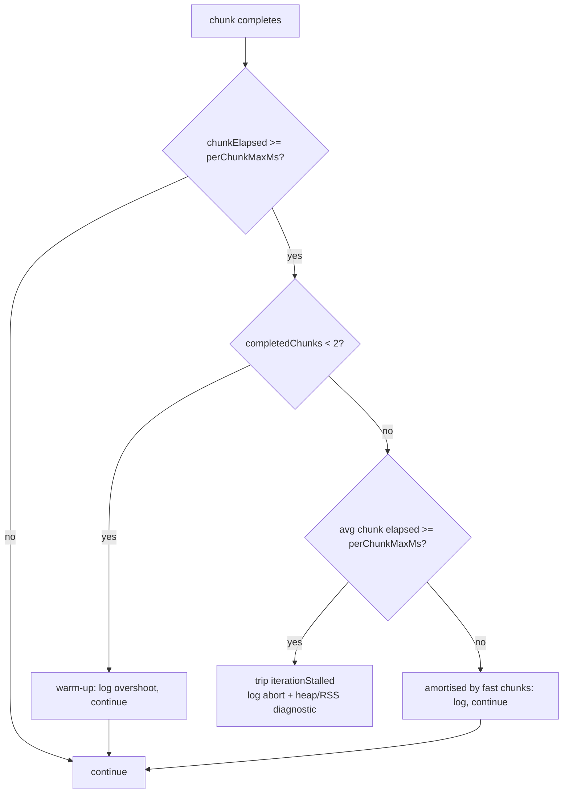

# Discovery throughput-stall detector: warm-up gate + rate-of-change check

## Summary

Defers the per-chunk throughput-stall guard in
`DataRecorderAnalysis.runAnalysisLoop` until a warm-up window of two completed
chunks has elapsed, and only trips the stall once the average per-chunk elapsed
time across all completed chunks still exceeds `perChunkMaxMs`. The
defence-in-depth iteration wall-clock cap is re-anchored at the end of warm-up
so warm-up time is no longer counted against subsequent chunks. The
throughput-stalled abort log line now carries a heap / RSS diagnostic so future
stalls can be correlated with memory pressure. Closes #2513.

Production GRQ-10 runs were tearing down the entire retry loop after a single
6-neuron warm-up chunk because the first Rust FFI call pays for parquet loading,
GPU initialisation, and module dispatch warm-up. Under the new behaviour the
warm-up overshoot is logged but the loop keeps running; the stall guard fires
only on sustained slowness past warm-up.

## Evidence

This is a backend (TypeScript / FFI orchestration) change — no UI to screenshot.
New unit tests assert the behaviour change directly:

- `warm-up gate: a single slow first chunk does NOT trip iterationStalled`
  reproduces the GRQ-10 pattern (chunk 1 = 5,000 ms, chunks 2–3 = 1 ms each,
  `perChunkMaxMs = 100 ms`) and confirms `analysisStalled` stays `false`. This
  test fails against the unfixed code with `analysisStalled === true` and passes
  after the fix.
- `warm-up gate: sustained slow chunks past warm-up DO trip iterationStalled`
  drives an always-slow fake clock and confirms the stall still fires once
  warm-up has elapsed and the rolling average stays above budget.
- `warm-up gate: stall guard never fires when chunks complete within budget`
  confirms the unhappy path (no stall) on a normal-paced run.
- `formatStallMemoryDiagnostics returns a non-empty diagnostic string` exercises
  the new helper that annotates the abort log.

Pre-existing tests under
`test/ErrorGuidedStructuralEvolution/DiscoverAnalysisChunking.ts` and
`test/ErrorGuidedStructuralEvolution/DiscoverAnalysisPerChunkTimeout.ts`
continue to pass — sustained slow chunks still trip the stall guard under the
new logic, and the mid-flight FFI hang timeout is unchanged.

`./quality.sh` passed end-to-end (6,446 tests, 0 failed, 4 ignored).

## Test Plan

- [x] New file
      `test/ErrorGuidedStructuralEvolution/DiscoverAnalysisStallWarmup.ts`
      covers the four cases above.
- [x] Existing `DiscoverAnalysisChunking.ts` and
      `DiscoverAnalysisPerChunkTimeout.ts` suites pass unchanged.
- [x] Full `./quality.sh` run (lint, format, deno check, all tests) is green.

## Implementation notes

- `STALL_WARMUP_MIN_COMPLETED_CHUNKS = 2` — minimum completed chunks before the
  per-chunk guard may trip.
- `iterationStart` and `iterationCapMs` are now mutable inside
  `runAnalysisLoop`. When the warm-up window closes (i.e. the second chunk
  completes), both are re-anchored: `iterationStart = now()` and
  `iterationCapMs = perChunkMaxMs * remainingChunks`. This bounds post-warm-up
  wall-clock time without counting the slow warm-up call.
- `formatStallMemoryDiagnostics()` returns a one-line diagnostic
  `heap=usedMB/totalMB rss=rssMB external=externalMB`, falling back to
  `heap=unavailable rss=unavailable` when `Deno.memoryUsage()` is not present
  (e.g. non-Deno test runners). The result is appended in square brackets to the
  `analysis throughput stalled …` log line.
- The mid-flight FFI timeout path (Issue #2420) is intentionally unchanged —
  that path defends against a hung Rust call, which is a different failure mode
  from a slow-but-completed warm-up chunk.
