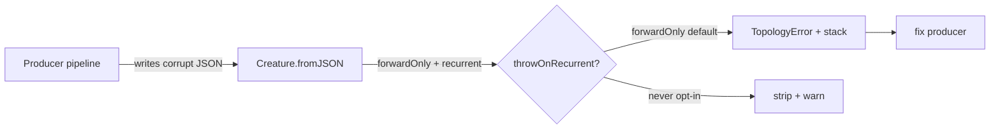

## Summary

Promote `Creature.loadFrom`'s recurrent-synapse strip from a silent warning to a
`TopologyError` throw by default for forward-only creatures. The old
strip-and-warn behaviour silently self-healed the runtime topology on every
load, hiding the producing pipeline's stack frame so the upstream corruption
that caused the 143 strip events on `@stsoftware/neat-ai 3.1.53`
(GRQ-3-rocket.log, 5 May 2026) was invisible. The new default surfaces the
offending edge so the producer can be fixed. Closes #2514.

A new `throwOnRecurrent: "always" | "forwardOnly" | "never"` option on both
`loadFrom` and `Creature.fromJSON` (default `"forwardOnly"`) gives repair tools
an explicit opt-out — `compactCreature`, the `applyChangeToCreature` family, the
legacy v0/v1/v2 upgrade pipeline, the `compact:*` repair helpers, and
`Creature.fromPersistedJSON` (the disk-load path) all pass
`throwOnRecurrent: "never"` with a code comment naming the bypass so they can
keep ingesting historic on-disk JSON safely.

The SemVer minor was bumped (`3.1.53 → 3.2.0`) and `CHANGELOG.md` was created
with a migration note for the breaking-by-default change.

## Evidence

This is a backend/library change with no UI surface — coverage is via unit tests
that exercise the throw default, the legacy strip path, and the message
contents.

Verified locally:

- `deno fmt --check` and `deno lint` pass
  (`./quality.sh
  --skip-tests --skip-discovery --skip-wasm` exits 0).
- `deno check mod.ts src/` passes (no type errors).
- `deno test --allow-all "test/creature/**/*.ts"` → 249 passed, 0 failed.
- `deno test --allow-all "test/discovery/**/*.ts" "test/compact/**/*.ts"
  "test/upgrade/**/*.ts" "test/ErrorGuidedStructuralEvolution/**/*.ts"
  "test/architecture/**/*.ts"`
  → 1292 passed, 0 failed.
- `deno test --allow-all "test/blackbox/**/*.ts" "test/breed/**/*.ts"
  "test/transfer/**/*.ts" "test/multithreading/**/*.ts"
  "test/intelligentDesign/**/*.ts" "test/optimize/**/*.ts"
  "test/predictiveCoding/**/*.ts" "test/reconstruct/**/*.ts"
  "test/fix/**/*.ts"`
  → 718 passed, 0 failed.
- The remaining test directories (`NEAT`, `cache`, `CRISPR`, `data`,
  `feedForward`, `lifecycle`, `methods`, `mutate`, `neuron`, `onnx`,
  `optimization`, `score`, `tag`, `utils`, `validate`, `wasm`, `workers`,
  `errors`, `propagate`, `fixtures`, `config`, `constants`, `costs`, `scripts`)
  → 4104 passed, 1 failed before reformat; failure was the `deno fmt --check`
  smoke test which was resolved by running `deno fmt` on the two affected test
  files. After reformat, `deno fmt --check` over all 2147 files passes cleanly.

## Test Plan

### New tests (this PR)

- `test/creature/LoadFromForwardOnlyThrow.ts` — four tests:
  - **Default behaviour throws on a forward-only creature with
    `output-0 → output-0`** (mirrors GRQ-3-rocket.log signature: `depth=0`,
    `fromUUID=output-0`).
  - **`throwOnRecurrent: "never"` preserves the legacy strip+warn** (warning
    emitted, no recurrent edge survives).
  - **`throwOnRecurrent: "always"` throws on a non-forward-only recurrent
    creature** (sanity-checks that the default lets recurrent creatures through
    and `"always"` opts into stricter checks).
  - **`loadFrom` throws synchronously and the error tags the source pipeline**
    (the `TopologyError` message includes `source=unit-test:throw-source` and
    the structural-hash fallback identifier).

### Modified tests (business-logic change)

The Issue #2514 default is by design _breaking_ — tests that were written around
the old strip-and-warn contract opt back into `throwOnRecurrent: "never"` so
they continue to verify the legacy path that repair tools still exercise:

- `test/creature/LoadFromObservability.ts` (Issue #2500 strip-warning
  observability — three tests).
- `test/creature/ForwardOnlyOutputRoundTrip.ts` — the `depth=<to-from>`
  warning-format test (one of five tests; the other four are unchanged).
- `test/architecture/ForwardOnlyLoadRepair.ts` — four legacy strip-and-repair
  tests (Issue #2090).
- `test/architecture/ForwardOnlySynapseGuard.ts` — two legacy strip-and-keep
  tests.

Coverage of the new throw default lives in
`test/creature/LoadFromForwardOnlyThrow.ts`.

### Production callers updated

These pipelines legitimately ingest corrupt input, so they pass
`throwOnRecurrent: "never"` with a code comment justifying the bypass:

- `src/compact/CompactCreature.ts`
- `src/compact/OrphanedNeuronCleanup.ts`
- `src/compact/DeadSubgraphPruning.ts`
- `src/upgrade/Upgrade.ts` (v0/v1 upgrade paths)
- `src/upgrade/UpgradeTwo.ts` (HYPOT/HYPOTv2 removal passes)
- `src/discovery/CandidateApplicationOps.ts` (`applyAddSynapses` /
  `applyAddNeurons` / `applyChangeSquash` / `applyRemoveSynapse` /
  `applyRemoveNeuron`).
- `src/architecture/ErrorGuidedStructuralEvolution/ApplyCoordinatedStructuralCandidate.ts`
- `src/Creature.ts`'s `fromPersistedJSON` (the disk-load path that may encounter
  genuinely historic on-disk JSON from older releases).
