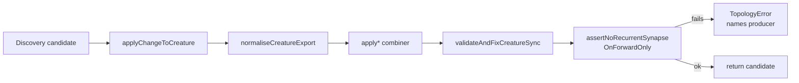

## Summary

Audit of `applyChangeToCreature` and `normaliseCreatureExport` for back-edge
introduction on forward-only creatures, per issue #2515. Wires
`assertNoRecurrentSynapseOnForwardOnly(...)` as a post-condition at every
combiner producer site so that any future corruption throws a `TopologyError`
naming the producing pipeline rather than surfacing as a downstream
`[loadFrom] Stripping recurrent synapse` warning. Closes #2515.

## Evidence

Backend-only change — no UI to screenshot. Verified via:

- Unit tests for `normaliseCreatureExport` (4 tests) covering round-trip
  exports, idempotent re-normalisation, output-id remapping, and UUID-keyed wire
  inputs. All assert the forward-only invariant (`from < to` against
  `buildIdToIndexMap`).
- Lifecycle integration tests covering every branch of `applyChangeToCreature`
  (8 tests): `add-synapses` (legal + adversarial), `add-neurons`,
  `change-squash`, `remove-synapse`, `remove-neuron`, and
  `coordinated-structural` (legal + adversarial).
- All 525 discovery tests and 158 lifecycle/ErrorGuidedStructuralEvolution tests
  still pass.
- `./quality.sh --lint-only` and `./quality.sh --check-only` are clean.

Producer tags wired in:

| Site                                  | Source tag in `TopologyError`                   |
| ------------------------------------- | ----------------------------------------------- |
| `applyAddSynapses`                    | `discovery:applyAddSynapses`                    |
| `applyAddNeurons`                     | `discovery:applyAddNeurons`                     |
| `applyChangeSquash`                   | `discovery:applyChangeSquash`                   |
| `applyRemoveSynapse`                  | `discovery:applyRemoveSynapse`                  |
| `applyRemoveNeuron`                   | `discovery:applyRemoveNeuron(<changeType>)`     |
| `applyCoordinatedStructuralCandidate` | `discovery:applyCoordinatedStructuralCandidate` |

## Test Plan

- `test/architecture/NormaliseCreatureExportForwardOnly.ts` — 4 tests.
- `test/lifecycle/ForwardOnlyApplyChangeLifecycle.ts` — 8 tests.
- Existing tests unchanged: `ForwardOnlyAssertion`, `ForwardOnlyLifecycle`,
  `CandidateApplicationOps`, `DiscoveryCandidatesForwardOnlyVersionBump`, all
  green.

Diagnostic note: `docs/issue-2515-forward-only-apply-audit.md` summarises the
audit, the producer tags, and the path that was confirmed (no current
introduction site found — the post-conditions are the load-bearing
defence-in-depth that names the producer if a regression ever lands).
