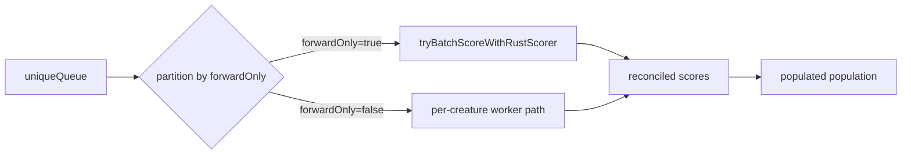

# Partition population by forwardOnly before invoking batch rust scorer

## Summary

`Fitness.calculate()` previously sent the entire deduplicated population to
`tryBatchScoreWithRustScorer()` in one call. The external `rust_scorer`
(NEAT-AI-scorer) rejects directory-mode batches that contain any
`forwardOnly=false` creature, so a single recurrent creature in a generation
poisoned the whole batch and forced the per-creature fallback for everything —
collapsing the once-per-generation performance benefit from Issue #2422.

This change partitions the unique creature queue by `forwardOnly` before the
batch attempt:

- Forward-only creatures take the batch path (one `rust_scorer` process per
  generation).
- Recurrent creatures take the per-creature worker path directly.
- When the forward-only subset is empty, the batch is skipped entirely (no
  temp dir, no spawn).
- A single INFO log line per generation summarises the partition.

Telemetry (`lastBatchScorerInvocations`, `lastScorerMs`,
`lastScoredCreatureCount`) accumulates across both paths so observability
remains accurate.

Closes #2517.

## Evidence

Backend-only change. The fix is verified by unit tests that exercise the
real `Fitness.calculate()` with a mocked `rust_scorer` runner and an
in-memory worker stub, asserting:

- The correct number of scorer processes spawned (or none at all).
- The exact UUID set written into the batch directory (recurrent UUIDs must
  not appear).
- The exact set of creatures the worker stub saw.
- That every creature in the population received a final score.

## Test Plan

New tests (`test/architecture/FitnessForwardOnlyPartition.ts`):

- `Fitness partition - all forwardOnly population batches every creature` —
  every creature reaches the batch directory, no worker calls.
- `Fitness partition - all recurrent population skips batch entirely` —
  scorer never spawned (`invocations === 0`), every creature scored via
  workers.
- `Fitness partition - mixed population batches forwardOnly only, recurrent
  via worker` — the batch directory contains exactly the forwardOnly UUIDs;
  workers see only the recurrent UUIDs; combined `lastScoredCreatureCount`
  covers the full population.
- `Fitness partition - batch failure on forwardOnly subset still scores
  recurrent via worker` — when batch reconciliation fails, the worker path
  re-scores everything (forwardOnly fallback + recurrent).

Updated test (`test/NEAT/FitnessBatchRustScorer.ts`):

- `buildPopulation()` now sets `forwardOnly: true` on the synthetic
  creatures so the existing "one scorer process per generation" test
  exercises the batch path under the new partition contract. Documented in
  the test file.

Existing tests unchanged and still passing:

- `test/score/BatchRustScorerBridge.ts` (full batch bridge contract)
- `test/architecture/Fitness*.ts` (telemetry, dynamic pool, busy-wait,
  topology grouping, WASM-panic recovery, typed errors, fast-pool
  evaluation)

Full quality gate (`./quality.sh --skip-discovery --skip-wasm`) passes:
`6418 passed | 0 failed | 4 ignored`.
