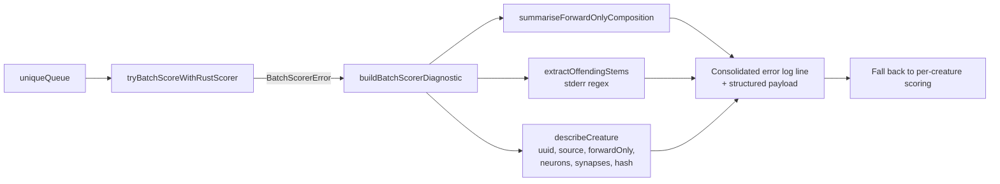

## Summary

Enriches batch rust scorer failure log lines with structured diagnostics so the
producer of a bad creature can be traced from a single log entry. When
`tryBatchScoreWithRustScorer` fails, the `Fitness.calculate` catch block now
extracts every offending creature UUID from the rust scorer's stderr (and from
the typed `BatchScorerError`'s `missingKeys` / `extraKeys` / `malformedKeys`),
cross-references each one against the in-memory population to attach the
`source` tag, `forwardOnly` flag, and neuron / synapse counts, and emits one
consolidated `error` line that also includes the population's `forwardOnly`
composition. The per-creature detail list is capped at 10 entries with a
`+N more` suffix to keep logs readable on large generations.

Closes #2518.

## Evidence

Backend / CLI change — no UI to screenshot. Verified by:

- New unit suite `test/score/BatchScorerDiagnostics.ts` (11 cases) exercises
  every helper directly against synthesised stderr blobs and creature
  populations.
- Existing integration test `test/NEAT/FitnessBatchRustScorer.ts` confirms the
  enriched log line is emitted from `Fitness.calculate`'s catch block. Sample
  output captured during the run:

  ```
  [NEAT-AI] Batch rust scorer reconciliation failed (MISSING_KEYS): … ;
  Batch scorer rejected 3 creature(s) (forwardOnly=true=0, forwardOnly=false=3):
    [uuid=a58ef313-… forwardOnly=false neurons=4 synapses=2,
     uuid=348d6af7-… forwardOnly=false neurons=4 synapses=2,
     uuid=d548c2dd-… forwardOnly=false neurons=4 synapses=2];
    falling back to per-creature scoring.
  ```

- Full `./quality.sh --skip-discovery --skip-wasm` run: **6414 passed, 0 failed,
  4 ignored**.



## Test Plan

Added `test/score/BatchScorerDiagnostics.ts` covering:

- Single-offender UUID extraction from a synthesised rust stderr blob.
- Multiple-offender extraction with deduplication and order preservation.
- Empty / undefined / non-matching stderr returning `[]`.
- Composition counters for all-forwardOnly, mixed, and all-recurrent
  populations.
- End-to-end `buildBatchScorerDiagnostic` enrichment from stderr (with `source`
  tag).
- End-to-end enrichment from typed `BatchScorerError` keys (`missingKeys` +
  `malformedKeys`).
- Cap-at-10 truncation with `+N more` suffix and verification that the 11th
  onwards stems are not embedded as detail entries.
- Unknown stem fallback when stderr names a UUID not in the in-memory
  population.
- Composition is always emitted even when no offenders can be identified.

Existing tests in `test/score/BatchRustScorerBridge.ts`,
`test/score/BatchScorerReconciler.ts`, and `test/NEAT/FitnessBatchRustScorer.ts`
continue to pass.

## Pre-PR Security Self-Check

- [x] Input validation: stderr regex anchors on the canonical UUID shape and the
      `.json` extension; no shell or SQL surface introduced.
- [x] Secrets: no credentials staged; only UUIDs, tags, and topology counts in
      log output.
- [x] Injection surface: none — diagnostics consume strings, not commands or
      queries.
- [x] Output encoding: log line is plain text emitted via the project `Logger`
      abstraction.
- [x] Authentication / authorisation: no new privileged operations.
- [x] Error handling: enriched diagnostic does not leak file paths or stack
      traces; falls back gracefully when stderr has no UUID reference.
- [x] Dependencies: no new third-party deps.
