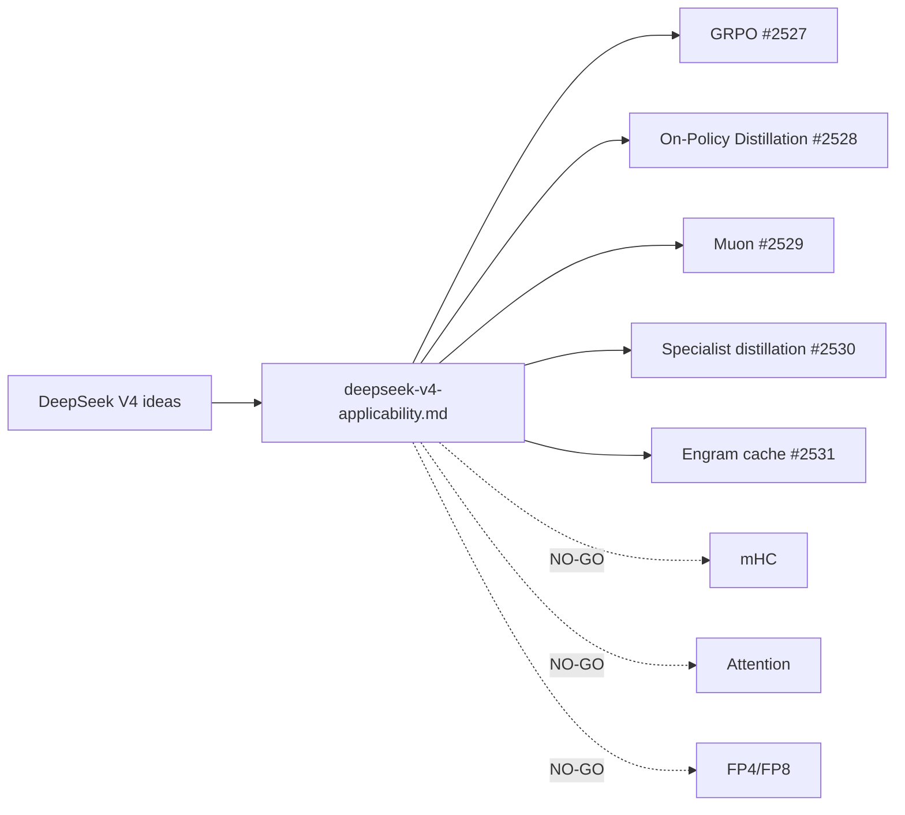

# PR Summary — Issue #2526

## Summary

Adds the foundation research note `docs/research/deepseek-v4-applicability.md`
that maps each notable DeepSeek V4 technique onto NEAT-AI's existing
architecture. Each of the eight V4 ideas listed in the issue (GRPO, On-Policy
Distillation, Muon, specialist + generalist distillation, mHC, Engram,
CSA + HCA attention, FP4/FP8 QAT) gets a one-paragraph technical summary,
the closest NEAT-AI module/concept, a GO / NO-GO recommendation with
projected experiment, an effort estimate (S/M/L), and a screening against
the UUID-stability and semantic-version invariants in `AGENTS.md`.

GO ideas link to the existing experimental sub-issues (#2527 GRPO,
#2528 OPD, #2529 Muon, #2530 specialist distillation, #2531 Engram). NO-GO
ideas (mHC, attention, FP4/FP8) are documented with the rationale for not
pursuing them at this time.

Documentation only — no source-code changes. Closes #2526.

## Evidence

This is a documentation-only change with no UI surface and no performance
implications. Verification:

- `./quality.sh --lint-only < /dev/null` passes (formatting + linting +
  bash check).
- The new file is the only addition under `docs/research/`.

The summary Mermaid diagram (rendered natively on GitHub) shows the V4
idea → NEAT-AI module mapping required by the acceptance criteria:

## Test Plan

- [x] `./quality.sh --lint-only < /dev/null` passes (formatting +
      linting + bash check) — required by the issue acceptance criteria.
- [x] Acceptance criteria covered:
  - All eight V4 ideas documented.
  - Each idea has a GO or NO-GO recommendation with rationale.
  - Each GO recommendation links to its experimental sub-issue.
  - Summary Mermaid diagram present.
  - No source-code changes — verified by
    `git diff --name-only origin/Develop...HEAD` listing only files under
    `docs/`.
