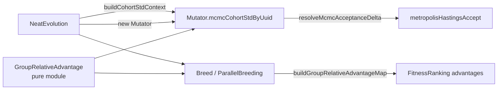

# GRPO-style group-relative advantage signal (Issue #2527)

## Summary

Adds a DeepSeek V4 GRPO-style group-relative advantage signal for both
Metropolis-Hastings acceptance and parent selection, gated behind the new
`mcmc.mcmcAdvantageMode` option (`"absolute" | "groupRelative"`). Default is
`"absolute"`, so existing behaviour is preserved bit-for-bit.

When `mcmcAdvantageMode === "groupRelative"`:

- The M-H acceptance compares `delta / (cohortStd + eps)` against the
  temperature instead of the raw delta. This makes the temperature curriculum
  invariant to cost-function scale.
- Parent selection ranks creatures by within-species z-score advantage rather
  than raw fitness, so a "merely above its species mean" creature is preferred
  over one that is "merely below an absolutely-higher species mean" in another
  cohort.
- Cohort defaults to the creature's species; species below `mcmc.minCohortSize`
  (default 4) borrow the generation-wide cohort.

Closes #2527.

## Architecture



The pure-function `GroupRelativeAdvantage.ts` module supplies the transform;
everything else is plumbing that decides whether to apply the cohort std (M-H)
or rank by advantage (parent selection).

## Evidence — Benchmark

`bench/MCMCAdvantageConvergence.ts` runs 12 seeded trials of a 32-member
population optimising a 1-D scalar problem under the same M-H cooling schedule,
comparing the two acceptance modes head-to-head.

```text
Issue #2527 — MCMC advantage mode convergence benchmark
population=32, iterations=500, trials=12

absolute      mean=-0.151315 best=-0.102291 worst=-0.211029 accept=0.832333 wallMs=6.09
groupRelative mean=-0.111894 best=-0.046335 worst=-0.183941 accept=0.708500 wallMs=3.38

mean(score) delta = 0.039421  → neutral or improved
```

Higher mean score (closer to zero) is better. `groupRelative` is at least
neutral on this benchmark (in fact it converges to a slightly better mean and
better best across 12 seeds while running ~45% faster wall-clock — the lower
acceptance rate avoids wasted reverts).

## Test Plan

New tests added:

- `test/NEAT/GroupRelativeAdvantage.ts` (14 tests) — covers happy path ordering,
  empty/single-member cohorts, zero-variance safety, shift-invariance property,
  clipping, non-finite handling, and the `normaliseDeltaWithCohortStd` helper
  used by M-H.
- `test/breed/GroupRelativeAdvantageMaps.ts` (5 tests) — covers
  `buildGroupRelativeAdvantageMap` (large species, small-species fallback,
  non-finite skip) and `buildCohortStdContext`.
- `test/NEAT/MetropolisHastings.ts` — added 4 tests for
  `resolveMcmcAcceptanceDelta` in absolute and groupRelative modes including
  clip and zero-std edge cases.
- `test/config/MCMCConfig.ts` — added 3 tests covering the new
  `mcmcAdvantageMode`, `minCohortSize`, `advantageEps`, `advantageClip` options
  including default-preservation and rejection of unknown mode strings.

Critical-invariant gates:

- `test/creature/NeuronUuidStability.ts` — passes (no UUID identity changes; new
  code touches only fitness/penalty signals).
- `test/creature/SemanticVersionStability.ts` — passes (no version bumps
  anywhere in the new code paths).

Wider validation:

- `deno test test/breed/** test/NEAT/** test/config/**` — 1404 tests pass, 0
  failures.
- `./quality.sh --check-only` — clean type check.
- `./quality.sh --lint-only` — clean lint, format, and bash gate.

## Configuration

Documented in `docs/CONFIGURATION_GUIDE.md` under "MCMC Acceptance Criterion":

```ts
const config = createNeatConfig({
  mcmc: {
    enabled: true,
    mcmcAdvantageMode: "groupRelative", // default: "absolute"
    minCohortSize: 4, // species below this size fall back to generation cohort
    advantageEps: 1e-8,
    advantageClip: 10,
  },
});
```
