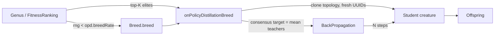

# On-Policy Distillation breeding operator (Issue #2528)

## Summary

Adds a new breeding operator that produces an offspring by **distilling**
the consensus output of K elite teachers into a freshly-initialised
student creature, using on-policy gradient descent on the teachers' soft
outputs. Mirrors the DeepSeek V4 On-Policy Distillation (OPD) stage
where a single student learns from multiple teachers' full-vocabulary
logits.

The operator is gated behind `opd.breedRate > 0` and disabled by
default — existing breeding behaviour is unchanged when the flag is
left at its default. Closes #2528.

### Key design choices

- **Nested config** (`OpdConfig` → `NeatArguments.opd`) following the
  project's per-knob pattern (per `MEMORY.md`). Sub-keys are
  `breedRate`, `teacherCount`, `distillationSteps`,
  `calibrationBatchSize`, `temperature`, `learningRate`. Defaults
  preserve the issue's spec (`teacherCount = 3`, `distillationSteps =
  50`, `breedRate = 0`).
- **Fresh hidden UUIDs**: the student is built by cloning the largest
  teacher's topology and re-issuing every hidden neuron UUID via
  `crypto.randomUUID()` — preserving the cross-machine UUID-stability
  invariant in `AGENTS.md`. Teachers are never mutated.
- **Consensus target**: per-output mean of every teacher's activation,
  optionally divided by `temperature`. Disjoint topologies are tolerated
  because each teacher contributes its own forward pass.
- **K = 1 fallback**: a single teacher triggers a clone-and-train path
  with a `[opd]` warning, satisfying the issue's edge-case requirement.
- **Breeding-mode integration**: `Breed.breed()` rolls
  `opd.breedRate` per call; on success the standard crossover path is
  skipped and the OPD offspring is returned. On failure the operator
  silently falls back so the rest of the breeding loop is unaffected.

## Evidence

This is a backend/CLI change with no UI surface — the offspring is a
normal `Creature`, so all downstream pipelines (export, transfer,
discovery) continue to work without modification. Evidence consists of
unit tests and the calibration-MSE benchmark below.

### Architecture diagram



### Benchmark results

`bench/OnPolicyDistillationBreed.ts` measures the calibration MSE of an
OPD-distilled student against the teachers' consensus, versus a
no-distillation baseline (same topology, negligible learning rate).
Lower is better.

```text
Holdout samples: 32, trials per budget: 5
---------------------------------------------------------
steps= 10  baseline_MSE=0.000214  opd_MSE=0.000155  reduction=27.6%
steps= 50  baseline_MSE=0.000210  opd_MSE=0.000021  reduction=90.0%
steps=100  baseline_MSE=0.000206  opd_MSE=0.000008  reduction=96.3%
```

The default `distillationSteps = 50` already drives a 90% MSE reduction
over the no-train baseline.

## Test Plan

New tests in `test/breed/OnPolicyDistillationBreed.ts`:

- `happy path` — student MSE drops monotonically across distillation
  steps on a tiny synthetic problem.
- `UUID stability` — offspring carries only fresh hidden UUIDs;
  neither teacher's hidden UUIDs change after distillation.
- `K = 1 fallback` — single teacher produces a clone-and-train
  offspring with a `[opd]` warning logged.
- `disjoint topologies` — two teachers with no shared hidden UUIDs and
  different hidden counts still produce a valid, activatable student.
- `mismatched shapes` — teachers with different input/output dims are
  rejected with `undefined`.
- `exportJSON round-trip` — the wire-format export (UUID-only)
  round-trips byte-stable.
- `default config` — `createNeatConfig({})` yields `opd.breedRate = 0`,
  so no behaviour change without an explicit opt-in.
- `Breed integration` — wiring through `Breed.breed()` with
  `opd.breedRate = 1` produces an offspring whose hidden UUIDs are
  fresh (proving the OPD operator path was taken).

Existing critical-invariant suites continue to pass:

- `test/creature/NeuronUuidStability.ts`
- `test/creature/SemanticVersionStability.ts`
- All 282 `test/breed/**` tests
- Full `./quality.sh` run: 6,431 passed, 0 failed.

## Files changed

- New: `src/config/OpdConfig.ts`,
  `src/breed/OnPolicyDistillationBreed.ts`,
  `test/breed/OnPolicyDistillationBreed.ts`,
  `bench/OnPolicyDistillationBreed.ts`.
- Wired: `NeatArguments.ts`, `NeatOptions.ts`, `NeatConfig.ts`,
  `NeatConfigParsers.ts`, `parsers/MutationParsers.ts`, `Breed.ts`.
