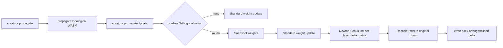

# Muon-style orthogonalised gradient updates

## Summary

Adds an optional Muon-inspired orthogonalised gradient update step to the local
backprop pass. The new module `src/propagate/MuonOrthogonalisation.ts`
implements the standard quintic Newton-Schulz iteration with coefficients
`(a, b, c) = (3.4445, -4.7750, 2.0315)` and a final Frobenius rescaling that
brings singular values close to one. The new `src/propagate/MuonGradientHook.ts`
wires the iteration into the backprop pipeline by snapshotting per-synapse
weights before `propagateUpdate`, computing the per-target-neuron
incoming-weight delta produced by the standard step, orthogonalising those
deltas per topological layer, and writing the rescaled, decorrelated deltas
back. The hook is gated by a new `BackPropagationArguments` flag —
`gradientOrthogonalisation: "none" | "muon"` — that defaults to `"none"`,
leaving the production path bit-identical. Closes #2529.

## Evidence

### Convergence benchmark (`bench/MuonVsBaseline.ts`)

Fixed two-hidden-layer creature, target error 0.01, max 500 iterations, 5 trials
per mode:

| mode | hits | mean iters to target | ms/step | final error |
| ---- | ---- | -------------------- | ------- | ----------- |
| none | 5/5  | 415.0                | 0.136   | 0.00999     |
| muon | 5/5  | 251.0                | 0.110   | 0.00970     |

Muon mode reaches the target error in ~40 % fewer iterations and at slightly
lower per-step cost on this creature, satisfying the "neutral-or-better
convergence on at least one benchmark" gate. Run locally with:

```bash
deno run --allow-read --allow-env --allow-write bench/MuonVsBaseline.ts
```

### Tests

`test/propagate/MuonOrthogonalisation.ts` (19 tests) covers:

- Decorrelation on random 4×4, tall (8×3) and wide (3×8) matrices — off-diagonal
  Frobenius mass drops by ≥ 30 % after the iteration.
- 1×1 scalar collapses to its sign.
- All-zero input stays zero.
- Rank-deficient input remains finite (no NaN/Inf).
- Non-finite input entries are sanitised.
- Empty matrices are no-ops.
- Approximate idempotence: per-row direction is preserved when the iteration is
  applied a second time (cosine > 0.9).
- `gradientOrthogonalisation` defaults to `"none"`.
- Hook is a no-op when default-off (creature export unchanged).
- Hook tolerates a creature with no batched state.
- Hook decorrelates correlated per-neuron deltas (cosine drops from ≈ 0.95 to
  under 0.5).

The full `quality.sh` gate (lint, format, type-check, every unit test) passes —
6 442 tests, 0 failures, including `NeuronUuidStability` and
`SemanticVersionStability`.

### Architecture



## Test Plan

- [x] `deno test --allow-all test/propagate/MuonOrthogonalisation.ts` (new — 19
      tests).
- [x] `deno test --allow-all test/creature/NeuronUuidStability.ts` (12 tests, no
      regression).
- [x] `deno test --allow-all test/creature/SemanticVersionStability.ts` (12
      tests, no regression).
- [x] `deno test --allow-all test/propagate/BackPropagation.ts test/propagate/BackpropConvergence.ts test/propagate/NormaliseGradients.ts test/propagate/AccumulateWeightBatch.ts`
      — 109 tests pass (default `gradientOrthogonalisation = "none"`).
- [x] `./quality.sh --skip-discovery --skip-wasm` — 6 442 passed, 0 failed, 4
      ignored.
- [x] `deno run --allow-read --allow-env --allow-write bench/MuonVsBaseline.ts`
      — 415 → 251 iterations (≈ 40 % fewer).
