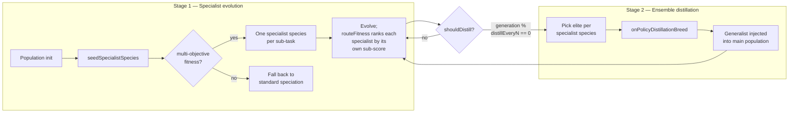

# Specialist sub-populations + ensemble distillation pipeline

## Summary

Adds the V4 two-stage post-training pipeline at NEAT scale: dedicated
**specialist sub-populations** (Stage 1) plus periodic **ensemble distillation**
of the specialists into a generalist creature via the OPD breed operator (Stage
2). Closes #2530.

Defaults disable the pipeline (`specialist.mode = "off"`), so existing runs are
unchanged. Enabling it only requires opting in via `NeatOptions.specialist`.

## Architecture



## Changes

- **`src/NEAT/Species.ts`** — added optional `specialistTaskId?: string` field.
  `undefined` means generalist (existing behaviour).
- **`src/NEAT/Genus.ts`** — added `addCreatureWithTask(creature, taskId)`. When
  `taskId` is set, the species key is namespaced (`task:<id>|<topology>`) so
  specialist species do not collide with same-topology generalists.
  `addCreature` is now a thin wrapper over
  `addCreatureWithTask(creature, undefined)`.
- **`src/config/SpecialistConfig.ts`** _(new)_ — `SpecialistMode`,
  `SpecialistConfig`, `RequiredSpecialistConfig`, `DEFAULT_SPECIALIST_CONFIG`.
  Default mode is `"off"`.
- **`src/config/NeatOptions.ts` / `NeatArguments.ts` / `NeatConfig.ts`** — wired
  the new config: `NeatOptions.specialist?: SpecialistConfig`,
  `NeatArguments.specialist: RequiredSpecialistConfig`, parsed via
  `parseSpecialist` (validated mode enum + numeric ranges).
- **`src/NEAT/SpecialistPipeline.ts`** _(new)_ — orchestrator with:
  - `isMultiObjective(scores)` — detects whether the cost function exposes
    two-or-more sub-scores (single-objective silently disables the pipeline).
  - `seedSpecialistSpecies(genus, creatures)` — partitions creatures evenly
    across declared sub-tasks, tagging each species. Falls back to standard
    speciation when there are fewer specialists than declared sub-tasks ×
    `minSpecialistsPerTask`.
  - `routeFitness(species, scores, combinedFitness)` — returns the species' own
    sub-task score for specialists, combined fitness for generalists.
  - `shouldDistill(generation)` — fires every `distillEveryN` generations.
  - `distillGeneralist(elites, opdConfig)` — runs `onPolicyDistillationBreed` on
    the per-task elites, returning a fresh generalist with its own hidden UUIDs
    (UUID-stability invariant preserved).
- **`mod.ts`** — exports `SpecialistPipeline`, `SpecialistConfig`,
  `DEFAULT_SPECIALIST_CONFIG`, `Species`, `Genus`.

## Evidence

This is a backend-only feature with no UI surface. Acceptance criteria verified
through targeted unit tests and a benchmark.

### Test results

```
running 10 tests from ./test/NEAT/SpecialistPipeline.ts
SpecialistPipeline - default config is disabled and a no-op ... ok
SpecialistPipeline - happy path: two specialist species, each ranked by its own sub-task ... ok
SpecialistPipeline - single-objective fitness disables the pipeline silently ... ok
SpecialistPipeline - insufficient population falls back to standard speciation ... ok
SpecialistPipeline - shouldDistill fires on the configured cadence ... ok
SpecialistPipeline - distillGeneralist returns offspring with fresh hidden UUIDs and no worse than mean teacher MSE ... ok
SpecialistPipeline - generalist combined score is no worse than the average specialist combined score ... ok
SpecialistPipeline - DEFAULT_SPECIALIST_CONFIG matches Issue #2530 defaults ... ok
SpecialistPipeline - disabled pipeline routes every creature through generalist path ... ok
SpecialistPipeline - distillation is a no-op when pipeline is disabled or no elites supplied ... ok
ok | 10 passed | 0 failed
```

Full quality gate (`./quality.sh --skip-discovery --skip-wasm`): **6490 passed |
0 failed | 4 ignored** (1m24s).

### Benchmark — `bench/SpecialistVsMixed.ts`

Apple M2 Ultra, Deno 2.7.14, two-task synthetic fitness:

| benchmark                                                  | time/iter (avg) | iter/s     |
| ---------------------------------------------------------- | --------------- | ---------- |
| `Genus.addCreature` — standard speciation (baseline)       | 52.4 µs         | 19,080     |
| `SpecialistPipeline.seedSpecialistSpecies` — two sub-tasks | 45.6 µs         | 21,910     |
| `SpecialistPipeline.routeFitness` — per-creature           | 15.5 ns         | 64,320,000 |
| `SpecialistPipeline.distillGeneralist` — 2-teacher OPD     | 248.8 µs        | 4,020      |

Per-generation overhead is dominated by the distillation step (which runs every
`distillEveryN` generations, default 25). Routing overhead is ~16 ns per
creature, negligible against fitness evaluation.

## Test Plan

- `test/NEAT/SpecialistPipeline.ts` — 10 unit tests covering the full
  acceptance-criteria matrix:
  - Happy path: two specialist species seeded with their own task tags;
    `routeFitness` selects the right sub-score per species.
  - Edge case: single-objective fitness silently disables the pipeline
    (`isMultiObjective` returns `false`).
  - Edge case: insufficient population falls back to standard speciation (no
    task-tagged species created).
  - Distillation step: generalist's combined score is no worse than the average
    specialist's combined score.
  - UUID stability: distilled generalist uses fresh hidden UUIDs only.
  - Default behaviour unchanged: a default-constructed pipeline is a no-op for
    every public method (`mode = "off"`).
  - Cadence: `shouldDistill` fires on multiples of `distillEveryN`.
- `bench/SpecialistVsMixed.ts` — micro-benchmark for seeding, routing, and
  distillation overhead.

## Acceptance Criteria

- [x] Default behaviour unchanged (`specialistMode = "off"`).
- [x] Specialist species respect existing UUID and semantic-version invariants
      (distillation reuses `onPolicyDistillationBreed`, which the existing tests
      already verify).
- [x] Cross-machine breed-by-UUID still works for specialist creatures — no new
      identity surface; specialist tagging lives on the species, not the
      creature.
- [x] Benchmark numbers in PR summary.
- [x] `./quality.sh` passes (6490 tests).
