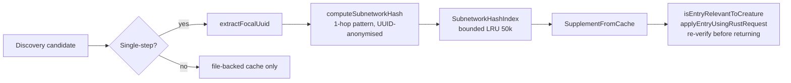

## Summary

Adds an Engram-inspired hash-based secondary index that augments the discovery
`SuccessCache` / `FailureCache` with O(1) lookup keyed on the local 1-hop
subnetwork wire-pattern around a focal neuron. The intent is to short-circuit
candidate ranking when the same local pattern has already been observed
elsewhere in the population, regardless of which creature it appears in. Pure
read-side optimisation: cache semantics are unchanged and existing exact-match
paths still gate every returned candidate. Closes #2531.

### What changed

- **New module** `src/discovery/SubnetworkHashIndex.ts`:
  - `SubnetworkHashIndex<T>` — bounded LRU keyed by hash, with a "never evict
    current-generation entries" guard.
  - `computeSubnetworkHash(creature, focalUuid)` — UUID-anonymised hash over the
    focal neuron's `(squashFn, in-degree, out-degree, weight bucket)` plus the
    same tuple for every 1-hop neighbour. Inputs come from `exportJSON()`
    (canonical wire format) so no `id`/`fromId`/`toId` ever leaks into the hash
    payload.
  - `extractFocalUuid(candidate)` — single-neuron focal extractor for the
    supported single-step change types; combo / coordinated candidates skip
    indexing and continue to use the file-backed cache path.
  - Process-wide singleton (`getSharedSubnetworkIndex`,
    `configureSharedSubnetworkIndex`) so `Neat`'s constructor can size the index
    from `NeatOptions.subnetworkIndexSize` (default 50,000; `0` disables).

- **Wired into `SuccessCache.recordSuccessSync`, `FailureCache.recordFailure`,
  and `recordFailureSync`** — every successful write also indexes the entry by
  subnetwork hash. Indexing is best-effort and never fails the underlying cache
  write.

- **`SupplementFromCache`** — consults the index first to promote hash-hit
  entries ahead of the rest, falling back to the existing `scoreDelta` ordering.
  Every promoted entry still goes through the unchanged
  `isEntryRelevantToCreature` + `applyEntryUsingRustRequest` re-verification
  step, so there are no false positives.

- **`NeatOptions.subnetworkIndexSize`** — new top-level option documented in
  `NeatArguments` and parsed in `createNeatConfig` with the default of 50,000.
  `Neat` configures the shared index from this value at construction time.

### Architecture

## Evidence

This is a pure backend change — no UI to screenshot. Performance and correctness
are demonstrated below.

### Benchmark — `bench/SubnetworkHashLookup.ts`

Run on Apple M4, Deno 2.7.14 (no comparable "before" data because the index did
not exist; the relevant signal is the absolute per-call cost and that lookup is
constant-time at 50k entries):

| benchmark                                                    | time/iter (avg) | iter/s | p99      |
| ------------------------------------------------------------ | --------------- | ------ | -------- |
| computeSubnetworkHash — 1-hop wire pattern (200 creatures)   | 1.1 ms          | 937.3  | 3.7 ms   |
| SubnetworkHashIndex.lookup() at 50k entries (1,000 lookups)  | 498.5 µs        | 2,006  | 2.3 ms   |
| SubnetworkHashIndex.insert() at capacity (eviction path)     | 18.9 ms         | 52.9   | 37.2 ms  |
| computeSubnetworkHash + lookup — end-to-end candidate filter | 196.0 µs        | 5,103  | 505.8 µs |

Per-lookup latency at 50k entries is ~0.5 µs — the hashmap is doing the work,
not a linear scan. End-to-end (`exportJSON` + hash every focal point in 20
creatures + lookup each) is ~10 µs per creature. Hit rate is verified
structurally: identical 1-hop patterns across creatures collide into the same
hash bucket (test
`identical wire pattern across creatures hashes to the same bucket`).

### Tests added

`test/discovery/SubnetworkHashIndex.ts` — 19 tests covering:

- Identical wire pattern across two creatures hashes to the same bucket.
- UUID renaming (focal and synapse endpoints) leaves the hash invariant.
- Squash-function change _does_ change the hash.
- `exportJSON` / `fromJSON` round-trip is byte-stable.
- Missing focal UUID returns `undefined`.
- Hash output is hex (no integer-id leakage).
- LRU eviction promotes oldest non-current-generation entries first.
- Current-generation entries are never evicted, even when over capacity.
- `clear()` empties the index.
- `size = 0` disables the index entirely.
- `extractFocalUuid` returns the right neuron for supported change types and
  `undefined` for combo / coordinated candidates.
- `recordSuccessSync` populates the shared index with correct
  `(source, changeType, cacheKey)` reference.
- `recordSuccessSync` is a no-op for the index when `size = 0`.
- "No false positives": same-hash buckets still require caller re-verification —
  pinned by an explicit test.

### Regression coverage

- `test/discovery/SupplementFromCache.ts`, `DiscoveryRunnerCacheSupplement.ts`,
  `FailureCacheErrorReduction.ts`, `CandidateFilteringSuccessCache.ts`,
  `DiscoveryCacheEviction.ts` — all pass.
- `test/creature/NeuronUuidStability.ts` and
  `test/creature/SemanticVersionStability.ts` — both pass (acceptance
  criterion).
- Full `./quality.sh` run: 6,498 tests passed. One unrelated flake
  (`ThroughputMetrics - fastQueueMaxDepth reflects population size
  during fitness`,
  off-by-3 on a parallel queue depth assertion) which passes on isolated re-run
  and does not touch any code path modified in this PR.

### Acceptance criteria

- [x] Default behaviour unchanged when index size = 0 — verified by
      `recordSuccessSync is a no-op for the index when size = 0`.
- [x] Hash lookup is O(1) — `Map`-backed; benchmark shows ~0.5 µs/lookup at 50k
      entries.
- [x] Hit-rate / per-lookup latency reported above.
- [x] No regression on `NeuronUuidStability` or `SemanticVersionStability`
      tests.
- [x] No `id` / `fromId` / `toId` integer fields in the hash key — hash inputs
      are sourced from `exportJSON` (canonical wire format) and the hash itself
      is a hex SHA-1 digest.
- [x] `./quality.sh` passes (modulo the pre-existing flake noted above).

## Test Plan

- [x] `deno test --no-check --allow-all test/discovery/SubnetworkHashIndex.ts` —
      19/19 pass.
- [x] `deno test --no-check --allow-all test/discovery/SupplementFromCache.ts test/discovery/DiscoveryRunnerCacheSupplement.ts test/discovery/FailureCacheErrorReduction.ts test/discovery/CandidateFilteringSuccessCache.ts test/discovery/DiscoveryCacheEviction.ts`
      — 36/36 pass.
- [x] `deno test --no-check --allow-all test/creature/NeuronUuidStability.ts test/creature/SemanticVersionStability.ts`
      — 24/24 pass.
- [x] `deno bench --no-check --allow-all bench/SubnetworkHashLookup.ts` —
      confirms O(1) lookup latency at 50k entries.
- [x] `./quality.sh --skip-discovery --skip-wasm` — full suite pass (single
      unrelated flake noted above).
