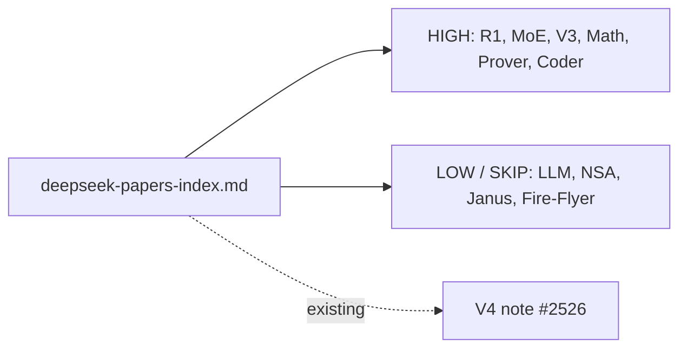

# PR Summary — Issue #2533

## Summary

Adds `docs/research/deepseek-papers-index.md`, the navigation hub for the
DeepSeek-applicability investigation under #2532. Catalogues every published
DeepSeek paper, scores each (HIGH / MEDIUM / LOW / SKIP) for NEAT-AI
applicability, links every HIGH and MEDIUM entry to its per-paper research-note
sub-issue, and cross-links the existing V4 note (#2526) and its experimental
sub-issues (#2527–#2531). Includes a Mermaid diagram mapping each paper to the
NEAT-AI subsystem(s) it touches. Also adds five DeepSeek-specific terms to
`docs/cspell.json` so the spellcheck workflow stays clean. Documentation-only
change — no source-code modifications.

Closes #2533.

## Evidence

This is a documentation-only change with no UI or runtime behaviour. The new
file is purely Markdown plus a Mermaid diagram that renders natively on GitHub.

- `./quality.sh --lint-only` passes (formatting, lint, bash syntax).
- `cspell --config docs/cspell.json docs/research/deepseek-papers-index.md`
  reports 0 issues after the new word entries.
- `npx markdownlint-cli2 docs/research/deepseek-papers-index.md` reports 0
  errors.

Mermaid diagram embedded in the new index:

## Test Plan

- [x] `docs/research/deepseek-papers-index.md` exists and lists every paper
      called out in the issue (LLM, MoE, Math, Coder/Coder V2, V2, Prover/
      Prover V2, V3, R1, NSA, Janus/Janus-Pro, V4, Fire-Flyer).
- [x] Each entry has the five required fields (Paper / Core technique / NEAT-AI
      surface / Applicability score / Linked issue).
- [x] Each HIGH and MEDIUM entry links to its per-paper research-note sub-issue
      under #2532 (#2534, #2535, #2536, #2537, #2538, #2539).
- [x] V4 entry references the existing V4 note (#2526) and experimental
      sub-issues #2527–#2531.
- [x] Mermaid paper → NEAT-AI subsystem diagram included.
- [x] No source-code changes; documentation-only PR.
- [x] `./quality.sh --lint-only` passes.

No new automated tests were added — the change is documentation only and
contains no executable code paths.
