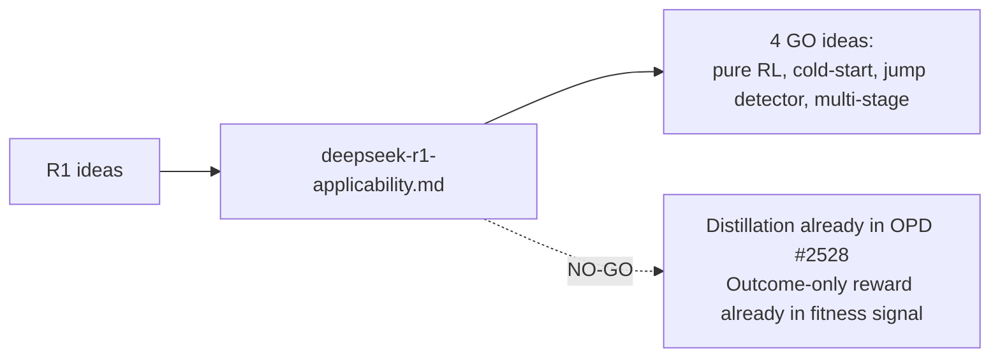

# PR Summary — Issue #2534

## Summary

Adds `docs/research/deepseek-r1-applicability.md`, a documentation-only research
note that maps the six headline DeepSeek R1 ideas (pure RL, cold-start SFT,
distillation, "aha moments", outcome-only reward, multi-stage pipeline) onto
NEAT-AI's evolution + breeding + backprop pipeline. Each idea gets a
one-paragraph technical summary citing the R1 paper, the closest existing
module, a GO / NO-GO recommendation with rationale, an effort/risk estimate
against the AGENTS.md UUID-stability and semantic-version invariants, and — for
every GO — a proposed experimental sub-issue title and outline (the sub-issues
themselves are deferred to the next planning round, per the issue brief).

The note explicitly compares against the existing OPD breed (#2528) so the
distillation idea is not duplicated, and includes a Mermaid diagram of the R1
idea → NEAT-AI module mapping.

Closes #2534.

## Evidence

This is a documentation-only PR — no source-code changes, no UI, no performance
metric to benchmark. The `./quality.sh --lint-only` gate passes (formatting +
linting + bash syntax checks). `deno fmt` reflowed the new research note's
tables and bullet structure on first run; no further diffs after re-running.

The Mermaid R1-idea → NEAT-AI-module diagram is embedded in the new research
note and renders natively on GitHub.

## Test Plan

- `./quality.sh --lint-only < /dev/null` passes (verified locally; output shows
  the new file picked up by `deno fmt` and `deno lint` with no errors).
- No new code or test changes; documentation only.
- Acceptance-criteria self-check (from #2534):
  - [x] `docs/research/deepseek-r1-applicability.md` exists and covers all six
        ideas.
  - [x] Each idea has GO or NO-GO with one-paragraph rationale.
  - [x] Each GO recommendation includes a proposed experimental sub-issue title
        and outline (not yet created).
  - [x] Differences vs. the existing OPD breed (#2528) are documented in a
        comparison table to avoid duplication.
  - [x] Mermaid diagram of R1 idea → NEAT-AI module mapping included.
  - [x] No source-code changes; documentation-only PR.
  - [x] `./quality.sh --lint-only` passes.
