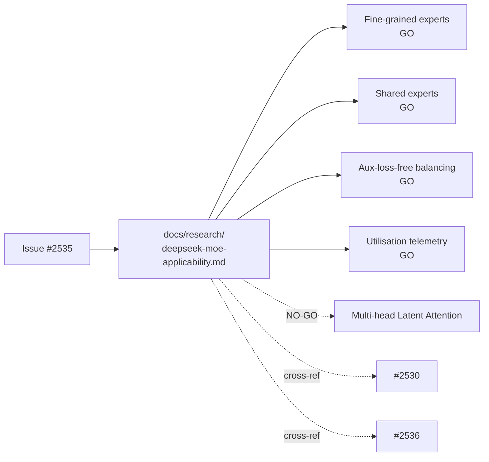

## Summary

Adds the DeepSeek MoE (V1 + V2) applicability research note at
`docs/research/deepseek-moe-applicability.md`. The note maps the five
headline ideas from DeepSeekMoE (V1) and DeepSeek-V2 — fine-grained expert
segmentation, shared-expert isolation, auxiliary-loss-free load balancing,
Multi-head Latent Attention (MLA), and per-expert utilisation telemetry —
onto NEAT-AI's speciation, breeding, and population-balancing surfaces.
Each idea carries a GO / NO-GO recommendation with a one-paragraph
rationale, S/M/L effort sizing, an explicit risk screen against the
UUID-stability and semantic-version invariants in `AGENTS.md`, and (for
every GO) a proposed experimental sub-issue title and outline.
Documentation only; no source-code changes. Closes #2535.

## Evidence

This is a documentation-only change. The note includes a Mermaid diagram
mapping MoE ideas to NEAT-AI modules, a summary table with effort sizing,
and per-idea risk screens against the UUID-stability and semantic-version
invariants from `AGENTS.md`. Cross-references the existing specialist
sub-pipeline issue (#2530) and the V3 companion note (#2536) where the
MoE concepts overlap.

The note covers all five items required by the issue's acceptance
criteria:

- [x] `docs/research/deepseek-moe-applicability.md` exists and covers all
      five ideas.
- [x] Each idea has GO or NO-GO with a one-paragraph rationale.
- [x] Each GO recommendation includes a proposed experimental sub-issue
      title and outline (not yet created).
- [x] Cross-references the specialist-pipeline issue (#2530) where the
      MoE concepts overlap, and the V3 companion note (#2536) where the
      aux-loss-free balancing line continues.
- [x] Mermaid diagram of MoE idea → NEAT-AI module mapping included.
- [x] No source-code changes; documentation-only PR.
- [x] `./quality.sh --lint-only` passes.

## Test Plan

- Documentation-only change; no unit tests added.
- `./quality.sh --lint-only` passes (formatting + lint + bash script
  syntax checks all green).
- Manual review of GO/NO-GO rationale paragraphs against AGENTS.md
  invariants confirms no proposed experiment requires changes to UUID
  assignment or `semanticVersion` handling.
