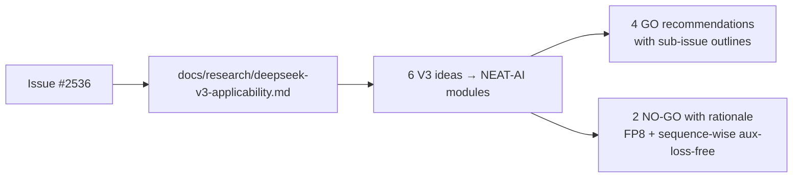

# PR Summary — Issue #2536

## Summary

Adds the DeepSeek V3 applicability research note at
`docs/research/deepseek-v3-applicability.md`. The note maps each notable V3
technique (Multi-Token Prediction, node-limited routing, sequence-wise
auxiliary-loss-free balancing, FP8 mixed precision, DualPipe, shared-output-head
ensemble) onto its closest NEAT-AI surface, records GO / NO-GO with a
one-paragraph rationale, names a proposed experimental sub-issue title and
outline for each GO, and explicitly distinguishes V3 additions from V2 (covered
in #2535). Documentation only; no source-code changes. Closes #2536.

## Evidence

This is a documentation-only change. The note includes a Mermaid diagram
mapping V3 ideas to NEAT-AI modules, a summary table with effort sizing, and
per-idea risk screens against the UUID-stability and semantic-version
invariants from `AGENTS.md`.

`./quality.sh --lint-only` runs cleanly (formatting + lint + bash check pass).
The note covers all six items required by the issue's acceptance criteria:

- [x] `docs/research/deepseek-v3-applicability.md` exists and covers all six
  ideas.
- [x] Each idea has GO or NO-GO with a one-paragraph rationale.
- [x] Each GO recommendation includes a proposed experimental sub-issue title
  and outline (not yet created).
- [x] Differences vs V2 (covered in #2535) are explicit so the reader knows
  which paper introduced what.
- [x] FP8 entry checks WASM toolchain status before recommending NO-GO.
- [x] Mermaid diagram of V3 idea → NEAT-AI module mapping.
- [x] No source-code changes; documentation-only PR.
- [x] `./quality.sh --lint-only` passes.

## Test Plan

- Documentation-only change; no new tests added.
- Quality gate: `./quality.sh --lint-only < /dev/null` — passes (formatting,
  lint, bash check all green).
- Mermaid blocks render in GitHub Pages; no Liquid syntax in prose.
