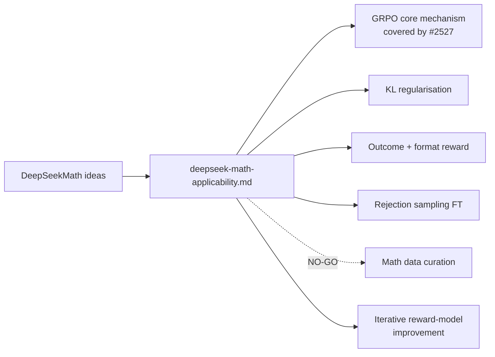

## Summary

Add `docs/research/deepseek-math-applicability.md`: a research note that
revisits the original DeepSeekMath paper (the GRPO paper, arXiv:2402.03300)
for techniques that extend beyond what V4 (#2526) incorporated and that the
GRPO experimental sub-issue (#2527) does not already capture. Six ideas are
mapped onto NEAT-AI surfaces with GO / NO-GO rationale, projected
experimental sub-issue outlines, S/M/L effort, and screening against the
UUID-stability and `semanticVersion` invariants in `AGENTS.md`. Closes #2537.

Documentation-only PR. No source-code changes.

## Evidence

This is a documentation-only change. `./quality.sh --lint-only` was run and
passed (deno fmt + deno lint + bash syntax check all clean).

The note includes a Mermaid `flowchart LR` diagram mapping each
DeepSeekMath idea to its closest NEAT-AI module, exactly as required by the
acceptance criteria.

## Coverage of Acceptance Criteria

- [x] `docs/research/deepseek-math-applicability.md` exists and covers all
      six ideas (GRPO core, KL regularisation, reward shaping, RFT,
      data curation, iterative reward-model improvement).
- [x] Each idea has a GO or NO-GO recommendation with one-paragraph
      rationale.
- [x] Cross-reference to #2527 explicitly notes what is already covered
      there vs what is new (item 1 of the note plus the dedicated
      "Cross-link to #2527" section).
- [x] Each GO recommendation includes a proposed experimental sub-issue
      title and a numbered outline (sub-issues are not yet created — this
      is a documentation-only PR).
- [x] Mermaid diagram of DeepSeekMath idea → NEAT-AI module mapping.
- [x] No source-code changes.
- [x] `./quality.sh --lint-only` passes.

## Test Plan

- [x] `./quality.sh --lint-only` passes (deno fmt + deno lint + bash check).
- [ ] Reviewer skim of the GO/NO-GO calls and the proposed sub-issue outlines.
- [ ] Reviewer confirms the cross-link to #2527 accurately reflects what
      that issue already covers (no duplication).
