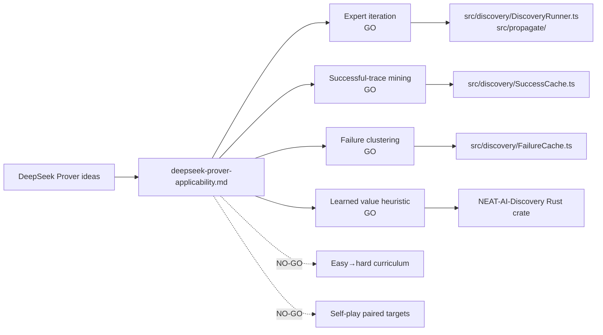

## Summary

Adds `docs/research/deepseek-prover-applicability.md`, a new research note that
maps the six headline ideas from DeepSeek-Prover and DeepSeek-Prover-V2 onto
NEAT-AI's discovery + breeding + backprop pipeline. Each idea has a GO / NO-GO
recommendation with rationale, S/M/L effort, risk-to-invariants screen, and
(for GOs) a proposed experimental sub-issue title and outline plus an explicit
"lands in NEAT-AI vs NEAT-AI-Discovery" call-out. Closes #2538.

Documentation-only change — no source-code modifications. `./quality.sh
--lint-only` passes.

## Evidence

### Idea → recommendation summary

| # | Prover idea                                      | Recommendation       | Effort | Lands in            |
| - | ------------------------------------------------ | -------------------- | ------ | ------------------- |
| 1 | Expert-iteration loop (search ↔ SFT)             | **GO**               | M      | NEAT-AI             |
| 2 | Successful-trace mining (mutation lineage)       | **GO**               | S      | NEAT-AI             |
| 3 | Failure clustering / failed-attempt diagnostics  | **GO**               | M      | NEAT-AI + Discovery |
| 4 | Curriculum from easy → hard                      | **NO-GO**            | L      | (out of library)    |
| 5 | Tree search with learned value heuristic         | **GO**               | L      | NEAT-AI-Discovery   |
| 6 | Self-play / autocurriculum (paired hard targets) | **NO-GO**            | M      | (covered)           |

### Module mapping diagram

### Acceptance-criteria check

- [x] `docs/research/deepseek-prover-applicability.md` exists and covers all
      six ideas.
- [x] Each idea has a GO or NO-GO with one-paragraph rationale.
- [x] Each GO recommendation includes a proposed experimental sub-issue title
      and outline (not yet created).
- [x] For each GO, the document indicates whether the work lands in NEAT-AI or
      NEAT-AI-Discovery.
- [x] Mermaid diagram of Prover idea → NEAT-AI / NEAT-AI-Discovery module
      mapping included.
- [x] No source-code changes; documentation-only PR.
- [x] `./quality.sh --lint-only` passes.

## Test Plan

- This is a documentation-only PR; no unit-test changes apply.
- `./quality.sh --lint-only < /dev/null` was run locally and passes (fmt,
  lint, bash-syntax, deno check stages all clean).
- Reviewer manual check: read the note end-to-end and confirm the
  recommendations are consistent with AGENTS.md (UUID stability, semantic
  version immutability, UUID-only discovery wire format).
