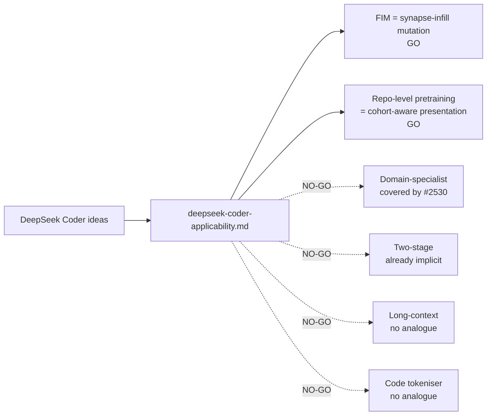

# PR Summary — Issue #2539

## Summary

Adds `docs/research/deepseek-coder-applicability.md`, the research note that
maps DeepSeek-Coder and DeepSeek-Coder-V2 ideas onto NEAT-AI's mutation,
training-augmentation, speciation, and discovery surfaces. The note covers all
six ideas required by the issue (fill-in-the-middle, repository-level
pretraining, domain-specialist pretraining, two-stage training, long-context
extension, code-specific tokenisation), records GO / NO-GO with one-paragraph
rationale per idea, proposes experimental sub-issue outlines for the GOs, and
explicitly cross-links **#2530** so the V4 specialist pipeline is not
duplicated.

Closes #2539.

## Evidence

Documentation-only PR — no source code changes. The research note follows the
same structure as the sibling DeepSeek applicability notes
(`deepseek-math-applicability.md`, `deepseek-prover-applicability.md`,
`deepseek-r1-applicability.md`, etc.) and is entirely confined to
`docs/research/`.

`./quality.sh --lint-only < /dev/null` was run and passed (formatter, linter,
bash check). No tests were added because no source code changed; the acceptance
criteria for this issue are documentation-only.

### Coverage of the six ideas

| # | Idea                                          | Recommendation               | Mapping target                                               |
| - | --------------------------------------------- | ---------------------------- | ------------------------------------------------------------ |
| 1 | Fill-in-the-middle (FIM)                      | **GO** (M)                   | `src/mutate/` + `src/propagate/` synapse-infill augmentation |
| 2 | Repository-level pretraining                  | **GO** (M)                   | `src/blackbox/` cohort-aware presentation order              |
| 3 | Domain-specialist pretraining                 | **NO-GO** (covered by #2530) | V4 specialist pipeline                                       |
| 4 | Two-stage training (pretrain → instruction)   | **NO-GO** (already implicit) | MCMC temperature + curriculum (deepseek-math Idea 6)         |
| 5 | Long-context extension via continued training | **NO-GO**                    | n/a — no attention / context length in NEAT-AI               |
| 6 | Code-specific vocabulary / tokenisation       | **NO-GO**                    | n/a — NEAT-AI consumes numeric vectors                       |

### Acceptance-criteria checklist

- [x] `docs/research/deepseek-coder-applicability.md` exists and covers all six
      ideas.
- [x] Each idea has GO or NO-GO with one-paragraph rationale.
- [x] Each GO recommendation includes a proposed experimental sub-issue title
      and outline (Ideas 1 and 2).
- [x] Cross-reference to #2530 explicitly notes what is already covered there vs
      what is new (top-of-document section plus Idea 3).
- [x] Mermaid diagram of Coder idea → NEAT-AI module mapping included in the
      document.
- [x] No source-code changes; documentation-only PR.
- [x] `./quality.sh --lint-only` passes.

### Idea → module mapping (preview)

## Test Plan

- [x] Run `./quality.sh --lint-only < /dev/null` — passes (format, lint, bash
      syntax).
- [x] Visual inspection of the rendered Mermaid diagram and tables
      (GitHub-flavoured Markdown).
- [x] No source-code or test changes — no unit tests required.
