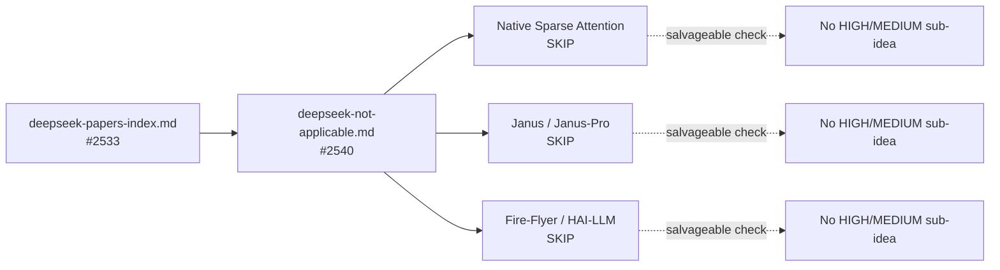

## Summary

Created `docs/research/deepseek-not-applicable.md` — a single negative-results
triage note covering the three DeepSeek papers that do not apply to NEAT-AI:
Native Sparse Attention (NSA), Janus / Janus-Pro, and Fire-Flyer / HAI-LLM. Each
paper has a one-paragraph technical summary, a one-paragraph NO-GO rationale,
and an explicit "salvageable sub-ideas" check. None of the three yielded a HIGH
or MEDIUM sub-idea, so nothing is escalated to a follow-up research note. The
catalogue ([`deepseek-papers-index.md`](research/deepseek-papers-index.md)) SKIP
entries and the summary table now link to this triage note alongside the
existing issue link.

Documentation only; no source-code changes. Closes #2540.

## Evidence

This is a documentation-only change with no UI to screenshot and no performance
impact to benchmark. Verified by:

- `./quality.sh --lint-only < /dev/null` — passes (formatter reflowed the new
  files; no lint errors).
- Manual review of the new file's structure against the issue's acceptance
  criteria (one-paragraph summary + one-paragraph NO-GO + salvageable check per
  paper, plus index update).

The relationship between the catalogue, the new triage note, and the three SKIP
papers:

## Test Plan

- [x] `./quality.sh --lint-only < /dev/null` passes.
- [x] `docs/research/deepseek-not-applicable.md` covers NSA, Janus / Janus-Pro,
      and Fire-Flyer / HAI-LLM with the required one-paragraph summary,
      one-paragraph NO-GO rationale, and salvageable-sub-ideas check.
- [x] The catalogue (`docs/research/deepseek-papers-index.md`) SKIP entries and
      summary table point at the new triage note for each of the four SKIP
      papers (NSA, Janus, Janus-Pro, Fire-Flyer).
- [x] No source-code changes; documentation-only PR.

## Acceptance criteria mapping

| Criterion                                                                                | Status |
| ---------------------------------------------------------------------------------------- | ------ |
| `docs/research/deepseek-not-applicable.md` exists and covers NSA, Janus, Fire-Flyer      | Done   |
| Each paper has a one-paragraph rationale for NO-GO                                       | Done   |
| Each paper has an explicit salvageable-sub-ideas check; no HIGH/MEDIUM ideas to escalate | Done   |
| The index from #2533 is updated to point at this triage note for each SKIP entry         | Done   |
| No source-code changes; documentation-only PR                                            | Done   |
| `./quality.sh --lint-only` passes                                                        | Done   |
