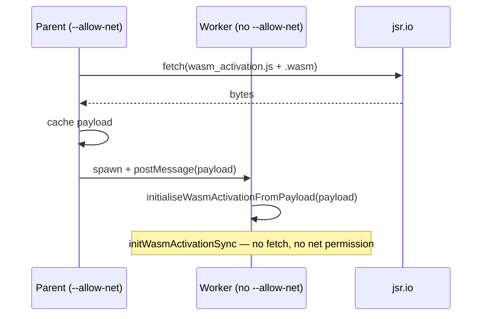

# PR Summary — Issue #2545

## Summary

Document the JSR-hosted-worker WASM bootstrap pattern (Track 3 of the
follow-up plan in #2545) and expose the helpers it relies on from the
public entry point. This fixes the production failure described in #2543
without forcing the library onto unstable Deno worker options or pulling
the WASM bytes inline. Closes #2545.

The change has four parts:

1. **Public API.** `mod.ts` now exports `loadWasmActivationInitPayloadAsync`
   and `initialiseWasmActivationFromPayload` alongside the existing
   `fetchWasmForWorkers`, plus the `WasmActivationInitPayload` type. This is
   the surface a consumer needs to fetch the WASM payload in their
   `--allow-net` parent and bootstrap WASM in a worker that does **not** have
   `--allow-net` to `jsr.io`.
2. **TROUBLESHOOTING.md.** New "JSR-hosted NEAT-AI in your own workers
   (Issue #2545)" section under WASM Issues. Explains the failure mode (older
   Deno default and explicit narrowing of `deno.permissions.net`), the
   pre-fetch + `postMessage` workaround using the public helpers, the
   "upgrade Deno 2.5+" alternative, and why the library cannot just set
   `permissions: "inherit"` itself today (`--unstable-worker-options` gate).
   Includes a Mermaid sequence diagram of the parent → worker handoff.
3. **README.md.** The WASM-required note now points consumers at the new
   troubleshooting section so users running their own worker pools find the
   pattern at a glance.
4. **Regression test.** `test/wasm/JsrWorkerInitDocumented.ts` pins the
   public surface — any future refactor that drops one of the documented
   exports fails the test before consumers hit a broken JSR import. It also
   exercises the parent → worker payload handoff in-process.

## Why Track 3

The issue body laid out three follow-up tracks. Tracks 1 (inline WASM bytes
via build step) and 2 (wait for `Worker.deno.permissions` to stabilise) are
genuinely out of scope for a single PR — they need either a JSR-tarball
bloat decision and an audit of the #2482 trap-stack regression, or an
upstream Deno change. Track 3 closes the documentation gap and ships the
public helpers consumers need today; the maintainer comment on the issue
("Please do as you recommend") cleared the trade-off.

## Evidence

This is a documentation + public API change. No UI, no performance work.

- All 6,449 existing tests pass after the changes (`./quality.sh
  --skip-discovery --skip-wasm`).
- The new regression test passes:

  ```
  running 3 tests from ./test/wasm/JsrWorkerInitDocumented.ts
  Issue #2545: documented JSR-worker helpers are exported from mod.ts ... ok
  Issue #2545: parent loads the payload and worker boot helper accepts it ... ok
  Issue #2545: payload is JSON-postMessage friendly (no functions, no host objects) ... ok

  ok | 3 passed | 0 failed (3ms)
  ```

### Bootstrap sequence (also reproduced in TROUBLESHOOTING.md)



## Test Plan

- [x] Added `test/wasm/JsrWorkerInitDocumented.ts` covering:
  - the three documented helpers are exported from `mod.ts`
  - `loadWasmActivationInitPayloadAsync()` returns a payload with non-empty
    `jsSource` and `wasmBinary`
  - `initialiseWasmActivationFromPayload(payload, true)` accepts the payload
    without throwing
  - the payload is structured-clone friendly (string + `Uint8Array`)
- [x] Verified `./quality.sh --skip-discovery --skip-wasm` runs the full
  suite (6,449 tests) cleanly with the changes applied.

## Pre-PR Security Self-Check

- [x] **Input validation**: no new external input paths.
- [x] **Secrets**: only `README.md`, `mod.ts`, `docs/TROUBLESHOOTING.md`,
  and a new test file staged — no `.env`, no credentials.
- [x] **Injection surface**: no new SQL, shell, FS, or HTTP calls.
- [x] **Output encoding**: no new user-facing output.
- [x] **Authentication/authorisation**: no new endpoints.
- [x] **Error handling**: no new error paths; reused existing typed
  `WasmError`.
- [x] **Dependencies**: no new third-party dependencies.
