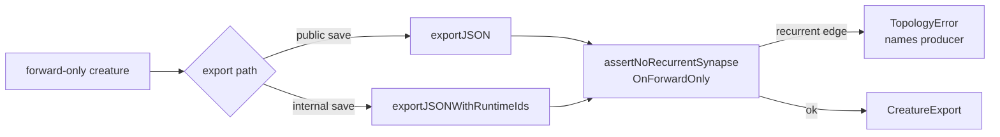

## Summary

Wires the existing `assertNoRecurrentSynapseOnForwardOnly` post-condition into
`exportJSONWithRuntimeIds` — the internal export path that the Issue #2515 audit
missed. Production GRQ logs (per #2113, #2546) continued to throw
`[loadFrom] Recurrent synapse … source=fromJSON` `TopologyError` on every load
even after #2515 wired the assertion into the discovery combiners and the public
`exportJSON` save path. Worker training, evolution scheduling, training teardown
/ outcome / setup, compaction, discovery replay, knowledge distillation, and the
legacy upgrade pipeline all route their internal saves through
`exportJSONWithRuntimeIds`, which had no save-side assertion. A forward-only
creature that gained a recurrent synapse upstream could therefore be persisted
by any of those paths and surface only as a load-side throw on the next worker
that ingested the JSON. Mirroring the assertion here pins the producer's stack
frame so the offending pipeline is named directly. Closes #2546.

## Evidence

Backend-only change — no UI to screenshot. Verified via:

- `test/architecture/ExportJSONWithRuntimeIdsForwardOnly.ts` (4 new tests): pins
  both production patterns from the issue —
  `synapse=2057->2057 fromUUID=output-0 toUUID=output-0 depth=0` (self-loop on
  output-0) and `synapse=4145->4143 fromUUID=output-0
  depth=-2` (backward
  output→hidden). Tests fail against the unfixed code (no throw) and pass after
  the fix (`TopologyError` named `exportJSONWithRuntimeIds`).
- All 6450 existing tests pass under
  `./quality.sh --skip-discovery
  --skip-wasm`.
- `./quality.sh --lint-only` and `deno check mod.ts` are clean.

Producer paths now covered (already routed through `exportJSONWithRuntimeIds`):

| Site                                        | Source tag in `TopologyError` |
| ------------------------------------------- | ----------------------------- |
| `WorkerProcessor` (returning trained)       | `exportJSONWithRuntimeIds`    |
| `NeatScheduling` (backtracked / forward)    | `exportJSONWithRuntimeIds`    |
| `CreatureTraining` (training round-trip)    | `exportJSONWithRuntimeIds`    |
| `TrainingOutcome` / `TrainingTeardown`      | `exportJSONWithRuntimeIds`    |
| `TrainingSetup` (best snapshot)             | `exportJSONWithRuntimeIds`    |
| `CompactUnused` (compaction snapshots)      | `exportJSONWithRuntimeIds`    |
| `ReplayEntryApplication` (discovery replay) | `exportJSONWithRuntimeIds`    |
| `KnowledgeDistillation` (distilled student) | `exportJSONWithRuntimeIds`    |
| `Upgrade` / `UpgradeTwo` (pre-4.x repair)   | no-op (forwardOnly is 4.x+)   |

## Test Plan

- `test/architecture/ExportJSONWithRuntimeIdsForwardOnly.ts` — 4 new tests:
  - passes for a valid forward-only creature.
  - passes for a non-forward-only creature even with a recurrent edge (assertion
    only fires on `forwardOnly === true`).
  - throws `TopologyError` named `exportJSONWithRuntimeIds` for the self-loop on
    output-0 pattern (issue evidence:
    `2057->2057
    fromUUID=output-0 toUUID=output-0 depth=0`).
  - throws `TopologyError` named `exportJSONWithRuntimeIds` for the backward
    output→hidden pattern (issue evidence:
    `4145->4143
    fromUUID=output-0 depth=-2`).
- Existing tests unchanged: `ForwardOnlyAssertion`,
  `ForwardOnlyApplyChangeLifecycle`, `NormaliseCreatureExportForwardOnly`,
  `ForwardOnlyOutputRoundTrip`, `LoadFromObservability` — all green.
- Full upgrade test suite (`test/upgrade/**/*.ts`) — all 49 tests green (pre-4.x
  upgrade paths legitimately ingest corrupt input but the `forwardOnly` flag is
  4.x+, so the assertion is a no-op for them).
- Full compact (`test/compact/**/*.ts`) and discovery (`test/discovery/**/*.ts`)
  suites — 667 tests green.
