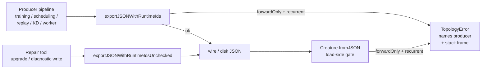

## Summary

Closes #2546.

Production GRQ-3/13 logs (2026-05-05/06) showed `TopologyError` firing on every
load with `source=fromJSON` for forward-only creatures carrying the canonical
recurrent-output signatures (`output-0 -> output-0` self-loops and backward
`output -> hidden` edges). The Issue #2515 audit wired the forward-only
post-condition into the `applyChangeToCreature` / `normaliseCreatureExport`
combiners and the public `exportJSON` save path, but missed
`exportJSONWithRuntimeIds()` — the internal export used by training, NEAT
scheduling, knowledge distillation, discovery replay, and the worker→main wire.
That variant historically bypassed the Issue #2511 save-side gate, so a corrupt
forward-only creature produced anywhere in those pipelines serialised cleanly
and only blew up at the next disk load.

This PR closes that producer surface:

- `exportJSONWithRuntimeIds()` now runs
  `assertNoRecurrentSynapseOnForwardOnly(creature, "exportJSONWithRuntimeIds")`
  as a save-side post-condition, naming itself in the thrown `TopologyError`'s
  message. Pre-4.x upgrade callers are unaffected — `forwardOnly` was introduced
  with 4.x, so the assertion is a no-op when `creature.forwardOnly !== true`.
- A new sibling, `exportJSONWithRuntimeIdsUnchecked()`, mirrors
  `exportJSONUnchecked()` for the small set of legitimate bypass cases:
  - The `upgrade()` legacy v0/v1 path and `upgradeTwo()`'s `removeHYPOT*` passes
    that operate on creatures pre-`fix()` (recurrent edges may still be present
    and are repaired by the upgrader).
  - The `NeatScheduling` training-failure diagnostic write that already runs
    after a thrown training error and must not chain a second throw that masks
    the root cause.
- All other call sites (`WorkerProcessor` train wire response, `NeatScheduling`
  fine-tune backtrack/forward variants, `KnowledgeDistillation`,
  `TrainingOutcome`/`TrainingTeardown`/`TrainingSetup`, `CreatureTraining`,
  `ReplayEntryApplication`, `CompactUnused`) now flow through the checked
  variant — any future regression that builds a recurrent forward-only synapse
  will be caught at the export site, with the producing pipeline's stack frame
  intact.
- `CHANGELOG.md` documents the writer-side gate and version is bumped to
  `3.3.6`.

## Evidence

Backend-only library change — no UI to screenshot. Verified via:

- Unit tests in `test/architecture/ExportJSONWithRuntimeIdsForwardOnly.ts`
  covering both production-observed signatures (output-0 self-loop and backward
  output→hidden) plus the two no-op cases (valid forward-only, and
  feedback-enabled with a legitimate recurrent edge). Tests fail against the
  unfixed code (no throw) and pass after the fix (`TopologyError` named
  `exportJSONWithRuntimeIds`).
- Touched test suites pass cleanly:
  - `test/architecture/` — 425 tests pass.
  - `test/upgrade/`, `test/compact/`, `test/creature/`, `test/discovery/`
    combined — 965 tests pass (covers the rerouted upgrade and compaction bypass
    paths and the load-side throw).
  - `./quality.sh --skip-discovery --skip-wasm` — 6453 passed, 0 failed, 4
    ignored.
  - `./quality.sh --lint-only` and `--check-only` — clean.

Producer paths now covered (already routed through the checked
`exportJSONWithRuntimeIds`):

| Site                                        | Source tag in `TopologyError` |
| ------------------------------------------- | ----------------------------- |
| `WorkerProcessor` (returning trained)       | `exportJSONWithRuntimeIds`    |
| `NeatScheduling` (backtracked / forward)    | `exportJSONWithRuntimeIds`    |
| `CreatureTraining` (training round-trip)    | `exportJSONWithRuntimeIds`    |
| `TrainingOutcome` / `TrainingTeardown`      | `exportJSONWithRuntimeIds`    |
| `TrainingSetup` (best snapshot)             | `exportJSONWithRuntimeIds`    |
| `CompactUnused` (compaction snapshots)      | `exportJSONWithRuntimeIds`    |
| `ReplayEntryApplication` (discovery replay) | `exportJSONWithRuntimeIds`    |
| `KnowledgeDistillation` (distilled student) | `exportJSONWithRuntimeIds`    |

Bypass paths now routed to the unchecked sibling (with a code comment naming the
bypass):

| Site                                         | Reason                           |
| -------------------------------------------- | -------------------------------- |
| `Upgrade.upgrade` (1.x → 2.x, 0.x → 1.0.0)   | legacy genome pre-`fix()` repair |
| `UpgradeTwo.removeHYPOT` / `removeHYPOTv2`   | legacy HYPOT removal pre-`fix()` |
| `NeatScheduling` training-failure diagnostic | already on a thrown error path   |

## Test Plan

- [x] `test/architecture/ExportJSONWithRuntimeIdsForwardOnly.ts` — 4 cases:
  - passes for a valid forward-only creature.
  - passes for a non-forward-only creature even with a recurrent edge (assertion
    only fires on `forwardOnly === true`).
  - throws `TopologyError` named `exportJSONWithRuntimeIds` for the self-loop on
    output-0 pattern (issue evidence:
    `2057->2057 fromUUID=output-0
    toUUID=output-0 depth=0`).
  - throws `TopologyError` named `exportJSONWithRuntimeIds` for the backward
    output→hidden pattern (issue evidence:
    `4145->4143 fromUUID=output-0
    depth=-2`).
- [x] Existing `ForwardOnlyAssertion` and `LoadFromForwardOnlyThrow` suites
      unchanged and still pass.
- [x] `ShallowCloneRuntimeIds` (legacy round-trip via
      `exportJSONWithRuntimeIds + fromJSON`) unchanged and still passes —
      confirms the new gate does not regress valid forward-only round-trips.
- [x] Full upgrade and compact suites pass — confirms the rerouted bypass paths
      still serialise legacy/in-repair creatures.
