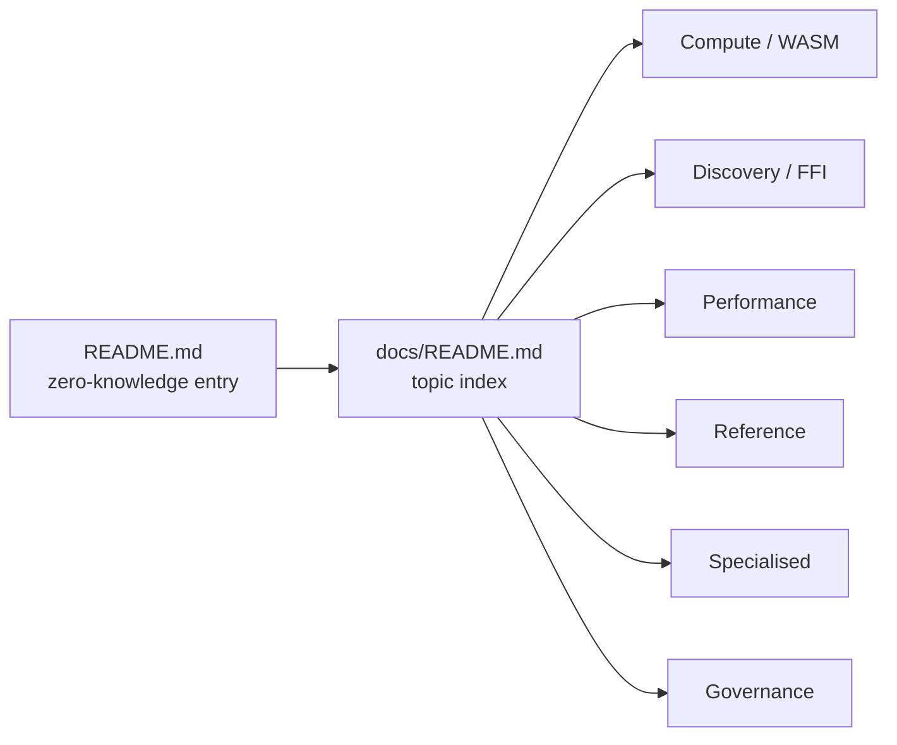

# PR Summary — Issue #2566: docs foundation

## Summary

Lays the navigation foundation for the docs refresh. Closes #2566.

- Adds **`docs/README.md`** — a topic-by-topic index covering Compute / WASM,
  Discovery / FFI, Performance, Reference, Specialised, and Governance, with
  one-line summaries for every long-form guide, a "Where to start" reading path,
  and an explicit out-of-scope list (`pr-summary-*.md`, `archive/`, `evidence/`,
  `research/`, etc.).
- Refreshes **`README.md`**:
  - new `📖 Docs map` section near the top linking to `docs/README.md` and every
    major topic doc;
  - new `🏗️ High-level architecture` Mermaid `flowchart` showing Creature →
    mutate/breed → activate via WASM → optional Rust Discovery FFI;
  - acronyms expanded on first use — NEAT, WebAssembly (WASM), Foreign Function
    Interface (FFI), Markov Chain Monte Carlo (MCMC), CRISPR (Clustered
    Regularly Interspaced Short Palindromic Repeats), graphics processing unit
    (GPU), and JavaScript Registry (JSR).
- Adds **`test/docs/DocsIndex.ts`** — a quality-gate test that the index exists,
  every major topic doc is referenced, internal links resolve, the Docs map is
  present in `README.md`, and acronyms are expanded on first use.

`COMPARISON.md` is intentionally untouched (owned by #2563).

## Evidence

This is a documentation-only change with a new behaviour-asserting test.
Verified via:

- `./quality.sh --lint-only` — pass (formatting, linting, bash syntax all
  green).
- `deno test test/docs/DocsIndex.ts` — 10/10 pass.
- `deno test test/scripts/ContributorCoreDocs.ts` — 6/6 pass (regression check
  for the existing core-dep doc references).

## Test plan

- [x] `docs/README.md exists and is non-trivial`
- [x] `docs/README.md uses the expected topic groupings`
- [x] `docs/README.md links to every major topic doc`
- [x] `docs/README.md flags pr-summary-*.md as out of scope`
- [x] `docs/README.md provides a 'where to start' reading path`
- [x] `docs/README.md internal links resolve`
- [x] `README.md has a Docs map section linking to docs/README.md`
- [x] `README.md includes at least one Mermaid diagram`
- [x] `README.md expands acronyms on first use`
- [x] `README.md still references core dependency documentation` (regression
      guard for `ContributorCoreDocs.ts`)
