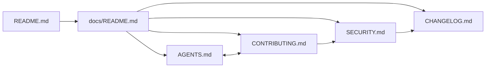

# PR Summary — Issue #2567

## Summary

Refreshes the four contributor- and governance-facing documents
(`AGENTS.md`, `CONTRIBUTING.md`, `SECURITY.md`, `CHANGELOG.md`) so they read
consistently with the recently refreshed `README.md` and `docs/README.md`,
expand acronyms on first use, link out to topic-specific deeper docs, and back
their claims with verifiable references. Adds Mermaid diagrams for the two
non-obvious flows (neuron-UUID lifecycle and the semantic-version invariant)
and for the contribution pipeline. Updates the `quality.sh` flag list to match
the script's actual `--help` output, and seeds the `[Unreleased]` block in
`CHANGELOG.md` with merged work that had no entry yet (#2513, #2529, #2545,
#2565, #2566, #2569, #2570). Closes #2567.

## Evidence

This is a documentation-only change — no UI, no runtime behaviour. The new
diagrams and cross-links are validated by `./quality.sh --lint-only` (Deno fmt,
Deno lint, bash syntax) and by `markdownlint-cli2` over the whole repo, both
of which pass.

### Changes per file

- **`AGENTS.md`** — added a top-level "Summary and where to go next" paragraph
  with links to topic docs (activation, neuron UUID, semantic version,
  Discovery, NEAT-AI-core dependency, contributing, security, changelog);
  added a `stateDiagram-v2` Mermaid diagram for the neuron-UUID lifecycle and a
  `flowchart` for the semantic-version invariant; expanded WASM, FFI, GPU,
  CPU, DX12, and MCMC on first use; replaced the dead "scattered
  `bumpToFourIfForwardOnlyConfirmed` helper calls" past-tense reference with a
  cleaner historical note; turned the trailing Documentation Layout section
  into a sibling-link list.
- **`CONTRIBUTING.md`** — added a top-level summary linking out to `AGENTS.md`,
  `docs/README.md`, `docs/DISCOVERY_GUIDE.md`, `docs/CORE_DEPENDENCY_POLICY.md`,
  `SECURITY.md`, and `CHANGELOG.md`; added a `flowchart LR` Mermaid of the
  contribution pipeline; replaced the four-flag bullet list with a complete
  table of every option `quality.sh --help` actually prints (verified against
  `quality.sh:18-43`); added a "Sibling docs" section.
- **`SECURITY.md`** — added a summary paragraph that points at the
  `/security-review` Claude Code skill and the in-repo automation
  (`dependency-review.yml`, `semgrep.yml`, `.gitleaks.toml`,
  `deno-outdated.yml`); switched the reporting contact to GitHub's private
  vulnerability advisory plus a security@ mailbox; tightened the supported
  versions wording to refer to the published JSR release; added a sibling-link
  section.
- **`CHANGELOG.md`** — added a "Sibling docs" line under the format note;
  appended `[Unreleased]` entries for #2529 (Muon-style orthogonalised
  gradient updates), #2545 (JSR-hosted-worker WASM bootstrap), #2513
  (throughput-stall warm-up gate), and a Documentation block covering #2566,
  #2569, #2570, and #2565. Historical entries were not rewritten.

### Verifying the references

Every cited path/test resolves on disk:

- `test/creature/NeuronUuidStability.ts`, `test/creature/SemanticVersionStability.ts`,
  `test/creature/CreatureSerializationPolicy.ts`
- `src/architecture/NeuronId.ts`, `src/utils/Logger.ts`,
  `src/wasm/WasmTopologyOps.ts`, `src/propagate/WasmTopologicalBackprop.ts`,
  `src/propagate/ElasticDistribution.ts`
- `bench/ParallelBreeding.ts`, `bench/GeneticCompatibilitySetIntersection.ts`
- `.github/workflows/dependency-review.yml`,
  `.github/workflows/semgrep.yml`,
  `.github/workflows/deno-outdated.yml`, `.gitleaks.toml`
- `docs/README.md`, `docs/DISCOVERY_GUIDE.md`, `docs/CORE_DEPENDENCY_POLICY.md`,
  `docs/PARITY_GATE.md`, `docs/ACTIVATION_FUNCTIONS.md`,
  `src/methods/activations/README.md`

## Test Plan

- [x] `./quality.sh --lint-only` (Deno fmt, Deno lint, bash syntax) passes
      cleanly.
- [x] `npx markdownlint-cli2 ...` passes with `0 error(s)` over all 603
      Markdown files.
- [x] All Mermaid blocks use the GitHub-supported syntax (`flowchart`,
      `stateDiagram-v2`) — they render natively on the GitHub PR view.
- [x] Every cited file path / test path / workflow path resolves on disk
      (verified manually).
- [x] No source code changed; no unit-test changes required.

## Acceptance Criteria

- [x] All four files have a brief summary at the top with links to deeper
      topic docs.
- [x] Every acronym used is expanded or linked on first use within each file
      (NEAT, WASM, FFI, GPU, CPU, DX12, MCMC, UUID, JSR, PR, SAST).
- [x] At least one Mermaid diagram has been added or refreshed
      (`AGENTS.md` gets two; `CONTRIBUTING.md` gets one).
- [x] No stale code references — every cited file path / line number / PR
      number resolves on disk.
- [x] `CHANGELOG.md`'s `[Unreleased]` block reflects merged changes since the
      last release (3.2.0, 2026-05-05).
- [x] Cross-references link these docs to `README.md`, `docs/README.md`, and
      at least one topic detail doc per file where relevant.
- [x] Australian English spelling throughout (`organisation`, `behaviour`,
      `optimise`, `centre`, `licence`).
- [x] `./quality.sh --lint-only` passes.
