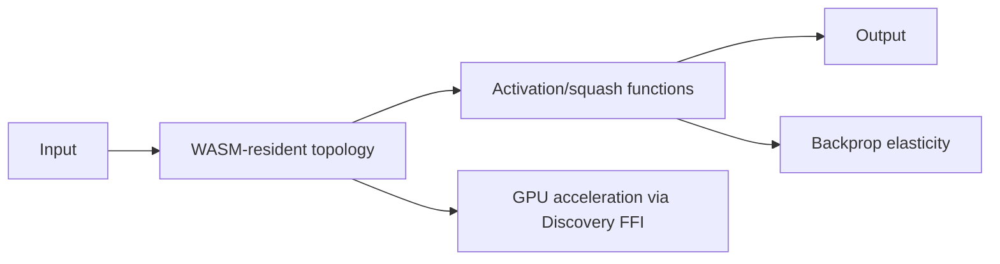

# PR Summary — Issue #2568

## Summary

Refreshed the four "compute cluster" docs so they read as a coherent group and
match the code they describe. Each file now opens with a TL;DR, expands its
acronyms (WASM, GPU, FFI, ReLU, GELU, ELU, SELU, etc.), cross-links the other
three siblings plus the docs index, and gains at least one new Mermaid
diagram. Closes #2568.

Changed files:

- `docs/ACTIVATION_FUNCTIONS.md` — TL;DR + sibling links; squash list verified
  one-for-one against `src/methods/activations/types/`,
  `src/methods/activations/aggregate/`, and `src/deprecated/`; deprecated rows
  now link to source; new `flowchart` showing where the squash sits in the
  forward/backprop pipeline.
- `docs/BACKPROP_ELASTICITY.md` — TL;DR + sibling links; new `sequenceDiagram`
  for forward → error → elastic distribution → weight update; "Where to Look
  in Code" updated to call out that the topological backprop loop and elastic
  distribution kernel are WASM-only (Issue #2416, no TS fallback) and to link
  the WASM artefacts under `wasm_activation/pkg/`.
- `docs/WASM_RESIDENT_TOPOLOGY.md` — TL;DR clarifying the analysis is "defer
  full residency, ship selective WASM-only kernels" plus sibling links;
  new `flowchart` of the TS ↔ WASM boundary (what crosses, what stays inside);
  references updated to include #2415/#2416 and the `AGENTS.md` WASM-only
  operations list.
- `docs/GPU_ACCELERATION.md` — TL;DR with acronym expansions and a pointer to
  `DISCOVERY_GUIDE.md`; backend compatibility table (Metal / Vulkan / DX12 /
  Gl / CPU) matching the NEAT-AI-Discovery README and `getGpuBackendInfo()`
  return shape; new Discovery → GPU pipeline `flowchart`.

## Evidence

This is a docs-only change — no source files modified, no UI surface to
screenshot. The cluster reading map is unchanged in `docs/README.md`; this PR
just deepens each leaf.



Squash audit — every name in `ACTIVATION_FUNCTIONS.md` resolves to a real
export:

- 32 standard squashes — match `src/methods/activations/types/*.ts`
- 3 aggregate squashes — match `src/methods/activations/aggregate/*.ts`
- 3 deprecated squashes (HYPOT, HYPOTv2, MEAN) — match `src/deprecated/*.ts`,
  and the table now links each row to the file.

`./quality.sh --lint-only < /dev/null` passes (formatting auto-applied to the
four files, lint clean across 1540 files, all bash scripts ✅).

## Test Plan

- Docs-only change. No new code paths, so no new unit tests.
- Verified all four files render Mermaid blocks with valid syntax (fenced
  ` ```mermaid ` blocks; flowchart/sequenceDiagram only).
- Verified no Liquid `` / `{{ ... }}` patterns appear in prose.
- Re-read the issue's acceptance criteria:
  - [x] Each file starts with a brief summary and links to siblings + Discovery
        cluster (where relevant).
  - [x] At least one new Mermaid diagram per file.
  - [x] First use of each acronym (WASM, GPU, FFI, NaN, ReLU, GELU, ELU, SELU,
        TANH, MCMC, UUID, LRU, GC, WGSL, DX12) is expanded.
  - [x] All squash names in `ACTIVATION_FUNCTIONS.md` resolve to real exports.
  - [x] Cross-references to `docs/README.md` and sibling docs added in all
        four files.
  - [x] Australian English spelling preserved.
  - [x] `./quality.sh --lint-only` passes.
