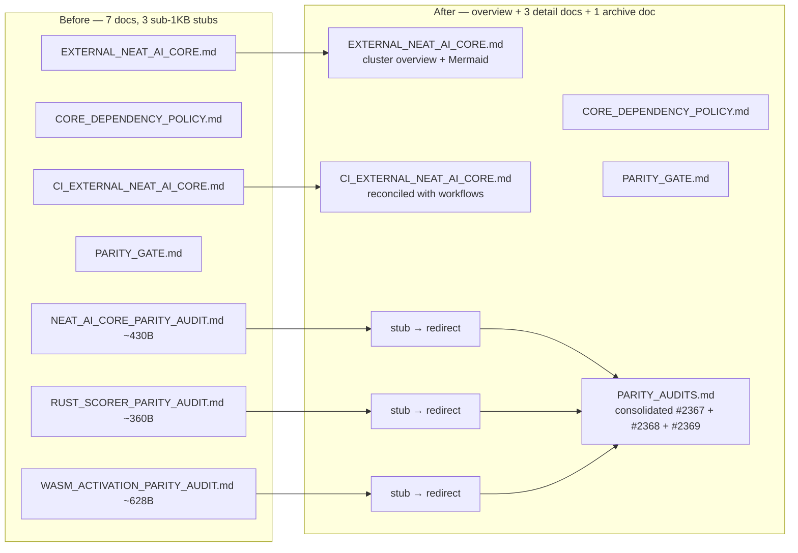

# PR Summary — Issue #2570

## Summary

Consolidates the seven-doc core-dependency / parity-audit cluster so it follows
the parent issue's "brief summary + link to detail" pattern. Closes #2570.

The three small `*_PARITY_AUDIT.md` stubs (430, 360, 628 bytes — all under 1KB)
merge into a single `docs/PARITY_AUDITS.md`. The originals become short redirect
notes so historical PR-summary links keep working. `EXTERNAL_NEAT_AI_CORE.md` is
promoted to the cluster overview with a Mermaid diagram of the dependency
relationship and a table linking every detail doc. `CI_EXTERNAL_NEAT_AI_CORE.md`
is reconciled against the actual GitHub Actions workflows
(`.github/workflows/quality.yml` and `publish.yml`), which both use
`./build.sh --verify-only` rather than the bare `./build.sh` shown in the
previous draft.

### Changes

- **New:** `docs/PARITY_AUDITS.md` — the single home for the three archived
  audits (Issues #2367, #2368, #2369), with a Mermaid diagram, cross-links into
  the live parity gate and the original `pr-summary-*` narratives, plus links to
  the implementing test files (`test/score/WasmJsScoreParity.ts`,
  `test/costs/MSE.ts`).
- **New:** `test/scripts/ParityAuditsConsolidation.ts` — quality-gate test that
  verifies the consolidation: the new doc covers each audit, every stub
  redirects, the cluster overview links every detail doc and carries a Mermaid
  diagram, and the CI doc cites the real workflow files.
- **Replaced:** `docs/NEAT_AI_CORE_PARITY_AUDIT.md`,
  `docs/RUST_SCORER_PARITY_AUDIT.md`, `docs/WASM_ACTIVATION_PARITY_AUDIT.md` —
  three short redirect notes pointing at the consolidated doc.
- **Promoted:** `docs/EXTERNAL_NEAT_AI_CORE.md` to the cluster overview. Adds a
  Mermaid `flowchart LR` of NEAT-AI-core → this repo → downstream extensions, a
  TL;DR, a 5-row cluster map table, an explicit link to
  `test/scripts/ScorerAlignmentPolicy.ts`, and a See-also entry linking to the
  Discovery cluster (`DISCOVERY_ARCHITECTURE.md`).
- **Reconciled:** `docs/CI_EXTERNAL_NEAT_AI_CORE.md` with the live workflow
  files. Adds a workflow/job/step/command table that points at
  `.github/workflows/quality.yml` and `publish.yml`, and notes the
  `--verify-only` invariant.
- **Cross-links:** `docs/CORE_DEPENDENCY_POLICY.md` gains a _Pre-PR auto-bump_
  section describing `bump-deps.sh` and links to
  `test/scripts/BumpDepsScript.ts`. `docs/PARITY_GATE.md` and
  `docs/CORE_DEPENDENCY_POLICY.md` Related-Documents now reference the
  consolidated audit doc.
- **Index/AGENTS:** `docs/README.md` swaps the three stubs for the consolidated
  `PARITY_AUDITS.md` entry plus an overview-marker on
  `EXTERNAL_NEAT_AI_CORE.md`. `AGENTS.md` Related-Documents replaces the
  per-stub entry with a single `PARITY_AUDITS.md` row.

## Evidence



Tests added/run for this change (all read-only, no flakes):

```text
running 5 tests from ./test/scripts/ParityAuditsConsolidation.ts
docs/PARITY_AUDITS.md exists and covers each archived audit ... ok
each audit stub redirects to the consolidated doc ... ok
docs/EXTERNAL_NEAT_AI_CORE.md is the cluster overview ... ok
docs/CI_EXTERNAL_NEAT_AI_CORE.md matches the real workflows ... ok
docs/README.md links the consolidated audit doc ... ok
ok | 27 passed | 0 failed
```

`./quality.sh --lint-only` exits 0 with no formatting or lint errors.

This is a docs-only change with no UI surface; the evidence is the Mermaid
diagram above and the new test file's assertions.

## Test Plan

- [x] **New test** — `test/scripts/ParityAuditsConsolidation.ts` (5 tests).
- [x] **Existing related tests** still pass:
      `test/scripts/CoreDependencyPolicy.ts` (4), `test/scripts/ParityGate.ts`
      (8), `test/scripts/ContributorCoreDocs.ts` (6),
      `test/scripts/ScorerAlignmentPolicy.ts` (4) — 22 total.
- [x] **Quality gate** — `./quality.sh --lint-only < /dev/null` passes.
- [x] **Inbound links audited** — the only inbound references to the three stub
      paths are in `docs/pr-summary-2367.md`, `pr-summary-2368.md`,
      `pr-summary-2369.md`, and `docs/README.md`. The pr-summary files keep
      their original links because the stubs remain as redirect pages;
      `docs/README.md` and `AGENTS.md` are updated to point at the consolidated
      doc directly.
