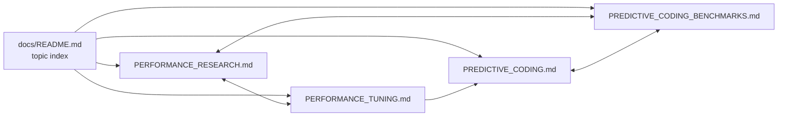

## Summary

Refreshed the four performance / predictive-coding docs so the cluster reads as
a coherent benchmarks-and-tuning narrative with consistent cross-references,
acronym expansions, and Mermaid diagrams. Closes #2571.

Each file now opens with a one-paragraph **Brief**, an **In this cluster**
section that links to the other three companion docs and the `docs/README.md`
index, an **Acronyms** glossary covering CPU, GPU, WASM, FFI, SIMD, MCMC, LRU,
JIT, MSE / MAE / MAPE / RMSE, UUID, PC, NEAT, and L2 norm, and at least one new
Mermaid flowchart:

- `PERFORMANCE_RESEARCH.md` — added the optimisation-pipeline flowchart
  (baseline → algorithmic change → re-bench → win/negative-result), expanded the
  See Also section with a "Reproducing the numbers" table mapping each topic to
  the bench script under `bench/` that produced its figures, and added explicit
  cross-references to the predictive-coding cluster.
- `PERFORMANCE_TUNING.md` — added a "Tuning decision flow" Mermaid diagram, and
  expanded the Further Reading section with cross-references to the research
  doc, the PC cluster, the GPU acceleration doc, and the docs index. The doc is
  retained as a single file (the largest section is well below the ~400-line
  threshold from the issue).
- `PREDICTIVE_CODING.md` — added the brief, cluster index, acronyms, a
  numbered Table of Contents covering the eight existing top-level sections, a
  new "predictive-coding loop at a glance" Mermaid flowchart that summarises the
  fast settling and slow learning loops in one picture, and replaced the legacy
  Further Reading list with cross-references to all sibling docs.
- `PREDICTIVE_CODING_BENCHMARKS.md` — added the brief, cluster index, acronyms,
  a "How a PC benchmark is produced" Mermaid flowchart, links from each
  benchmark section to the source bench script under `bench/predictiveCoding/`,
  and a See Also section pointing back to the parent doc and the wider
  performance docs.

Numbers are kept verbatim with their existing issue / PR references; the issue
explicitly requested that historical results be preserved with date / PR
markers rather than overwritten. The Methodology and Note callouts in
`PREDICTIVE_CODING_BENCHMARKS.md` make the "append, do not overwrite" policy
explicit. The dates and `iter/s` figures originate from issues
[#1558](https://github.com/stSoftwareAU/NEAT-AI/issues/1558),
[#1914](https://github.com/stSoftwareAU/NEAT-AI/issues/1914), and
[#1915](https://github.com/stSoftwareAU/NEAT-AI/issues/1915).

## Evidence

This is a documentation-only change with no code or behaviour modifications.
Verification:

- `./quality.sh --lint-only < /dev/null` — passes (formatting, linting, and
  bash syntax check all clean).
- The four files retain all existing benchmark numbers, callouts, and
  references; only structural framing (briefs, ToCs, cross-refs, Mermaid
  diagrams) was added.

## Test Plan

- [x] `./quality.sh --lint-only < /dev/null` passes.
- [x] Each refreshed file opens with a Brief, links to the other three
      companion docs, and includes at least one new Mermaid diagram.
- [x] Acronyms (CPU, GPU, FFI, RMSE, MAPE, etc.) are expanded on first use in
      each file.
- [x] Cross-references to `docs/README.md` index appear in each file.
- [x] Australian English spellings preserved throughout (no introduced
      Americanisms).
- [x] No claim was added without an evidence link — the new prose either
      points at an existing benchmark issue, an existing PR, or a script under
      `bench/`.
