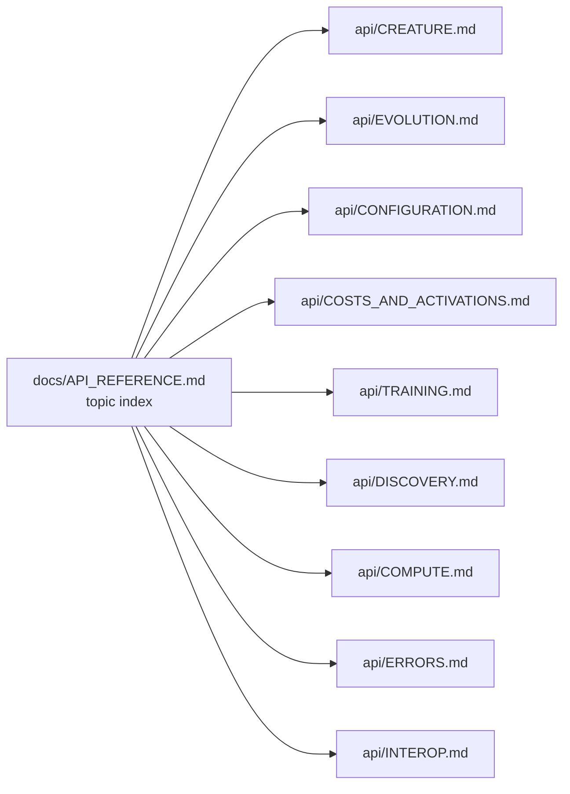

# PR 2572 — split API_REFERENCE.md into index + topic detail docs

## Summary

Split the 1466-line `docs/API_REFERENCE.md` monolith into a short topic
index (~131 lines) plus nine topic detail docs under `docs/api/`, one per
major API (Application Programming Interface) surface. Each detail doc
starts with a one-sentence summary, lists the exports it documents,
expands acronyms on first use, and cross-references related topics.
Inbound links from `README.md`, `AGENTS.md`, `docs/README.md`,
`docs/CRISPR_GUIDE.md`, `docs/DISCOVERY_GUIDE.md`, and the
`test/architecture/PublicAPI.ts` / `test/config/MCMCConfigDocumentation.ts`
header comments were updated to point at the new homes. Closes #2572.

## Topic split

| File                                     | Approx. lines | Surface                                                                             |
| ---------------------------------------- | ------------: | ----------------------------------------------------------------------------------- |
| `docs/API_REFERENCE.md`                  |          ~131 | Short index + Mermaid topic map                                                     |
| `docs/api/CREATURE.md`                   |          ~318 | `Creature`, CRISPR, serialisation types, `Upgrade`, `randomConnectMissing`          |
| `docs/api/EVOLUTION.md`                  |          ~282 | `Creature.evolveDir()`, `Selection`, `Mutation`, presets, `PlateauDetector`         |
| `docs/api/CONFIGURATION.md`              |          ~441 | `NeatOptions`, sub-configs, MCMC, training events, Logger, RNG                      |
| `docs/api/COSTS_AND_ACTIVATIONS.md`      |          ~147 | Cost functions and the 38-function activation menu                                  |
| `docs/api/TRAINING.md`                   |          ~211 | `BackPropagationOptions`, `TrainOptions`, synthetic synapses                        |
| `docs/api/DISCOVERY.md`                  |          ~168 | Discovery FFI helpers, cleanup, disk-space monitoring                               |
| `docs/api/COMPUTE.md`                    |          ~159 | WASM preload, worker bootstrap, LRU cache, `getCacheStats`                          |
| `docs/api/ERRORS.md`                     |          ~114 | `CrisprError`, `BreedExhaustionError`, `ValidationError`                            |
| `docs/api/INTEROP.md`                    |          ~256 | Transfer learning, ONNX, topology export, Intelligent Design                        |

## Acceptance criteria

- [x] `docs/API_REFERENCE.md` is now a short index (under ~300 lines).
- [x] One topic detail doc per API cluster lives under `docs/api/`.
- [x] Every export documented matches a real export in `mod.ts` — verified
      against `mod.ts` while writing each doc; the existing
      `test/architecture/PublicAPI.ts` exercise continues to pass.
- [x] Each topic detail doc starts with a brief summary and
      cross-references related topics.
- [x] First use of each acronym (API, JSON, UUID, FFI, JSR, etc.) expanded
      in each detail doc independently.
- [x] All inbound links to the old monolithic doc were updated:
  - `README.md` — bullet text now mentions `docs/api/`.
  - `AGENTS.md` — bullet now mentions the per-surface detail docs.
  - `docs/README.md` — index entry mentions the topic split.
  - `docs/CRISPR_GUIDE.md` — link now points at `api/CREATURE.md#-crispr`.
  - `docs/DISCOVERY_GUIDE.md` — link now points at `api/DISCOVERY.md`.
  - `test/architecture/PublicAPI.ts` and
    `test/config/MCMCConfigDocumentation.ts` — header comments updated.
- [x] `docs/README.md` index entry updated.
- [x] Australian English spelling throughout (organisation,
      regularisation, behaviour, optimise).
- [x] `./quality.sh --lint-only` passes; no broken relative links.

## Evidence

This is a documentation-only change (no UI, no behaviour change). Verified
by:

1. **`./quality.sh --lint-only` passes** — formatter and linter clean,
   2228 files checked, no errors.
2. **`test/docs/DocsIndex.ts` passes** — 10/10 tests, including the
   `docs/README.md internal links resolve` check that walks every
   markdown link in `docs/README.md` and asserts the target exists.
3. **`test/architecture/PublicAPI.ts` passes** — 20/20 tests, confirming
   every exercised symbol from the docs is still a real `mod.ts` export.
4. **Manual relative-link audit** of every `[text](path)` in each
   `docs/api/*.md` file — all targets resolve (script run during
   review).

## Test plan

- `./quality.sh --lint-only < /dev/null`
- `deno test --no-check --allow-read test/docs/DocsIndex.ts < /dev/null`
- `deno test --no-check --allow-read --allow-net --allow-env
  test/architecture/PublicAPI.ts < /dev/null`

No new tests were added because:

- Link resolution is already covered by the existing
  `test/docs/DocsIndex.ts::docs/README.md internal links resolve` test
  (which now also walks the new `api/` link added to `docs/README.md`).
- API export presence is already covered by
  `test/architecture/PublicAPI.ts`.
- The new `docs/api/*.md` files are docs-only — adding bespoke
  per-file link tests would duplicate `quality.sh`'s formatter/linter
  pass.
