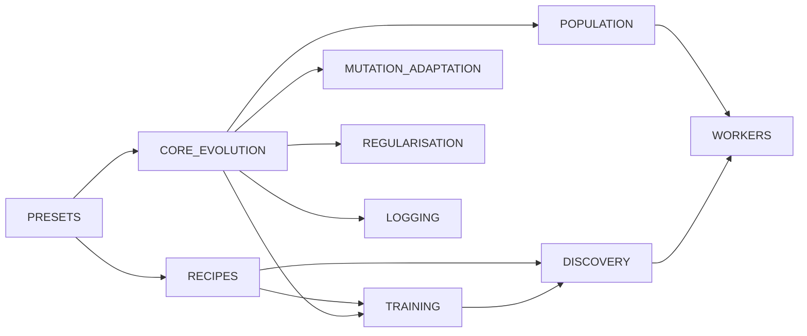

# Split CONFIGURATION_GUIDE.md into summary index + topic detail docs

## Summary

Split the 1,416-line `docs/CONFIGURATION_GUIDE.md` into a 92-line topic
index plus ten focused topic detail docs under `docs/config/`, grouped by
configuration domain to mirror the structure of `src/config/`. Each detail
doc documents every option (name, type, default, valid range, "what
happens when you change it") and cross-references the performance cluster.
Inbound links from `DISCOVERY_GUIDE.md`, `API_REFERENCE.md`, and
`docs/README.md` were updated to point at the new structure. Closes #2573.

## Topic map

## What changed

- `docs/CONFIGURATION_GUIDE.md` — now a 92-line topic index linking to
  every detail doc, with a Mermaid topic map and a See-also block pointing
  at the performance cluster and discovery guide.
- New `docs/config/` directory with ten topic detail docs:
  - `PRESETS.md` — `QUICK_START_PRESET`, `LARGE_NETWORK_PRESET`,
    `MEMORY_CONSTRAINED_PRESET`, `DISCOVERY_FOCUSED_PRESET`, composition.
  - `CORE_EVOLUTION.md` — population, mutation, elitism, growth penalties,
    stopping conditions, speciation, CRISPR, feedback-loop mode.
  - `TRAINING.md` — backprop cadence, batch size, sample rate, synthetic
    synapses, data fuzzing, k-fold cross-validation.
  - `DISCOVERY.md` — Rust FFI discovery: sample rate, recording/analysis
    timeouts, caching, replay, debug options, min candidates per category.
  - `MUTATION_ADAPTATION.md` — adaptive mutation thresholds, plateau
    detection, stability adaptation, MCMC, hyperparameter evolution.
  - `REGULARISATION.md` — weight/bias regularisation, ensemble diversity,
    output range constraints, quantum step.
  - `POPULATION.md` — adaptive population sizing, fine-tune population.
  - `WORKERS.md` — thread count, worker thread cap, fast/heavy
    partitioning, parallel evaluation.
  - `LOGGING.md` — log cadence, log level, custom loggers, deterministic
    seeds, and the cross-cutting validation rules.
  - `RECIPES.md` — fast prototyping, production training,
    research/reproducibility, time-series, minimal complexity, max
    generalisation, self-tuning evolution.
- `docs/README.md` index entry rewritten to reflect the new structure.
- `docs/DISCOVERY_GUIDE.md` — discovery cross-link now points at
  `config/DISCOVERY.md`.
- `docs/API_REFERENCE.md` — MCMC cross-link now points at
  `config/MUTATION_ADAPTATION.md#-mcmc-acceptance-criterion`.

## Evidence

This is a documentation-only change with no UI surface. Verification:

- New regression suite `test/docs/ConfigurationGuideSplit.ts` (7 tests):
  - asserts the index is ≤ 300 lines (currently 92);
  - asserts every detail doc is linked from the index;
  - asserts every detail doc exists, is substantive (>500 chars), starts
    with a heading, and cross-references the performance cluster;
  - asserts every relative link in the index and detail docs resolves on
    disk;
  - asserts `docs/README.md` continues to reference the configuration
    guide.
- Existing `test/docs/DocsIndex.ts` (10 tests),
  `test/config/ConfigurationGuideDefaults.ts` (12 tests), and
  `test/config/MCMCConfigDocumentation.ts` (5 tests) all pass — the code
  defaults referenced by the documentation remain accurate.
- `./quality.sh --lint-only` passes cleanly (formatter + linter +
  bash-check).

## Test plan

- [x] `deno test --allow-read test/docs/ConfigurationGuideSplit.ts` — 7/7
      pass.
- [x] `deno test --allow-read test/docs/DocsIndex.ts` — 10/10 pass.
- [x] `deno test --allow-read test/config/ConfigurationGuideDefaults.ts` —
      12/12 pass.
- [x] `deno test --allow-read test/config/MCMCConfigDocumentation.ts` —
      5/5 pass.
- [x] `./quality.sh --lint-only` — passes; no broken relative links.
