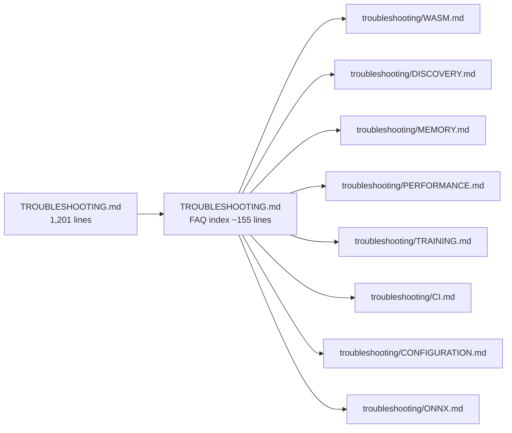

# PR Summary — Issue #2574

## Summary

Split the 1,201-line `docs/TROUBLESHOOTING.md` into a short FAQ-style index plus
eight per-topic detail docs under `docs/troubleshooting/`. Readers Googling an
error message land on a self-contained topic doc instead of scrolling a 40 KB
page. Closes #2574.

- `docs/TROUBLESHOOTING.md` is now ~155 lines: a topic map, one-sentence symptom
  entries, and a link to the matching detail doc anchor.
- New detail docs:
  - `docs/troubleshooting/WASM.md` — WASM init / load, JSR-hosted worker
    pre-fetch, `RuntimeError: unreachable`, panic recovery.
  - `docs/troubleshooting/DISCOVERY.md` — Rust FFI build,
    `NEAT_AI_DISCOVERY_LIB_PATH`, arch mismatch, FFI permission, GPU detection,
    "discovery not finding improvements" decision tree.
  - `docs/troubleshooting/MEMORY.md` — memory issues decision tree, V8 heap,
    SIGTERM 143, leak-detection tests, discovery memory tuning.
  - `docs/troubleshooting/PERFORMANCE.md` — "training is slow" decision tree.
  - `docs/troubleshooting/TRAINING.md` — fitness plateau, NaN/Infinity decision
    trees, data fuzzing, hyperparameter evolution.
  - `docs/troubleshooting/CI.md` — `coverage.yaml` retry strategy, `quality.sh`
    step list.
  - `docs/troubleshooting/CONFIGURATION.md` — invalid option combinations,
    `ValidationError` decoding, forward-only vs recurrent constraints.
  - `docs/troubleshooting/ONNX.md` — ONNX export compatibility and numerical
    differences.
- Inbound links updated: `README.md` JSR-worker pre-fetch deep link now points
  to
  `docs/troubleshooting/WASM.md#-jsr-hosted-neat-ai-in-your-own-workers-issue-2545`;
  `mod.ts` JSDoc and `docs/api/COMPUTE.md` updated likewise; `docs/README.md`
  index entry mentions the new `troubleshooting/` cluster.
- All existing remedies preserved verbatim in the detail docs — no content
  removed.

## Evidence

This is a docs-only change with no UI or runtime behaviour change.

- `deno test --allow-read test/docs/DocsIndex.ts` — 10 tests pass, including
  `docs/README.md internal links resolve`.
- `deno test --allow-read --allow-net --allow-env --allow-ffi
  test/docs/TroubleshootingGuide.ts`
  — 11 behaviour tests pass against the reorganised content.
- `./quality.sh --lint-only` — passes (`deno fmt`, `deno lint`, bash check).
- Custom link-resolution sweep across the 9 affected docs — all relative links
  resolve.

## Test plan

- [x] `deno test test/docs/DocsIndex.ts` — index links and structure.
- [x] `deno test test/docs/TroubleshootingGuide.ts` — documented behaviours
      still hold.
- [x] `./quality.sh --lint-only` — formatting, lint, bash checks.
- [x] Manual link sweep across all new troubleshooting docs.
- [x] Verified the JSR-worker anchor
      `#-jsr-hosted-neat-ai-in-your-own-workers-issue-2545` resolves at its new
      home in `docs/troubleshooting/WASM.md`.
