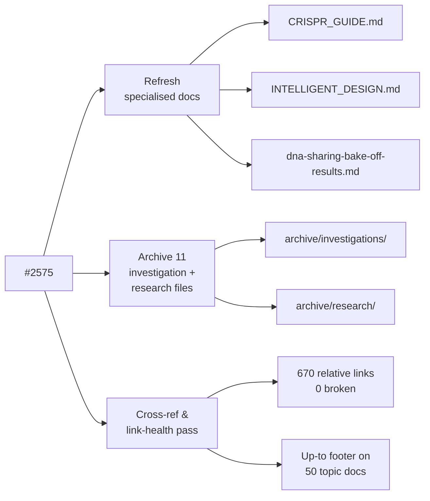

# PR Summary — Issue #2575

## Summary

Final cleanup pass for the May 2026 documentation milestone. Refreshes the three
specialised "fun but factual" concept docs, archives the one-off investigation
and DeepSeek research artefacts, and adds a uniform "Up to" cross-reference
footer so every in-scope topic doc links back to [`README.md`](../README.md) and
[`docs/README.md`](README.md). Closes #2575.

What changed:

- **Specialised concepts refreshed** with a brief summary header at the top plus
  a Mermaid diagram or chart:
  - [`docs/CRISPR_GUIDE.md`](CRISPR_GUIDE.md) — explains CRISPR (Clustered
    Regularly Interspaced Short Palindromic Repeats), links to Wikipedia and
    `src/reconstruct/CRISPR.ts`, adds a flowchart of a CRISPR injection (DNA →
    validate → upgrade → cleave → score → keep/drop).
  - [`docs/INTELLIGENT_DESIGN.md`](INTELLIGENT_DESIGN.md) — explains Intelligent
    Design as the systematic squash-function search, links to
    `src/intelligentDesign/`, adds a side-by-side flowchart contrasting random
    mutation vs Intelligent Design.
  - [`docs/dna-sharing-bake-off-results.md`](dna-sharing-bake-off-results.md) —
    confirms the bake-off numbers are still current (Issue #2496), adds a
    Mermaid `xychart-beta` chart of the lift across strategies, and a follow-up
    note pointing at #2490 for the real-evolve-step rerun.
- **Archived** 11 one-off investigation/research artefacts under
  `docs/archive/`:
  - `docs/issue-2418-…investigation.md` and `docs/issue-2515-…audit.md` →
    `docs/archive/investigations/`.
  - All nine `docs/research/deepseek-*.md` → `docs/archive/research/`. The
    cluster moved together so internal cross-links still resolve; the few
    outbound links to repo source paths and to `CRISPR_GUIDE.md` were rebased by
    one level.
  - Each archived file received a banner explaining the move and pointing back
    to [`docs/README.md`](README.md). The `deepseek-papers-index` catalogue
    keeps its banner and remains exercised by `test/docs/DeepseekPapersIndex.ts`
    (path comment updated).
- **Cross-reference and link-health pass**:
  - Walked all 670 relative links across the in-scope docs tree — **zero
    broken**.
  - Appended a small `**Up to:**` footer to every in-scope topic doc (top-level
    `docs/*.md`, plus the detail docs under `docs/api/`, `docs/config/`,
    `docs/troubleshooting/`) that lacked an explicit link back to `README.md`
    and `docs/README.md`.
- **Updated `docs/README.md`** "Out of scope" section so the archive map
  reflects the new `archive/research/` and `archive/investigations/`
  subdirectories and removes the standalone `research/` and `issue-*-*.md`
  references.

## Evidence

Documentation-only change. `./quality.sh --lint-only` (Deno fmt, Deno lint,
markdownlint, bash syntax) passes.



Verification commands run locally:

```bash
./quality.sh --lint-only < /dev/null   # exit 0
# Custom Python sweep — all 670 relative links resolve, 0 broken.
```

## Test Plan

- [x] `./quality.sh --lint-only` passes (Deno fmt, Deno lint, markdownlint, bash
      syntax).
- [x] All 670 relative links across the in-scope docs tree resolve (custom
      sweep).
- [x] Internal cross-links inside the moved DeepSeek cluster still resolve (the
      cluster moved as a unit).
- [x] `test/docs/DeepseekPapersIndex.ts` continues to point at the existing
      catalogue (path comment updated to `docs/archive/research/…`).
- [x] Australian English spelling spot-checked across modified files.
