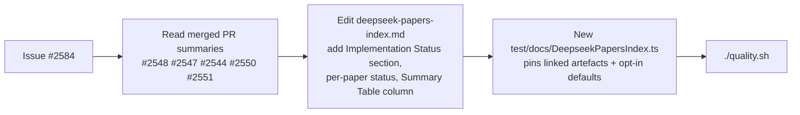

# DeepSeek paper catalogue — post-implementation results (Issue #2584)

## Summary

Updates `docs/research/deepseek-papers-index.md` to reflect the outcomes of the
May 2026 "Research DeepSeek" milestone. Each of the V4-tied experimental
sub-issues (#2527–#2531) landed only after a before/after benchmark showed a
meaningful gain — the catalogue now records that fact, points at the merged PRs,
names the opt-in configuration knob, and quotes the headline benchmark numbers.
Closes #2584.

Three changes to `deepseek-papers-index.md`:

1. New **Implementation Status (Issue #2584)** section listing every landed
   operator with the sub-issue, merged PR, opt-in flag, and benchmark headline
   in a single at-a-glance table.
2. Inline **Implementation status** lines on the DeepSeekMath, R1, and V4
   entries describing what landed and what remained research-only.
3. New **Status** column on the Summary Table and a short caveat noting the
   table reflects the May 2026 milestone — _Implemented_ vs _Research only_ vs
   n/a.

A companion test file (`test/docs/DeepseekPapersIndex.ts`) pins the contract:
the artefacts the catalogue links to must exist on disk, and each documented
opt-in flag must default to the disabled path.

## Evidence

This is a documentation + test change with no UI surface. Evidence is the
benchmark numbers from the original landed PRs (now surfaced in the catalogue)
plus the new test file.

### Benchmark headlines transcribed into the catalogue

| Sub-issue | PR    | Benchmark headline (from the original PR summary)                                               |
| --------- | ----- | ----------------------------------------------------------------------------------------------- |
| #2527     | #2548 | mean -0.151 → -0.112, ~45 % lower wall time over 12 seeds (`bench/MCMCAdvantageConvergence.ts`) |
| #2528     | #2547 | calibration MSE -90 % at 50 distillation steps vs no-train baseline                             |
| #2529     | #2544 | 415 → 251 iterations to target error (~40 % fewer); per-step ≈19 % cheaper                      |
| #2530     | #2550 | generalist combined score ≥ mean specialist combined score (10/10 unit tests)                   |
| #2531     | #2551 | ~0.5 µs lookup at 50 k entries; ~10 µs end-to-end per creature                                  |

### Update flow



### New test results

```
running 15 tests from ./test/docs/DeepseekPapersIndex.ts
deepseek-papers-index — referenced artefact exists: bench/MCMCAdvantageConvergence.ts ... ok
deepseek-papers-index — referenced artefact exists: test/NEAT/GroupRelativeAdvantage.ts ... ok
deepseek-papers-index — referenced artefact exists: bench/OnPolicyDistillationBreed.ts ... ok
deepseek-papers-index — referenced artefact exists: test/breed/OnPolicyDistillationBreed.ts ... ok
deepseek-papers-index — referenced artefact exists: bench/MuonVsBaseline.ts ... ok
deepseek-papers-index — referenced artefact exists: test/propagate/MuonOrthogonalisation.ts ... ok
deepseek-papers-index — referenced artefact exists: bench/SpecialistVsMixed.ts ... ok
deepseek-papers-index — referenced artefact exists: test/NEAT/SpecialistPipeline.ts ... ok
deepseek-papers-index — referenced artefact exists: bench/SubnetworkHashLookup.ts ... ok
deepseek-papers-index — referenced artefact exists: test/discovery/SubnetworkHashIndex.ts ... ok
deepseek-papers-index — GRPO advantage mode defaults to absolute (#2527) ... ok
deepseek-papers-index — OPD breed rate defaults to 0 (#2528) ... ok
deepseek-papers-index — Muon orthogonalisation defaults to none (#2529) ... ok
deepseek-papers-index — specialist pipeline defaults to off (#2530) ... ok
deepseek-papers-index — subnetwork hash index size has documented default (#2531) ... ok

ok | 15 passed | 0 failed
```

## Test Plan

- [x] `deno test --allow-read --allow-env test/docs/DeepseekPapersIndex.ts` — 15
      new tests pass.
- [x] `./quality.sh --skip-discovery --skip-wasm` — full quality gate clean.
- [x] Manual proof-read of `docs/research/deepseek-papers-index.md` for
      Australian-English spelling and Markdown table integrity.
