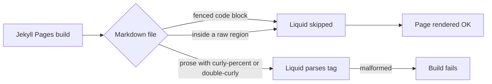

# PR Summary — Issue #2590

## Summary

Fixed the GitHub Pages (Jekyll) build failure caused by literal Liquid syntax in
two PR-summary docs, and added a regression test that scans every Markdown file
under `docs/` for the same class of mistake. The Pages build was crashing with:

```
Liquid Exception: Liquid syntax error (line 64): Tag '' was not
properly terminated with regexp: /\%\}/ in pr-summary-2568.md
```

Two files contained literal Liquid sequences in prose. Inline backticks do not
protect Liquid under Jekyll, so wrapping in a Liquid raw block (or moving the
offending text into a fenced code block) is required.

- `docs/pr-summary-2568.md` line 64 — the bullet that described the Liquid
  pattern was itself the pattern Jekyll could not parse. Wrapped the offending
  fragment in a Liquid raw region on the same line so `deno fmt` cannot split
  the opening tag across lines.
- `docs/pr-summary-2344.md` line 75 — the inline command containing a GitHub
  Actions expression was being rewrapped by `deno fmt` across two lines, which
  made any inline raw wrapping fragile. Moved the command into a fenced ```bash
  block, where Jekyll does not parse Liquid at all.

Closes #2590.

## Evidence

This is a docs + test change with no UI surface.



Regression test output (the test fails before the docs fix and passes after):

```
running 6 tests from ./test/docs/JekyllLiquidSafety.ts
docs/**/*.md contains no unescaped Liquid syntax (#2590) ... ok (70ms)
findLiquidOffences flags bare {% in prose ... ok (0ms)
findLiquidOffences flags bare {{ in prose ... ok (0ms)
findLiquidOffences ignores Liquid inside fenced code blocks ... ok (0ms)
findLiquidOffences ignores Liquid inside  blocks ... ok (0ms)
findLiquidOffences supports inline  on one line ... ok (0ms)
ok | 6 passed | 0 failed (72ms)
```

Both `./quality.sh --lint-only < /dev/null` and
`./quality.sh --check-only
< /dev/null` pass.

## Test Plan

- Added `test/docs/JekyllLiquidSafety.ts` with six tests:
  - `docs/**/*.md contains no unescaped Liquid syntax (#2590)` — walks every
    `.md` file under `docs/` and fails (with file + line) on any Liquid sequence
    outside a fenced code block or a raw region. This is the regression gate.
  - Four unit tests around the helper `findLiquidOffences` covering prose,
    fenced blocks, multi-line raw regions, and a single inline raw/endraw pair.
- Confirmed by running the test suite with the fix reverted (the regression test
  reports both file:line offences); reapplied the fix and the test goes green.
- Re-ran the rest of `test/docs/` to confirm no other docs test was affected —
  54 tests pass.
