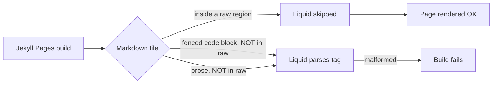

# PR Summary — Issue #2592

## Summary

Fixed the GitHub Pages (Jekyll) build failure caused by literal Liquid sequences
inside fenced code blocks in `docs/pr-summary-2590.md`, and corrected the
regression gate added in #2590 to scan inside fenced blocks too. Closes #2592.

The original #2590 fix assumed Liquid does not parse fenced code blocks. That
assumption is wrong: Jekyll runs Liquid on the raw source **before** kramdown
sees the fences, so any curly-percent or curly-curly sequence inside a fence is
still parsed as a Liquid tag. The Pages build crashed with:



```
Liquid Exception: Liquid syntax error (line 10): Tag '' was not
properly terminated with regexp: /\%\}/ in pr-summary-2590.md
```



## Changes

- `test/docs/JekyllLiquidSafety.ts` — dropped the previous in-fence skip; the
  walker now flags curly-percent and curly-curly sequences anywhere outside a
  Liquid raw region. Updated the helper test that previously asserted fenced
  blocks were safe to assert the corrected behaviour and renamed it accordingly.
  Added a new helper test that proves the fix pattern (wrapping a fenced block
  in a raw region) is safe.
- `docs/pr-summary-2590.md` — wrapped the fenced block that quotes the Liquid
  error message in a raw region, and replaced the second fenced test-output dump
  (which itself contained literal raw and endraw tag text and would prematurely
  terminate any outer raw region) with a prose summary.
- `docs/pr-summary-2344.md` — wrapped the fenced bash block that contains a
  GitHub Actions expression in a raw region so Liquid does not consume the
  expression.

## Evidence

This is a docs + test change with no UI surface.



Before the fix the walker reported four offences across two files (the first of
which was the actual build-breaking line at `docs/pr-summary-2590.md:10`). After
the fix the walker reports zero offences, and all seven helper tests pass —
including the new flags-Liquid-inside-fenced-blocks test and the new test that
covers wrapping a fenced block in a raw region.

`./quality.sh --lint-only < /dev/null` and
`./quality.sh --check-only < /dev/null` both pass.

## Test Plan

- Updated `test/docs/JekyllLiquidSafety.ts`:
  - `findLiquidOffences` no longer tracks fenced blocks; only Liquid raw regions
    suppress flagging.
  - Renamed and rewrote the helper test that previously asserted fenced blocks
    were safe to assert the corrected behaviour and reflect that Jekyll parses
    fences too (#2592).
  - Added a new helper test covering the canonical fix pattern: wrapping a
    fenced block in a raw region.
  - The `docs/**/*.md` walker now fails on any unwrapped Liquid in any location
    and reports each offence as `file:line`.
- Verified: with the docs fix reverted, the walker reports the four offences
  described above; with the fix applied, all seven tests pass.
