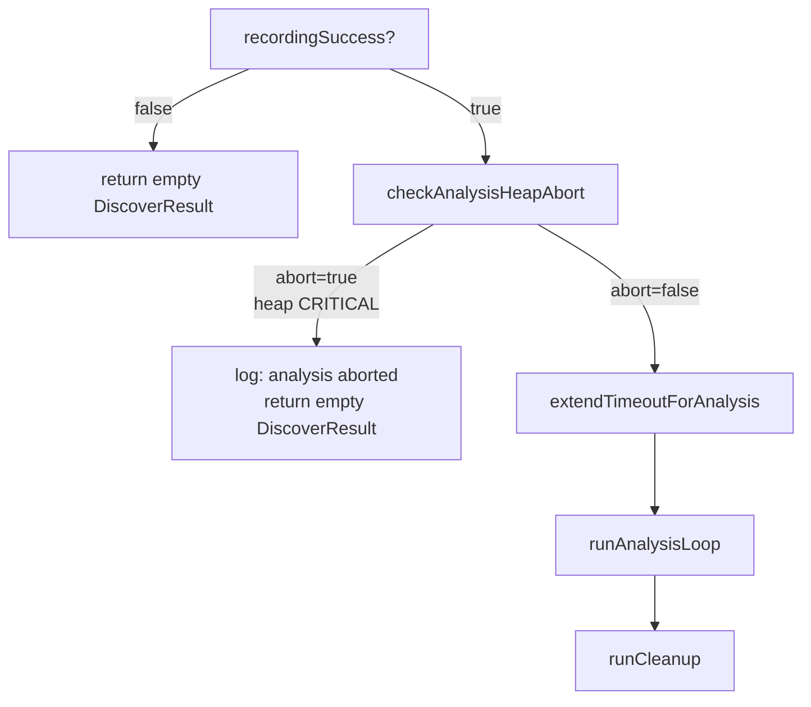

# Discovery: skip analysis extension when MemoryMonitor heap is CRITICAL

## Summary

`DataRecorder.recordFiles()` previously extended the discovery timeout
unconditionally after the recording phase, then ran `runAnalysisLoop()` even
when the heap was already at MemoryMonitor `CRITICAL` pressure. The
critical-level cache eviction (clear WASM caches, drop activation cap to 1) had
already fired in earlier ticks and was not enough — analysis kept allocating and
the worker hit
`Fatal JavaScript out of memory: Ineffective
mark-compacts near heap limit` (see
GRQ-22-sloth.log).

This PR adds a heap-aware guard at the analysis-extension boundary:

- New module
  `src/architecture/ErrorGuidedStructuralEvolution/AnalysisHeapGuard.ts` exposes
  `sampleHeapPressure`, `isHeapCritical`, and `checkAnalysisHeapAbort`. Heap is
  sampled via the same `MemoryUsageProvider` abstraction used by
  `MemoryMonitor`, so tests inject deterministic samples without hitting
  `Deno.memoryUsage()`.
- `DataRecorder.recordFiles()` now calls `checkAnalysisHeapAbort` immediately
  before `extendTimeoutForAnalysis(...)`. If the sample reports
  `pressureLevel === "critical"`, the extension is skipped, the analysis loop is
  **not** invoked, and the existing partial-result path returns the same empty
  `DiscoverResult` shape used by the `recordingSuccess === false` branch — no
  new persistence format.
- A single grep-friendly log line is emitted on abort:
  `[Neat] Discovery <id> analysis aborted: heap CRITICAL at extension boundary`.
- When `memory.enabled === false` the guard never trips, preserving legacy
  unconditional-extension behaviour for callers that opted out of memory
  monitoring.

Closes #2594.

## Evidence

This is a backend/library change with no UI surface. The behaviour is verified
by deterministic unit tests against `AnalysisHeapGuard` and via inspection of
the `DataRecorder` call site (the `if (heapAbort.abort) return …` branch sits
between `recordingSuccess` handling and `extendTimeoutForAnalysis`).



Test run (`deno test test/ErrorGuidedStructuralEvolution/AnalysisHeapGuard.ts`):

```
ok | 11 passed | 0 failed (5ms)
```

Targeted regression run on adjacent EGSE timeout/analysis tests:

```
ok | 21 passed | 0 failed (809ms)
```

## Test Plan

Added `test/ErrorGuidedStructuralEvolution/AnalysisHeapGuard.ts` covering:

- `sampleHeapPressure` returns `critical` / `warning` / `normal` for the default
  thresholds, and reports `normal` when `heapTotal === 0` (missing telemetry
  must not trigger the abort).
- `isHeapCritical` honours `memory.enabled === false` (returns `false` even when
  the heap is at 99 %), respects custom `criticalThreshold`, and trips at the
  default 0.85 boundary.
- `checkAnalysisHeapAbort` emits the abort log line **exactly once** when the
  heap is critical, returns `abort: true`, and emits **no** log line on the
  happy path (`abort: false`).
- The module-level `_setHeapGuardProviderForTests` injection is honoured.

The existing `DiscoverRecordTimeout` and `DiscoverAnalysisChunking` suites
continue to pass, confirming the happy path through `DataRecorder.recordFiles`
(heap below critical → `extendTimeoutForAnalysis` is called and the existing
`analysis timeout extended by Xm` log line is emitted) is unchanged.
