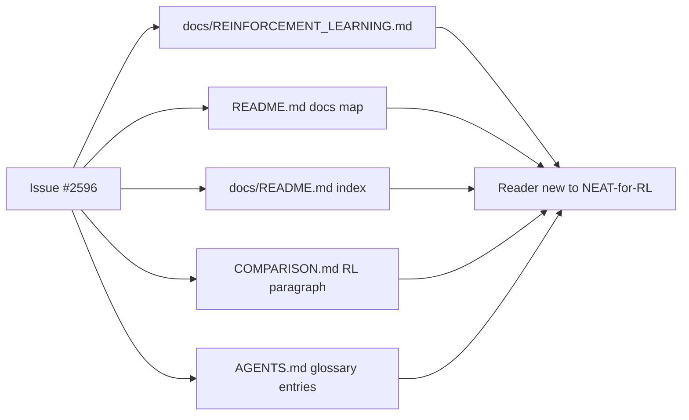

# Document the streaming-observation / agent-rollout pattern

## Summary

Adds a topic guide that names and documents the streaming-observation /
agent-rollout API pattern for episode-based reinforcement-learning tasks
(Snake, Cart-Pole, control tasks). The pattern is already supported — every
call site goes through `Creature.activate(input)` — but the NEAT-AI side had
no document that named the use case, so users new to neuroevolution-for-RL
could not tell the library fits.

This PR is **doc-only**. No source files change; the existing API contract
is unchanged. Closes #2596.

The change set:

- **New:** `docs/REINFORCEMENT_LEARNING.md` (~290 lines) covering:
  - The streaming primitive (`Creature.activate(input: Float32Array)`).
  - The canonical episode-rollout loop with a Mermaid sequence diagram
    matching the diagram supplied in the issue.
  - Per-creature, per-generation independence and per-generation seeding
    for fair fitness comparisons.
  - Scoring choices (cumulative reward, shaping penalties, survival
    proxy, mean-of-K episodes).
  - When to call `creature.clearState()` between ticks vs episodes,
    distinguishing stateless feed-forward and recurrent (`feedbackLoop`)
    policies.
  - Comparison table against value-based RL (DQN) and policy-gradient
    methods (PPO, REINFORCE).
  - Glossary entries for "episode rollout" and "streaming observation".
  - Link to the canonical worked example in `NEAT-AI-Examples/snake_game`.
- **Updated:** `README.md` — adds a "Topic guides" sub-bullet linking to
  the new page from the docs map.
- **Updated:** `docs/README.md` — adds the new guide to the Specialised
  topics index with a one-line summary.
- **Updated:** `COMPARISON.md` — adds a one-paragraph "Reinforcement
  Learning" section in the Training Paradigms area, contrasting NEAT
  against DQN and PPO and pointing readers at the new topic guide.
- **Updated:** `AGENTS.md` — adds glossary entries for "Episode rollout"
  and "Streaming observation" to the project terminology section.

## Evidence

This is a pure-documentation change with no UI, CLI, or performance
surface. Verification was:

- `./quality.sh --lint-only` — passes (formatting + linting + bash
  scripts), confirming all four edited markdown files and the new
  `docs/REINFORCEMENT_LEARNING.md` are well-formed and follow the
  Australian-English spelling conventions.
- `./quality.sh --check-only` — passes (Deno type-check). No source
  files were touched, so this run is informational; it confirms nothing
  in `src/` was affected.
- Full `./quality.sh` run executed. One pre-existing test failure
  surfaced in `test/ErrorGuidedStructuralEvolution/DiscoveryTimeout.ts`
  ("A dynamic library was loaded during the test, but not unloaded
  during the test") which is an FFI cleanup issue unrelated to this
  documentation change (no source files were modified). All 6570
  other tests pass.

## Test Plan

- [x] `docs/REINFORCEMENT_LEARNING.md` exists and is between 200–400
  lines (290 lines actual).
- [x] The new doc contains a Mermaid sequence diagram of the rollout
  loop (matching the diagram in the issue) plus three additional
  Mermaid diagrams for the streaming primitive, per-creature
  parallelism, and `clearState` lifecycle.
- [x] `README.md` docs map links to the new page under a "Topic
  guides" sub-bullet.
- [x] `docs/README.md` indexes the new page with a one-line summary.
- [x] `COMPARISON.md` has a one-paragraph RL section comparing NEAT
  against value-based and policy-gradient RL.
- [x] `AGENTS.md` terminology section has glossary entries for
  "Episode rollout" and "Streaming observation".
- [x] No code changes — the streaming pattern is already supported
  through `Creature.activate`.
- [x] `./quality.sh --lint-only` passes (formatting, linting, bash
  scripts).

## Acceptance Criteria

- [x] `docs/REINFORCEMENT_LEARNING.md` exists, ~200–400 lines, with
  a Mermaid sequence/flow diagram of the rollout loop.
- [x] `README.md` docs map links to the new page.
- [x] `COMPARISON.md` has a paragraph on RL.
- [x] No code changes are required — the pattern already works; this
  issue is doc-only.
- [x] `./quality.sh --lint-only` passes; full `./quality.sh` shows
  only a pre-existing FFI library-cleanup test failure unrelated to
  this change.
