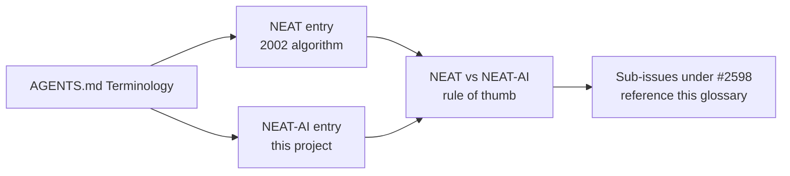

## Summary

Established a canonical distinction between **NEAT** (the standard 2002
algorithm by Stanley & Miikkulainen) and **NEAT-AI** (this project) in
`AGENTS.md`, so the rest of the documentation can reference it consistently.
Closes #2599.

Two new entries were added to the existing **Terminology** section:

- **NEAT** — the original NeuroEvolution of Augmenting Topologies algorithm
  from the 2002 paper. Reserved for discussions of that algorithm only.
- **NEAT-AI** — this project. Started from pure NEAT but now extends it with
  memetic evolution, error-guided Discovery, MCMC mutation acceptance,
  synthetic synapses, predictive coding, Muon-style orthogonalised gradients,
  and other modern algorithms.

A new **🆚 NEAT vs NEAT-AI — which term to use** subsection codifies the
rule of thumb so contributors know which term belongs where:

- Say **NEAT-AI** for anything the repo does.
- Say **NEAT** (or "standard NEAT" / "pure NEAT") only when contrasting with
  the 2002 algorithm.
- Avoid bare "NEAT" as shorthand for the implementation in user-facing docs.

This is foundational and unblocks the other sub-issues under #2598 — they
can now reference this glossary entry instead of redefining the distinction
in each file.

## Evidence

Documentation-only change (no code, no UI, no benchmarks). Verified with:

- `npx markdownlint-cli2 AGENTS.md` → 0 errors.
- `./quality.sh --lint-only` → all four steps pass (deno fmt, deno lint,
  bash check). `deno fmt` rewrapped a few lines in the new section.
- Manual inspection: links resolve to the same Stanley & Miikkulainen PDF
  already cited elsewhere in the file.

## Test Plan

- [x] `AGENTS.md` Terminology section contains entries for both **NEAT** and
      **NEAT-AI** with the distinction described in the issue.
- [x] Includes a contributor rule of thumb on which term to use where.
- [x] Markdown renders cleanly (markdownlint-cli2 reports zero errors;
      no broken links).
- [x] `./quality.sh --lint-only` passes (formatting, linting, bash check).
