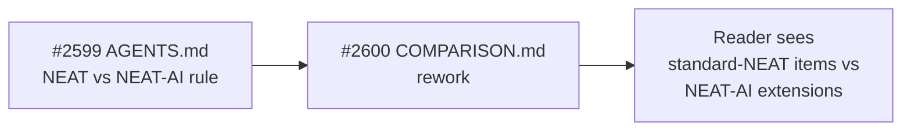

## Summary

Reworks `COMPARISON.md` so a reader cannot confuse the original NEAT algorithm
(Stanley & Miikkulainen, 2002) with NEAT-AI's much-extended implementation.
Closes #2600.

The document now applies the terminology rule introduced in #2599
([AGENTS.md NEAT vs NEAT-AI section](../AGENTS.md#-neat-vs-neat-ai--which-term-to-use))
throughout: **NEAT** is reserved for the 2002 algorithm and **NEAT-AI** is used
for everything in this repository.

### Key changes

- **Title and Overview** — title rewritten to "NEAT-AI vs Traditional Neural
  Networks and Modern LLMs"; Overview states explicitly that NEAT-AI started
  from pure NEAT but incorporates many algorithms beyond the 2002 paper. The
  first occurrences of NEAT and NEAT-AI link to the AGENTS.md terminology
  entries.
- **"What We've Implemented"** — split into two clearly delimited subsections:
  - "🔬 Standard NEAT machinery (Stanley & Miikkulainen, 2002)" — items
    inherited directly from the 2002 paper (evolutionary topology search,
    speciation, historical marking, genetic operators, fitness sharing).
  - "🚀 NEAT-AI extensions (beyond the 2002 paper)" — every NEAT-AI extension is
    annotated with `*(NEAT-AI extension)*` and, where relevant, contrasts itself
    with standard NEAT. Predictive coding, discovery, MCMC acceptance, and
    others link to their dedicated guides.
- **Section renames** — "🧬 NEAT (Our Implementation)" → "🧬 NEAT-AI" in the
  Architectural Comparison, Training Paradigms, Pros, and Cons sections. The
  Ecosystem Comparison section heading and TOC entry now read "NEAT-AI vs
  Standard Libraries". The Architectural Comparison caption explicitly contrasts
  NEAT-AI with standard NEAT.
- **Audited bare "NEAT" references** — sentences such as "NEAT does not learn a
  value function" (RL section), "NEAT is typically used for supervised
  learning", "Standard NEAT implementations accept all mutations
  unconditionally", and similar were reworded to make clear whether the claim is
  about pure NEAT, NEAT-AI, or both.
- **Conclusion and "Use NEAT when…"** — now use NEAT-AI throughout when
  describing this project, and "standard NEAT" when describing the 2002
  algorithm.

### Evidence

This is a docs-only change. Markdownlint and the `--lint-only` portion of
`./quality.sh` pass. Full `./quality.sh --skip-discovery --skip-wasm` shows two
pre-existing FFI/dynamic-library leak failures in
`test/ErrorGuidedStructuralEvolution/DiscoveryTimeout.ts` that reproduce on the
unmodified file (verified by stashing and running the test on the parent commit)
and are unrelated to this docs change.

### Test plan

- [x] `./quality.sh --lint-only < /dev/null` passes (markdown formatted, bash
      scripts pass, lint clean).
- [x] First mention of NEAT and NEAT-AI links to AGENTS.md terminology entries
      (`#-terminology` and the rule section).
- [x] Every list item under "What We've Implemented" is grouped or annotated as
      "standard NEAT" or "NEAT-AI extension".
- [x] No remaining bare "NEAT" references describe NEAT-AI's codebase, features,
      or behaviour. `grep -nE '\bNEAT\b'` confirms remaining bare uses refer to
      the 2002 algorithm, the original paper, or
      "NEAT-derived"/"NEAT-style"/"NEAT-evolved" qualifiers.
- [x] Pros/Cons, Training Paradigms, Conclusion, and Ecosystem Comparison
      sections consistently use NEAT-AI for this project.
