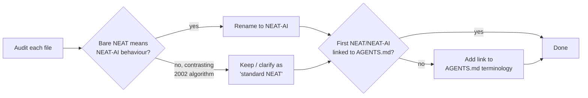

# Sweep remaining docs to clarify NEAT vs NEAT-AI references

## Summary

Closes #2602.

This PR completes the long-tail sweep started by #2599 (terminology entry) and
#2600/#2601 (README and COMPARISON updates). It audits every long-form topic
guide under `docs/` (excluding historical `pr-summary-*.md` files) and the
root-level `CONTRIBUTING.md` and `SECURITY.md`, replacing bare **NEAT**
references that describe NEAT-AI behaviour with **NEAT-AI**, and adding a link
to the AGENTS.md terminology entries on the first occurrence of NEAT/NEAT-AI in
each updated file.

`CHANGELOG.md` was reviewed but not edited — historical entries are preserved
verbatim per the issue scope; the convention is enforced via the new AGENTS.md
guidance for prospective entries.

## Files changed

| File                             | Edits                                                                                                                                                                                                   |
| -------------------------------- | ------------------------------------------------------------------------------------------------------------------------------------------------------------------------------------------------------- |
| `CONTRIBUTING.md`                | Linked first NEAT-AI; added IMPORTANT note about NEAT vs NEAT-AI; clarified `src/NEAT/` folder description                                                                                              |
| `SECURITY.md`                    | Linked first NEAT-AI to AGENTS.md terminology                                                                                                                                                           |
| `docs/INTELLIGENT_DESIGN.md`     | Renamed "NEAT options" → "NEAT-AI options" in NeatOptions row                                                                                                                                           |
| `docs/DISCOVERY_GUIDE.md`        | Linked first NEAT-AI to AGENTS.md terminology                                                                                                                                                           |
| `docs/CRISPR_GUIDE.md`           | Linked first NEAT-AI to AGENTS.md terminology                                                                                                                                                           |
| `docs/BACKPROP_ELASTICITY.md`    | Linked first NEAT-AI to AGENTS.md terminology                                                                                                                                                           |
| `docs/CONFIGURATION_GUIDE.md`    | Linked first NEAT-AI to AGENTS.md terminology                                                                                                                                                           |
| `docs/API_REFERENCE.md`          | Linked first NEAT/NEAT-AI to AGENTS.md; renamed bare NEAT → NEAT-AI in Creature class, NeatOptions, evolveDir, ONNX export sections; clarified "standard NEAT" contrast in synthetic synapses paragraph |
| `docs/PREDICTIVE_CODING.md`      | Added NEAT-AI acronym entry with terminology link; renamed "NEAT networks" → "NEAT-AI networks" in topology context                                                                                     |
| `docs/REINFORCEMENT_LEARNING.md` | Linked first NEAT-AI to AGENTS.md; renamed bare NEAT → NEAT-AI in fitness/optimisation/scaling sentences                                                                                                |
| `docs/ACTIVATION_FUNCTIONS.md`   | Linked first NEAT-AI to AGENTS.md; renamed bare NEAT → NEAT-AI throughout topology-evolution sections (mutation probability, evolution suitability, deprecated functions)                               |
| `docs/PERFORMANCE_TUNING.md`     | Linked first NEAT-AI to AGENTS.md; renamed bare NEAT → NEAT-AI in synthetic-synapse and island-model sections                                                                                           |
| `docs/PERFORMANCE_RESEARCH.md`   | Linked first NEAT-AI to AGENTS.md; renamed "typical NEAT scenario/creatures" → NEAT-AI                                                                                                                  |
| `docs/TROUBLESHOOTING.md`        | Linked first NEAT-AI to AGENTS.md terminology                                                                                                                                                           |
| `docs/pr-summary-2599.md`        | Incidental `deno fmt` re-wrap (no semantic change)                                                                                                                                                      |

### Kinds of edits applied

Three classes of edit appear in this PR:

- **Rename** — bare "NEAT" describing this repo's behaviour → "NEAT-AI".
- **Clarify** — sentences that contrast with the 2002 algorithm now say
  "standard NEAT" explicitly and name NEAT-AI as the contrasting party.
- **Link added** — the first occurrence of NEAT/NEAT-AI in each updated file
  links to the AGENTS.md terminology and "NEAT vs NEAT-AI" rule.

## Out of scope

- `docs/pr-summary-*.md` historical PR records (per issue scope) — only the
  pre-existing `pr-summary-2599.md` was touched, and only by `deno fmt`
  (whitespace re-wrap, no semantic change).
- `CHANGELOG.md` historical entries — not rewritten. The convention applies to
  new entries, enforced by AGENTS.md.

## Evidence

This is a pure documentation PR — there is no UI to screenshot and no runtime
behaviour to benchmark. Verification is via the project quality gate:

- `./quality.sh --lint-only` passes (formatting + linting + bash check).
- `./quality.sh --check-only` passes (deno type-check).

No source code or tests were modified.

## Test Plan

- [x] `deno fmt` passes on every modified file
- [x] `deno lint` passes (markdownlint-cli2 + deno lint)
- [x] `deno check` passes
- [x] Spot-check: every updated file's first NEAT/NEAT-AI mention is a clickable
      link to `AGENTS.md#-terminology` or
      `AGENTS.md#-neat-vs-neat-ai--which-term-to-use`.
- [x] No `pr-summary-NNNN.md` historical record has had its content semantically
      changed.
