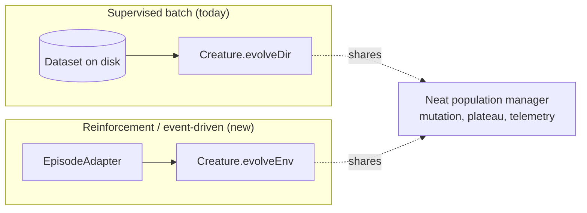

# PR #2610 — RFC: First-class event-driven evolution API (`evolveEnv`)

## Summary

Adds `docs/event-driven-evolution.md`, the design RFC for a first-class
event-driven evolution entry point — `Creature.evolveEnv(adapter, options)`. The
doc names the paradigm split between supervised batch evolution (`evolveDir` /
`evolveDataSet`) and reinforcement / event-driven evolution, specifies the
fully-typed `EpisodeAdapter<S, A>` contract, justifies the `evolveEnv` name
against `evolveEpisodic` and `evolveAgent`, sets out the fitness-aggregation
rules so existing `targetError` / plateau-detection / `onTrainingEvent`
semantics carry over unchanged, lists which existing internals are reused vs
new, sketches the multi-threaded rollout plan, and defines a five-step migration
path for the episodic examples in NEAT-AI-Examples (`cart_pole`, `mountain_car`,
`snake_game`, `maze_navigation`, `lunar_lander`). Also adds a topic entry for
the new document to `docs/README.md` so it is discoverable from the index.

This is design-only — no source code changes.

Closes #2610.

## Evidence

This is a documentation-only change with no UI, performance, or runtime impact.
Verification:

- `./quality.sh --lint-only < /dev/null` passes (formatting, linting, bash
  syntax).
- `deno fmt --check docs/event-driven-evolution.md docs/README.md` passes.
- The new doc embeds three Mermaid diagrams (paradigm split, sequence diagram
  for the new scorer path, multi-threaded rollout flow) so reviewers can grasp
  the architecture at a glance.

## Test Plan

No automated tests added — this PR is design-only and does not touch any runtime
code path.

- [x] `./quality.sh --lint-only` clean.
- [x] `docs/README.md` topic index links to the new RFC.
- [x] All eight RFC points from issue #2610 are addressed in
      `docs/event-driven-evolution.md`.
- [x] `EpisodeAdapter<S, A>` and `EpisodicOptions` are fully typed; no `unknown`
      / `any`.
- [x] Cross-references to NEAT-AI-Examples#230 and the five migration follow-ups
      are in place.
