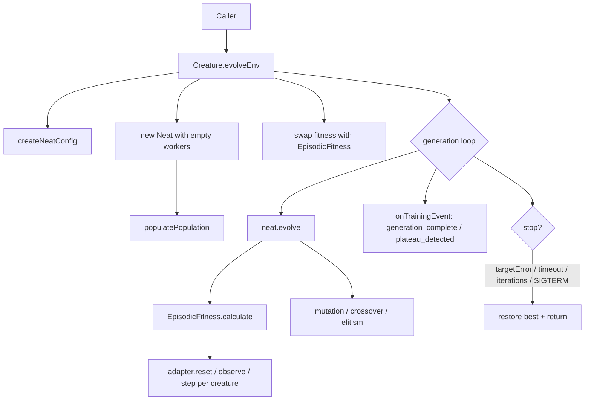

## Summary

Implements `Creature.evolveEnv(adapter, options)` per Issue #2611. The new API
lets callers evolve a creature against a streaming-observation simulator
(RL-style) using the same `Neat` machinery that already drives `evolveDir()` —
population, mutation, crossover, elitism, plateau detection, and lifecycle
events are all reused. Only the scorer is swapped from the worker-based dataset
`Fitness` to a new `EpisodicFitness` that runs episode rollouts inline (`reset`
→ `observe` → `Creature.activate` → `decode` → `step`). Multi-threaded worker
rollouts are deliberately deferred to a follow-up so this PR stays reviewable.
Closes #2611.

## Architecture

## Reward → error mapping

Cumulative episode reward is mapped to the non-negative `error` slot consumed by
`Score.calculate`:

| Reward   | Default error        | Score behaviour          |
| -------- | -------------------- | ------------------------ |
| `r >= 0` | `0` (target reached) | `1 - growth penalty`     |
| `r < 0`  | `-r` (positive)      | `1 - error - growth - …` |

Callers can override via `EpisodicOptions.rewardToError` to reshape the
relationship — useful when the simulator's reward signal needs a fixed offset or
a quadratic shaping to keep `targetError` thresholds intuitive.

## Files

- `src/creature/EpisodeAdapter.ts` — public `EpisodeAdapter<S, A>` interface,
  `EpisodicOptions`, `EpisodeTrialsEvent`, and `defaultRewardToError`.
- `src/creature/EpisodicFitness.ts` — drop-in `Fitness` subclass that runs
  episodes inline, dedup by UUID, supports trial averaging with deterministic
  per-trial seeds, and emits `onEpisodeTrials` per scored creature.
- `src/creature/CreatureTraining.ts` — new `evolveEnv()` function (mirrors
  `evolveDir()` outer shape, with workers replaced by inline scoring).
- `src/Creature.ts` — `Creature.evolveEnv()` facade method.
- `mod.ts` — re-exports `EpisodeAdapter`, `EpisodicOptions`,
  `EpisodeTrialsEvent`, and `defaultRewardToError`.
- `test/creature/EvolveEnv.ts` — nine new tests.

## Evidence

This is a backend / library API change with no UI surface; the test plan below
verifies behaviour. `./quality.sh --lint-only` passes; targeted tests pass
(`9 passed | 0 failed`).

## Test Plan

- `evolveEnv: defaultRewardToError flattens non-negative rewards to 0`
- `evolveEnv: rejects creature whose I/O does not match adapter`
- `evolveEnv: happy path reaches targetError within iterations` — `targetError`
  stop, trivial 1-input/1-output adapter (the issue's "happy path" test).
- `evolveEnv: iterations cap stops the run` — `iterations` stop.
- `evolveEnv: timeoutMinutes option is accepted and run completes` — parameter
  parity with `evolveDir()`. The internal `Math.max(1, …)` clamp on
  `timeoutMinutes` makes a sub-minute integration test impractical;
  `evolveDir()` shares the identical stop-condition code path
  (`CreatureTrainEvolve.ts`).
- `evolveEnv: trialsPerScore > 1 averages multiple trials` — trial averaging,
  `onEpisodeTrials` payload (`trialRewards`, `meanReward`, `stdReward`,
  `error`).
- `evolveEnv: deterministic given the same seed` — the same seed routes every
  stochastic decision through the same xoshiro256** stream;
  `crypto.randomUUID()` neuron IDs introduce small ordering drift, so the test
  asserts identical generation count and tight epsilon on error/score.
- `evolveEnv: emits generation_complete events` — lifecycle events parity.
- `evolveEnv: SIGTERM interrupts the run` — SIGTERM stop parity.
